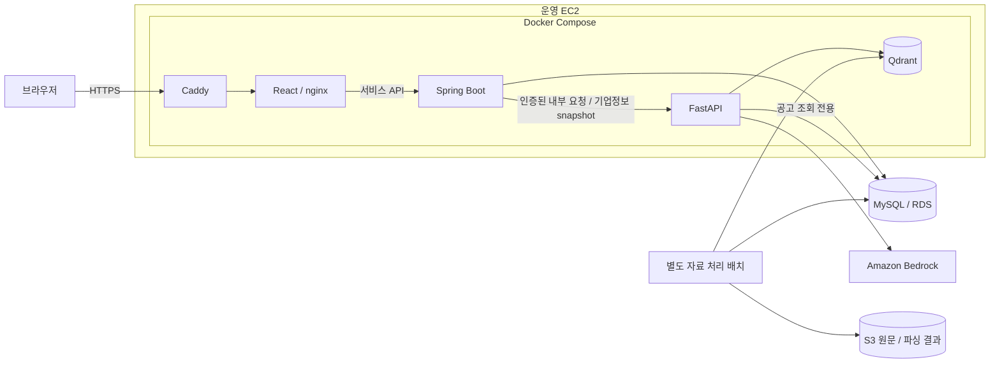
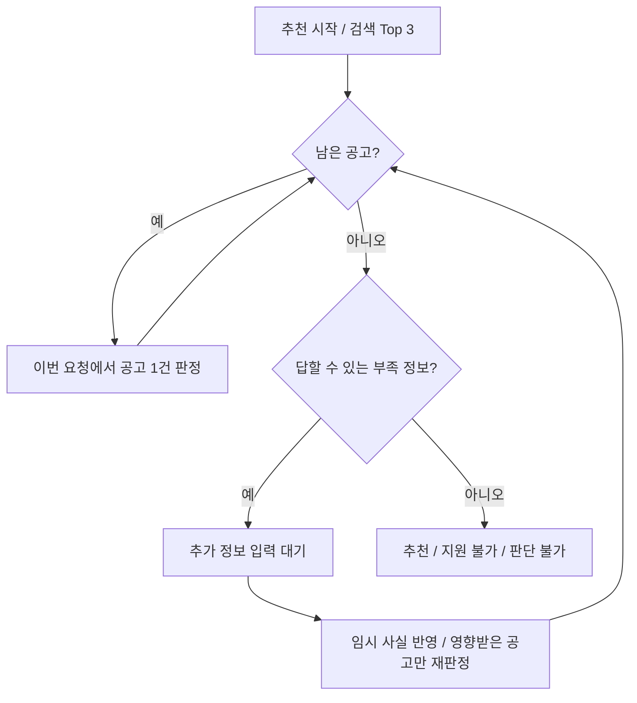

# BizAid AI — 프로젝트 마스터 가이드

> 기준일: **2026-10-07**. 다른 AI가 프로젝트를 이해하고 안전하게 작업을 이어가기 위한 현재 기준 문서다.
> 저장소의 코드·공통 계약·최신 문서와 개발 보고서를 대조했다. 운영 서버·AWS·실제 환경 파일은 이번 문서 작업에서 조회하지 않았다.
> **구현됨**, **과거 실행으로 확인됨**, **사용자가 운영 완료를 확인함**, **이번에 확인하지 않음**을 구분한다. 문서를 읽는 것만으로 새 작업·배포·데이터 변경이 승인되는 것은 아니다.

## 목차

- [1. 다음 AI가 먼저 알아야 할 것](#1-다음-ai가-먼저-알아야-할-것)
- [2. 서비스 목적과 현재 상태](#2-서비스-목적과-현재-상태)
- [3. 전체 구조와 책임 경계](#3-전체-구조와-책임-경계)
- [4. 저장소 지도와 코드 진입점](#4-저장소-지도와-코드-진입점)
- [5. 화면과 사용자 흐름](#5-화면과-사용자-흐름)
- [6. 공개 API와 내부 API](#6-공개-api와-내부-api)
- [7. Spring 서비스와 데이터 소유권](#7-spring-서비스와-데이터-소유권)
- [8. 데이터 수집과 원문 보존](#8-데이터-수집과-원문-보존)
- [9. 문서 파싱과 표·OCR 처리](#9-문서-파싱과-표ocr-처리)
- [10. 조각·임베딩·식별값](#10-조각임베딩식별값)
- [11. 검색·질문 해석·근거 답변](#11-검색질문-해석근거-답변)
- [12. 기업정보 기반 순위와 자격 판정](#12-기업정보-기반-순위와-자격-판정)
- [13. LangGraph 추천 상태와 동시성](#13-langgraph-추천-상태와-동시성)
- [14. 인증·사용량·개인정보](#14-인증사용량개인정보)
- [15. 개발·운영 설정과 로컬 실행](#15-개발운영-설정과-로컬-실행)
- [16. 운영·배포·복원·모니터링](#16-운영배포복원모니터링)
- [17. 테스트·평가·실제 수치](#17-테스트평가실제-수치)
- [18. 기술 판단·실패·남은 한계](#18-기술-판단실패남은-한계)
- [19. AI 작업 절차와 변경별 확인](#19-ai-작업-절차와-변경별-확인)
- [20. 근거 문서와 이 문서의 유지 방법](#20-근거-문서와-이-문서의-유지-방법)

## 1. 다음 AI가 먼저 알아야 할 것

### 시작할 때

1. 사용자의 **현재 요청**과 `git status --short --branch`를 확인한다. 기존 staged·unstaged 작업을 보존한다.
2. [AGENTS.md](AGENTS.md), [현재 Task](harness/workspace/current-task.md), [작업 절차](harness/docs/workflow.md), [Git 정책](harness/rules/git-policy.md)를 읽는다.
3. 이 문서에서 해당 기능을 찾고, 연결된 **실제 코드·계약·테스트**를 열어 변경 범위를 확인한다.
4. 새 Task라면 기존 current-task와 검토 상태를 Report에 보존한 뒤 Task와 Registry.report를 맞춘다. 기존 Task를 이어가는 인수인계라면 제어 파일의 개발자 이름만 바꾸지 않는다.

### 판단 기준

| 질문 | 기준 |
| --- | --- |
| 무엇을 해도 되는가? | 현재 사용자 요청과 승인 범위. 문서의 다음 작업 목록은 자동 실행 지시가 아니다. |
| 무엇이 구현돼 있는가? | 현재 production code와 공통 계약. 최신 실행 보고서의 시점·범위를 함께 확인한다. |
| 지금 해야 할 일은 무엇인가? | 현재 Task와 사용자의 추가 지시. 이 문서에 특정 Task를 영구 고정하지 않는다. |
| 과거에 검증됐는가? | 실제 종료 코드·표본·환경이 있는 Report. 코드 존재나 문서 문장만으로 PASS를 만들지 않는다. |
| 최초 설계와 현재 구현이 다른가? | [PROJECT_DESIGN](PROJECT_DESIGN.md)은 최초 목표·배경이다. 현재 구현을 그 목표에 맞춘다고 임의로 확장하지 않는다. |
| 로컬 보고서가 없는 새 환경인가? | 새 Generated Report는 Git에서 제외될 수 있다. 없으면 해당 실험의 재현 여부는 미확인으로 남긴다. |

### 반드시 유지할 경계

- 개발은 `dev`에서 한다. 별도 요청 없이 commit·push·merge·force push·브랜치 삭제를 하지 않는다.
- 실제 `.env`, `.env.dev`, `.env.prod`, AWS 인증 파일과 비밀값을 임의로 열거나 출력하지 않는다. 이름·필요 변수·참조 경로만 다룬다.
- 실제 build/push·운영 서버 접속·AWS 변경·실모델 호출·대량 데이터 처리·DB migration 적용은 현재 요청의 승인 범위를 먼저 확인한다.
- React는 Spring만 호출한다. Spring의 인증·기업정보를 우회해 FastAPI나 DB를 직접 연결하지 않는다.
- FastAPI는 회원·기업·대화·추천 상태 테이블을 직접 읽거나 쓰지 않는다.
- 적용된 Flyway migration·동결 V1 평가·원본 자료·기존 식별값·벡터를 임의 변경하지 않는다.
- 새 코드·계약·규칙을 ignore로 숨기지 않는다. 검사를 약화해 성공시키거나 개발자가 AGY 승인 기록을 만들지 않는다.

이 프로젝트는 공개 포트폴리오다. 새 문서·코드·이미지·로그에 실제 AWS 계정 번호·서버 IP·버킷 이름·ARN·이메일·토큰·비밀번호를 넣지 않는다. 예시는 가상 값으로 작성한다.

## 2. 서비스 목적과 현재 상태

**BizAid AI는 기업마당 공고와 첨부 공고문을 함께 사용해 중소기업 지원사업을 검색하고, 예시 기업정보로 지원 자격을 미리 검토하는 서비스다.**

운영 주소: **https://biz-aid.cloud**. 사용자가 2026-10-05 운영 배포 완료를 확인했다. 실제 사용자가 제공한 회사 정보를 받기 위한 서비스가 아니라 포트폴리오 데모다.

공공 API에는 공고명·기관·분야·대상·신청기간이 있다. 업력·매출·신용점수·제외 사유·자부담 등 세부 조건은 PDF·HWP·HWPX 문서 안에 있다. 그래서 정형 조회와 문서 근거 검색을 함께 사용한다.

| 범위 | 현재 저장소 상태 |
| --- | --- |
| 데이터 파이프라인 | 정형 수집, 첨부 수집, S3 보관, 파싱, 조각 생성, 임베딩, 별도 V2 색인 구현 |
| 검색·RAG | MySQL 후보 필터, 공고 단위 hybrid 검색, 특정 공고 선택, 근거 답변·출처 검증 구현 |
| 맞춤 추천 | 기업정보 후보 필터·순위 반영, 상위 3개 자격 판정, 부족 정보·재판정·최종 결과 구현 |
| 웹 서비스 | React ↔ Spring ↔ FastAPI 연결, 가입·체험·기업정보·공고·대화·계정 관리 구현 |
| 운영 도구 | Caddy/Compose/RDS/Bedrock 설정, 복원, 서비스별 버전, 한 줄 배포·되돌리기, 점검·SNS 알림 구현 |
| AI 관측 | 개발에서 선택적 LangSmith. 운영에서는 설정과 관계없이 외부 추적 비활성 |
| 확인 한계 | 현재 운영 이미지 태그·AWS 리소스 상태·개별 최신 수정의 운영 반영 여부는 이번에 확인하지 않음 |

**운영 중이라는 사실과 저장소 최신 변경이 운영에 반영됐다는 사실은 다르다.** 이전의 `20261005-03`은 최초 운영 기록의 태그이며 현재 서버 태그로 단정하지 않는다.

### 데이터 상태의 시간 구분

| 기록 시점 | 기록된 상태 | 해석 |
| --- | --- | --- |
| V1 기준선 | 100-source 검증 자료, 3,849 point | 평가 재현용 동결. 서비스 갱신 대상 아님 |
| 2026-10-03 V2 적재 기록 | 2,776원본·64,041 point, 기준일 서비스 범위 1,372공고 | 해당 시점의 적재/완전성 수치 |
| 2026-10-05 배포 자료 | 공고 1,554건, 문서 source 3,288건, V2 60,362 point | 후속 정리 뒤 만든 배포 스냅샷 수치. 앞 시점과 합산하지 않음 |
| 이번 문서 작업 | 실제 DB·Qdrant 개수 미조회 | 위 숫자를 현재 서버 실측이라고 쓰지 않음 |

운영 공고 자료는 배포 때 준비한 고정 자료다. 자동 수집·갱신 작업은 없다. 과거 종료 공고 정리와 재생성 도구가 구현된 것과 주기 갱신이 켜진 것은 다르다.

## 3. 전체 구조와 책임 경계



| 구성 | 소유하는 일 | 맡기지 않는 일 |
| --- | --- | --- |
| React | 화면, 입력, 서버 상태 캐시, 사용자가 요청한 추천 진행 | 자격 최종 계산, 공고 후보/순위 생성, AI 직접 호출 |
| Spring | 인증·기업정보·대화·사용 횟수·추천 상태·동시성, 공고 정형 조회 | Python 검색/판정 로직의 재구현 |
| FastAPI | 받은 사실과 상태로 질문 해석·검색·판정·추천 단계 실행 | Spring 소유 데이터의 직접 조회·수정, 상태의 자체 영구 저장 |
| MySQL | 정확한 정형 공고와 서비스 사실, 문서 상태·식별 metadata | 문서 의미 검색 |
| Qdrant | 문서 조각의 의미·단어 벡터 검색 | 모집 상태·날짜·회원 권한 결정 |
| S3 | 원본과 파싱 결과 보관 | 실시간 질문의 직접 검색 |
| LLM | 질문 조건 추출, 근거 설명, 조건별 비교 | SQL 생성, 근거 URL 창작, 최종 자격 상태 결정 |
| 자료 처리 배치 | 원문·정형 데이터·문서·색인 생성과 이력 | 회원/대화 도메인 변경 |

기본 원칙: **DB가 아는 사실은 코드와 DB로, 문서는 RAG로, 해석이 필요한 부분은 LLM으로 처리한다.**

Caddy는 HTTPS 인증서 발급·갱신, 대표 도메인 전달, www 영구 이동, 보안 헤더를 담당한다. frontend nginx는 React 파일을 제공하고 `/api`를 Spring에 전달한다. FastAPI·Qdrant·RDS를 브라우저에 공개하지 않는다.

개발에서는 Caddy 없이 frontend nginx 또는 Vite proxy를 사용하고 MySQL도 로컬 Compose에서 실행한다. 운영 Compose에는 MySQL 컨테이너가 없으며 외부 RDS를 사용한다.

## 4. 저장소 지도와 코드 진입점

| 위치 | 역할 / 먼저 볼 파일 |
| --- | --- |
| `frontend/` | React UI. [App.tsx](frontend/src/App.tsx), `features/`, `shared/` |
| `backend/` | Spring 서비스. [backend 안내](backend/README.md), `src/main/java/com/bizaid/` |
| `data-pipeline/src/biz_aid_pipeline/` | 제품 Python 코드. [runtime.py](data-pipeline/src/biz_aid_pipeline/runtime.py), [API app.py](data-pipeline/src/biz_aid_pipeline/api/app.py) |
| `migrations/` | Spring·Python이 공유하는 유일한 Flyway 계보 |
| `contracts/` | 외부 API·Frontend/Backend·Backend/AI 경계와 기계 계약 |
| `scripts/` | 실행·배포·복원·검사 CLI. 제품 판단 로직은 해당 package에 둔다. |
| `infra/` | 개발 DB 준비와 HWP 변환 컨테이너 |
| `evals/` | 동결 입력으로 검색·AI·표 품질을 재는 평가 도구 |
| `tests/contract/`, `tests/integration/` | Python 규칙·오프라인 테스트 / 격리 MySQL 통합 테스트 |
| `docs/` | 운영·설정·AI 개선 비교. 사진/영상은 README의 `docs/images/` 예정 이름만 존재 |
| `harness/` | 작업 범위·규칙·Registry·검증·보고서·Backlog |
| `data/`, `models/`, `certs/` | 원문·생성물·모델·인증서. Git 제외. 공개 소스에 실제 자료·키를 추가하지 않는다. |

### Python package별 역할

| package | 주요 경계 |
| --- | --- |
| `config` | 프로필·변수·운영 안전 검증. 실제 설정값을 문서로 복사하지 않음 |
| `bizinfo`, `ingestion`, `persistence`, `quality` | API 원문·정규화·FULL 검증·공고 DB 적재 |
| `documents`, `storage` | 첨부 relation·형식 확인·ZIP 멤버·S3 검증 보관 |
| `parsing` | PDF/HWP/HWPX/이미지/오피스 → 공통 DoclingDocument |
| `chunking`, `indexing` | 파싱 결과 → FinalChunk → BGE-M3 벡터·Qdrant |
| `retrieval` | 읽기 전용 검색. 저장·upsert·파싱 코드를 호출하지 않음 |
| `candidates` | 정형 후보, 질문 조건, 공고 단위 검색·개인화 순위·지역 조건 |
| `rag` | LLM provider, 근거 답변, 목록/질문 분기 |
| `eligibility` | Profile 기반 공고 자격 판정·상위 공고 판정 |
| `workflow` | LangGraph 단계·추가 정보·재판정·최종 묶음 |
| `api`, `observability` | 내부 HTTP 직렬화·인증 / 민감정보 제외 추적 |

[ServiceRuntime](data-pipeline/src/biz_aid_pipeline/runtime.py)은 CLI와 FastAPI가 함께 쓴다. DB pool·Qdrant·provider를 재사용하고 BGE-M3 Retriever는 처음 필요할 때 잠금 안에서 만들어 재사용한다. 요청마다 무거운 모델을 생성하지 않는다.

## 5. 화면과 사용자 흐름

| URL | 화면 | 로그인·기업정보 조건 |
| --- | --- | --- |
| `/` | 서비스 소개·가입 없이 체험 | 비로그인 소개. 로그인 사용자는 `/ai`로 이동 |
| `/login` | 로그인·회원가입·체험 진입 | 가입 동의 입력. 회사정보 등록 폼은 별도 |
| `/ai` | AI 검색·공고 질문·대화 기록 | 로그인 필요. 기업정보가 없으면 전체 지역에서 검색 가능 |
| `/programs` | 일반 공고 목록·필터 | 공개 조회 |
| `/programs/:pblancId` | 공고 상세·지원 가능 여부 | 공고는 공개. 자격 판정은 로그인·기업정보 필요 |
| `/company` | 내 기업정보 등록·수정 | 로그인 필요. 일반 사용자당 기업정보 하나 |
| `/recommend/:workflowId?` | 추천 시작·진행·부족 정보·최종 결과 | 로그인·기업정보 필요. 주소의 ID로 상태 복원 |
| `/account` | 비밀번호 변경·회원 탈퇴 | 로그인 필요. 체험은 계정 변경 제한 |
| `/terms`, `/privacy` | 이용약관·개인정보 안내 | 공개 조회 |

회사정보 입력 안내는 [DemoCompanyNotice](frontend/src/shared/components/DemoCompanyNotice.tsx)를 재사용한다. 문구는 **실제 정보 대신 예시 정보를 넣어 주세요.** 이다. 적용 위치는 회사정보 등록/수정, 추천 추가 정보 폼, 공고 상세 신용점수/체납 폼이다.

체험은 미리 정한 예시 기업정보를 가진 계정을 만들어 `/ai`로 보낸다. 체험 기업정보를 수정하지 못한다. 부족 정보 입력과 단일 자격 확인은 예시 값으로 이용한다. 체험 계정은 24시간 뒤 정리한다.

React는 TanStack Query로 서버 상태를 관리한다. `frontend/src/shared/api/client.ts`가 요청·오류·재발급을 처리하며 Access Token을 메모리에 둔다. 화면의 빈 결과·로딩·추가 정보·실패는 실제 서버 응답대로 표시한다.

**오래된 주석 주의:** 일부 App/RequireCompany 설명에는 AI 검색도 기업정보 등록이 필요하다고 남아 있지만, 현재 [AiSearchPage](frontend/src/features/ai/AiSearchPage.tsx)는 기업정보 없는 사용자의 전체 지역 검색을 허용한다. 추천의 RequireCompany와 혼동하지 않는다. 이번 문서 작업에서 앱 주석/동작은 수정하지 않았다.

## 6. 공개 API와 내부 API

정확한 입력·응답 필드는 [Frontend/Backend 계약](contracts/frontend-backend/README.md), Controller/DTO, `frontend/src/features/*/*Api.ts`를 함께 확인한다. 아래는 탐색 지도다.

### Spring API

| 경로 | 메서드와 용도 | 주요 파일 |
| --- | --- | --- |
| `/api/health` | GET·HEAD, 공개 생존 확인 | `common/web/HealthController`, `auth/infrastructure/SecurityConfig` |
| `/api/auth/signup`, `/login`, `/refresh`, `/logout` | POST, 계정·토큰 수명 관리 | `auth/presentation/AuthController` |
| `/api/auth/trial` | GET 사용 가능 여부 / POST 체험 생성 | `AuthController`, `TrialService` |
| `/api/auth/me` | GET 로그인 사용자 | `AuthController` |
| `/api/account/password`, `/withdraw` | PUT 변경 / POST 탈퇴 | `AccountController`, `AccountService` |
| `/api/company`, `/regions` | GET·POST·PUT 기업정보 / GET 지역 목록 | `company/presentation/CompanyController` |
| `/api/programs`, `/filter-options`, `/{pblancId}` | GET 목록·선택지·상세 | `program/presentation/ProgramController` |
| `/api/conversations` | GET 목록 / POST 생성 | `conversation/presentation/ConversationController` |
| `/api/conversations/{id}`, `/{id}/messages` | DELETE 대화 / GET·POST 메시지 | `ConversationController` |
| `/api/ai/query` | POST 목록 검색 또는 문서 질문 | `ai/presentation/AiController`, `AiQueryService` |
| `/api/programs/{pblancId}/eligibility` | POST 단일 자격 판정 | `AiController`, `EligibilityService` |
| `/api/ai/personalized-search`, `/personalized-eligibility` | POST 개별 V2 검색/판정 API | `AiController`, 해당 Application Service |
| `/api/ai/workflows` | GET 과거 추천 / POST 추천 시작 | `ai/presentation/WorkflowController` |
| `/api/ai/workflows/{id}`, `/{id}/continue`, `/{id}/answers` | GET 복원 / POST 다음 단계·추가 사실 | `WorkflowController`, `RecommendationWorkflowService` |
| `/api/ai/usage` | GET 오늘 사용량 | `usage/presentation/UsageController` |

표에서 묶어 쓴 경로는 앞의 기본 경로 아래에 붙는다. 예: `/api/company/regions`, `/api/auth/login`. 실제 메서드별 공개 여부는 SecurityConfig를 확인한다.

### FastAPI 내부 API

| 경로 | 기능 |
| --- | --- |
| `GET /health` | AI process 생존 확인. 전체 DB·모델 품질 확인 아님 |
| `POST /internal/v1/query` | 목록/문서 질문 |
| `POST /internal/v1/eligibility` | 단일 공고 자격 판정 |
| `POST /internal/v2/personalized-search` | 기업 조건 후보·순위 |
| `POST /internal/v2/personalized-eligibility` | 상위 공고 자격 판정 API |
| `POST /internal/v2/workflows/start` | 저장된 기업 snapshot으로 추천 시작 |
| `POST /internal/v2/workflows/advance` | 받은 State로 진행/추가 답변 단계 실행 |

내부 API는 `X-Internal-Api-Key` 헤더로 인증한다. 값은 환경으로 주입하며 공개하지 않는다. Browser → FastAPI 직접 호출용 CORS를 열지 않는다. `data-pipeline/src/biz_aid_pipeline/api/app.py`는 검증·직렬화·호출만 맡는다.

FastAPI JSON은 snake_case, Java·React DTO는 camelCase다. [HttpAiGateway](backend/src/main/java/com/bizaid/ai/infrastructure/HttpAiGateway.java)의 전용 ObjectMapper가 변환하며 알 수 없는 응답 필드는 무시한다. 새 필드가 앱 동작에 꼭 필요하면 DTO·UI·계약·테스트를 함께 확인한다.

`NO_CANDIDATES`, `NO_INDEXED_PROGRAMS`, `SELECTION_REQUIRED`, `INSUFFICIENT_EVIDENCE`, `INELIGIBLE`, `NEEDS_MORE_INFO` 같은 결과는 사업 판단 결과이며 통신 장애와 구분한다. 사업 결과를 로그인 실패/서버 장애로 바꾸지 않는다.

Spring은 upstream 내부 인증 실패를 사용자 401로 내보내지 않는다. 503은 AI 사용 불가, 시간 초과는 504, 그 밖의 upstream 실패는 지정된 안전한 오류 코드로 변환한다. 상세 예외·본문·비밀값을 사용자에게 반사하지 않는다.

## 7. Spring 서비스와 데이터 소유권

### 코드 구성

`backend/src/main/java/com/bizaid/`는 도메인별 `auth`, `company`, `program`, `conversation`, `ai`, `activity`, `usage`, 공통 `common`으로 나뉜다.

| 내부 계층 | 내용 |
| --- | --- |
| presentation | Controller, 요청/응답 DTO, 입력 검증 |
| application | 유스케이스·트랜잭션·권한·서비스 연결 |
| domain | Entity·값·상태 규칙 |
| infrastructure | JPA·QueryDSL·JWT·외부 HTTP·설정 구현 |

의존 방향은 presentation → application → domain이다. 공통 폴더에는 여러 도메인이 실제 공유하는 것만 둔다. 별도 Aggregate/Port/Event 체계를 필요 없이 추가하지 않는다.

CRUD는 JPA, 선택 조건이 많은 공고 조회는 QueryDSL을 쓴다. 공고 데이터는 파이프라인 소유이므로 Spring이 임의 수집·갱신하지 않는다. AI 호출은 `AiGateway` 경계와 `HttpAiGateway` 한 곳에 모은다.

### 테이블과 소유권

| 테이블 | 역할 / 소유 계층 |
| --- | --- |
| `support_programs`, `support_program_sync_history` | 정형 공고와 수집 이력 / 파이프라인 |
| `document_acquisition_runs`, `document_sources` | 첨부 relation·원본 형식·SHA·보관 위치 / 파이프라인 |
| `document_parse_results`, `document_archive_members` | 버전별 파싱 상태·압축 멤버 / 파이프라인 |
| `users`, `refresh_tokens`, `login_throttles`, `user_consents` | 계정·인증·동의 / Spring |
| `companies` | 사용자당 하나의 회사 snapshot 기준 / Spring |
| `conversations`, `messages` | 대화와 AI 결과 JSON / Spring |
| `ai_workflows` | 추천 State JSON·진행 상태·version / Spring |
| `ai_usage_counters` | 계정·IP·체험·전체·가입 요청 횟수 / Spring |
| `activity_logs` | 성공/실패와 안전한 요약 / Spring |

FastAPI의 SQLAlchemy Core repository는 공고 후보·정형 metadata를 조회한다. `users`·`companies`·`ai_workflows`를 직접 읽지 않는다. 새로운 서비스 사실은 Spring에서 snapshot으로 전달한다.

### Flyway 계보

| migration | 핵심 변경 |
| --- | --- |
| V1·V2 | 정형 공고·실행 이력 / 한국어 COMMENT |
| V3·V4·V5 | 문서 source / S3 검증 위치 / parse 결과 |
| V6·V7·V8·V9 | 회원·기업·대화 / AI JSON / 활동 기록 / 추천 상태 |
| V10·V11 | 일반 ZIP 멤버 / 기업 지역 표준명 |
| V12·V13 | 로그인 제한·계정 관리 / 체험·동의·사용량 |
| V14·V15 | 한도·IP 예약/환불 설명 COMMENT |

DDL의 유일한 소유자는 [migrations](migrations/README.md)다. Python에 Alembic/자동 DDL을 만들지 않는다. Spring도 같은 계보를 사용한다. 이미 적용된 파일은 checksum이 보존돼야 하므로 수정 대신 새 migration을 작성한다. 작성과 실제 적용의 승인은 구분한다.

## 8. 데이터 수집과 원문 보존

### 정형 공고

```text
기업마당 API → 응답 원문/metadata/SHA 보존 → 타입 검증 → 정규화
→ source fingerprint → MySQL transaction → 실행/완전성 기록
```

- 공고 기준 키는 `pblanc_id`다. unknown field, 누락·null·빈 문자열 차이는 원본 JSON에 보존한다.
- HTML·URL·파일명·자유형 신청기간을 임의로 깨끗하게 만들어 원문을 덮지 않는다. 화면용 정제·파생 날짜는 분리한다.
- 실제 날짜 범위만 파생한다. “예산 소진시까지”처럼 종료일을 모르는 값은 UNKNOWN으로 남긴다.
- fingerprint는 정규화된 source JSON의 SHA-256이다. `created_at`, 관측 실행 ID 같은 운영 상태를 내용 hash에 섞지 않는다.
- INSERT·변경 UPDATE·CONTENT_NOOP을 구분한다. 동일 내용은 source 내용과 수정 시각을 다시 쓰지 않고 관측 상태만 갱신한다.

`source_active`는 API universe에서 관측됐다는 의미이며 “지금 신청 가능”과 다르다. SAMPLE/PARTIAL에서 보이지 않았다고 삭제하지 않는다. FULL은 모든 page·totalCount·ID·중복·정규화·transaction 검증을 통과해야 한다.

dev FULL의 미관측 처리에는 DRY-RUN 안전 경계가 있다. 과거 결과만으로 실제 soft-delete를 적용하지 않는다. 물리 삭제 경로를 추가하지 않는다. 중단된 실행의 page를 다른 시점 실행과 혼합하지 않는다.

### 첨부와 S3

`documents/`는 후보 URL/redirect/크기/실제 형식을 검증하고 원본 SHA를 기준으로 저장한다. 공고 relation과 파일 본문은 다른 개념이다. 같은 원본이 여러 공고에 연결될 수 있다.

S3에는 검증된 원본 binary와 DoclingDocument JSON을 보관한다. MySQL은 검증된 pointer·SHA·크기·상태를 보관한다. 기존 로컬 corpus는 원문 이사/복원 증거이므로 임의 삭제하지 않는다.

일반 ZIP은 압축을 제한된 깊이로 풀어 `document_archive_members`로 관리한다. 안전한 멤버만 실제 형식별 parser로 넘긴다. HWPX도 ZIP container 형식이지만 전용 parser가 읽으며 일반 ZIP 처리와 섞지 않는다.

새 Run은 고유 run-id를 사용한다. DB commit과 파일 Report 저장은 별도라 Report 쓰기 실패가 DB rollback을 뜻하지 않는다. 실제 DB 결과와 보고서 실패를 구분해서 복구한다.

주요 CLI는 [data-pipeline 안내](data-pipeline/README.md)에 있다. `collect`·S3 이사·대량 파싱·색인 명령은 자료/비용/DB를 바꾸므로 문서 읽기만으로 실행하지 않는다.

## 9. 문서 파싱과 표·OCR 처리

공통 결과는 **DoclingDocument**다. 서로 다른 형식을 제각각 chunk하지 않고 구조·원문·출처를 공통 표현으로 유지한다.

| 형식 | 현재 처리 |
| --- | --- |
| PDF | Docling layout·읽기 순서 + PP-TableMagic 표 구조. native text가 부족한 page만 PP-OCRv5 |
| HWP | 변환 컨테이너/LibreOffice로 PDF → 공통 PDF 경계 재사용 |
| HWPX | container XML을 전용 adapter로 읽어 제목·본문·표를 조립 |
| PNG·JPEG | 이미지 OCR. 신뢰도·본문 역할/실패 상태 기록 |
| DOCX | 오피스 parser. 실제 쪽수가 없으면 문서 순서·제목 경로로 출처 표현 |
| PPTX | 오피스 parser. 슬라이드와 위치 정보를 보존 |
| 일반 ZIP | 직접 Docling ZIP route는 비활성. 별도 안전 추출 뒤 멤버의 형식별 parser 사용 |
| XLSX·ODT·DOC·XLS·PPT·HWPML·UNKNOWN | 해당 route는 비활성/미지원. 임의 자동 변환·추측 처리하지 않음 |

정확한 route 상태는 [파싱 계약](contracts/schemas/document-parsing.contract.json)이다. 구현해 둔 변환 도구의 존재와 route 활성화는 다르다.

### 표를 틀리게 만드는 것보다 원문을 보존한다

PDF의 표는 PP가 검출한 경계와 cell grid를 검증한 뒤 구조화한다. native 단어 또는 선정 page의 OCR text를 cell에 연결한다. Docling TableFormer로 무조건 fallback하지 않는다.

- `TABLE_VALID`: 구조가 입증된 TableItem으로 사용한다.
- `TABLE_QUALITY_FAILED`: 행·열·병합 관계를 만들지 않고 해당 bbox의 원문과 실패 사유를 보존한다.
- 겹친 표·container·caption·footnote·cell 밖 text를 버리거나 한 표에 조용히 합치지 않는다.
- 금액·기간·퍼센트 같은 critical token의 설명되지 않는 손실을 검사한다.
- `source_sha256`, page/slide, bbox, parser identity, 품질 verdict를 metadata로 남긴다.

### 상태를 성공으로 덮지 않는다

`PARSED`, `EMPTY_TEXT`, `OCR_REQUIRED`, `ENCRYPTED`, `REJECTED_UNSAFE`, `CONVERSION_FAILED`, `PARSE_FAILED`, `UNSUPPORTED_FORMAT`, `ROUTE_NOT_ENABLED`를 구분한다.

PARSED만 검증된 S3 파싱 결과를 가진다. 실패/보류를 빈 성공 문서로 만들지 않는다. HWP 변환기 오류·모델 누락·암호화·압축 안전 실패의 원인을 별도로 기록한다.

도식·차트의 의미를 이해하는 범용 시각 모델은 production에 도입하지 않았다. OCR 문자가 존재한다고 그림의 의미까지 정확하다는 뜻은 아니다.

모델 artifact는 고정 manifest·hash로 제공하고 실행 중 다운로드하지 않는다. 전체 parser 환경과 BGE-M3만 필요한 질문 서버의 artifact 범위를 분리한다.

## 10. 조각·임베딩·식별값

### FinalChunk

[HybridChunker](data-pipeline/src/biz_aid_pipeline/chunking/chunker.py)는 저장된 DoclingDocument를 읽는다. `max_tokens=512`, 같은 BGE-M3 tokenizer, heading·표 header·문서 순서를 사용한다.

`text`는 원문 기반 본문이다. `embedding_text`에는 공고명·제목 경로를 검색 문맥으로 추가한다. provenance·내부 parser metadata·저장 경로를 본문으로 섞지 않는다.

512는 chunk 목표 길이다. 제목이나 나눌 수 없는 표 행 때문에 넘을 수 있으며 조용히 자르지 않는다. embedding 입력의 상한은 계약에서 별도로 검증한다.

### BGE-M3와 Qdrant

- 모델·revision·tokenizer를 공통 계약에 고정한다. CPU dense 1024차원과 sparse token weight를 만든다.
- Dense는 문장의 의미, sparse는 사업명·금액·고유명사 같은 단어 일치를 잡는다. ColBERT 출력은 사용하지 않는다.
- 서로 다른 embedding identity의 벡터를 한 collection에 섞지 않는다.
- 같은 내용의 임베딩은 재사용하되 공고 relation을 가진 point는 별도로 만든다.
- `document_role`은 BODY·FORM·LIST·UNKNOWN이다. FORM을 service 문서 근거로 자동 넣지 않는다.
- 대형 참고자료 admission과 기존 영향 정리는 별도 계약/도구로 다룬다. 원문 보관과 검색 대상은 다를 수 있다.

### 다음 AI가 바꾸면 안 되는 식별 관계

| 이름 | 무엇으로 정해지는가 | 변경 영향 |
| --- | --- | --- |
| `source_sha256` | 원본 byte | 원본 파일 identity |
| `parse_key` | 원본·parser/변환기·설정·artifact identity | 새 파싱 결과로 분리 |
| `chunk_set_key` | parse 결과·chunker/tokenizer·설정 | 조각 집합·stale 정리 변경 |
| `chunk_id` | 조각 집합·공고 relation·순번의 UUIDv5 | Qdrant point ID |
| `content_key` | 공통 본문·제목 문맥 | 벡터 재사용 경계 |
| `embedding_key` | 모델·revision·artifact·설정·runtime 버전 | 새 collection 필요 |

설명 문구 변경과 동작 설정 변경을 구분한다. 설명성 JSON 필드를 hash에 불필요하게 섞지 않는다. 반대로 tokenizer·분할·embedding_text 변경을 같은 key로 숨기지 않는다.

V1 collection은 기준선 재현용 동결이다. dev 서비스 V2는 `QDRANT_COLLECTION_NAMESPACE=v2`로 분리하고, prod 질문 서버는 `QDRANT_COLLECTION`에 명시한 준비된 collection을 읽는다. prod에서 dev의 namespace 계산을 그대로 적용한다고 가정하지 않는다.

Retriever는 schema/identity와 후보 scope를 검사하며 collection 생성·upsert·삭제를 하지 않는다. 재색인은 서버 배포 스크립트가 대신 수행하지 않는다.

## 11. 검색·질문 해석·근거 답변

### 일반 질문 흐름

```text
사용자 질문
→ 선택한 공고/질문 유형 확인
→ 필요한 경우 LLM의 구조화 조건 추출
→ 허용 값·질문 원문 근거 검사
→ MySQL 활성 공고 후보
→ 후보 안에서 Qdrant 검색
→ 목록 또는 근거 답변
→ 코드의 출처/결과 검증
```

LLM이 말한 조건이라도 질문에 실제로 없는 조건은 hard filter로 쓰지 않는다. “신청 가능”, “지원” 같은 일반 표현을 임의 업종·규모·기간으로 바꾸지 않는다. SQL은 코드가 만든다.

`source_active/deleted`, 모집 상태, 분야·대상 같은 정확한 범위는 MySQL 후보 계층이 결정한다. 후보 밖 Qdrant point는 검색/결과 검증에서 거부한다. 날짜 UNKNOWN은 OPEN으로 추측하지 않는다.

### 목록과 문서 질문

| 유형 | 처리 |
| --- | --- |
| `SEARCH_LIST` | 공고 단위 grouped dense/sparse 순위 → RRF 결합 → 중복 공고/사업 정리 → MySQL metadata 목록. 목록 문장을 쓰는 LLM은 추가하지 않음 |
| `DOCUMENT_QA` | 대상 공고 범위의 hybrid 근거 → context/evidence ID → LLM 답변 → 코드가 citation 연결 |
| 선택 필요 | 비슷한 공고가 있으면 `SELECTION_REQUIRED`. 임의 하나를 골라 답하지 않음 |

RRF는 각 검색 순위의 `1/(k+rank)`를 합치며 계약의 `k=60`을 사용한다. 의미·단어 검색 점수의 절대 스케일을 억지로 맞추지 않는다.

특정 공고 선택은 코드의 공고명·선택 ID·모집/동점 규칙으로 처리한다. 새 대화 문맥을 자동으로 RAG에 넣는 다회전 질의 확장은 구현된 대화 저장과 별개다.

Citation은 실제 검색 chunk의 공고·source·page/slide·bbox·chunk_index로 조립한다. LLM은 `[E1]` 같은 이번 요청의 evidence ID만 선택한다. 없는 출처·다른 공고 ID·미지의 evidence ID는 오류로 거부한다.

context의 표 triplet은 읽기 쉬운 cell 표현으로 바꾸되 원문·근거 ID를 유지한다. 파싱 구조가 없는 표를 답변 단계에서 복원했다고 주장하지 않는다.

### LLM provider와 제한시간

[rag/llm.py](data-pipeline/src/biz_aid_pipeline/rag/llm.py)의 공통 `LlmProvider`를 통해 Ollama 또는 Bedrock을 선택한다. dev 기본 provider가 Ollama라는 것과 현재 개발 환경/운영에서 Bedrock을 쓰는 것은 다르다.

Bedrock은 Claude Haiku 4.5의 ConverseStream과 지정 tool JSON을 사용하고 출력 schema를 다시 검증한다. SDK credential chain을 사용하며 EC2는 IAM 역할, 운영 이미지에는 AWS 키 파일을 넣지 않는다.

| 경계 | 현재 설정/계약 |
| --- | --- |
| LLM 한 번의 전체 기한 | 75초. token이 계속 나와도 전체 기한을 넘길 수 없음 |
| Spring → FastAPI | 연결 3초·응답 90초 기본 |
| frontend nginx의 API 대기 | 120초 |
| 자격 판정 출력 | 조건 15개 도달 또는 출력 2560 token 상한이면 실패 처리 |

잘린 JSON·출력 상한·기한 초과를 부분 성공으로 판정하지 않는다. 자동 재시도로 실제 사용량·비용·조건 개수를 임의 늘리지 않는다. 일부 workflow 공고별 실패는 다음 공고를 막지 않지만 실패 자체를 숨기지 않는다.

## 12. 기업정보 기반 순위와 자격 판정

### 어떤 요청이 어느 기업정보를 쓰나

| 경로 | 실제 전달 범위 / 주의 |
| --- | --- |
| 일반 `/api/ai/query` | Spring의 query 경로에서 기업 지역을 전달. 일반 검색을 기업의 모든 사실에 대한 완전 개인화라고 부르지 않음 |
| 별도 `/api/ai/personalized-search` | 현재 Java `CompanySearchSnapshot`은 규모·영업상태·지역·개업일만 전달 |
| 추천 workflow·personalized-eligibility | `EligibilityService.snapshot`의 판정용 전체 profile을 전달. 업종·직원·매출·인증 등의 순위 반영은 이 경로에서 사용할 수 있음 |
| 단일 `/api/programs/{id}/eligibility` | 저장된 profile + 이번 요청의 신용점수·체납 입력 |

Python의 개인화 기능이 넓어졌다고 기존 Java의 좁은 snapshot이 자동으로 넓어지는 것은 아니다. 필드 확장은 API/DTO/테스트 범위를 먼저 확인한다.

### 후보와 순위

- 기업 규모는 지원 대상의 포함 관계로 매핑한다. 폐업은 후보 없음이며, 정보 부족은 없는 사실을 추측하는 근거가 아니다.
- 기업 지역은 공통 16개 광역 표준명을 쓴다. 다른 광역 소관·제목 지역을 제외하는 규칙, 중앙부처·매핑 없는 기관을 유지하는 fail-open 규칙을 계약에서 읽는다.
- 소관기관/제목 지역은 실제 신청 가능 지역의 대리 정보다. 전국 대상인데 특정 지역 기관이 공고를 낸 경우 오제외 위험이 남아 있다.
- 업종·사업자 형태·업력 구간·직원/매출 구간·참(true)인 수출/벤처/연구소 정보로 코드가 짧은 검색 문장을 만든다.
- 같은 후보 안에서 질문과 기업정보 문장으로 각각 검색한다. 추가 LLM 호출은 없다.
- 질문 가중치 1, 기업정보 가중치 0.3, 일반 질문이면 0.6으로 RRF를 합친다. 회사 사실이 없으면 기존 질문 경로를 유지한다.
- 이후 기존 지역 가산점/유사도 경계와 상위 3개 선택을 유지한다. 가중치·깊이·제외 규칙은 [RAG 계약](contracts/schemas/rag-answer.contract.json)의 `personalized_ranking`이다.
- 순위용 회사 문장 원문은 응답·로그·LangSmith에 보내지 않고 사용 항목 이름과 가중치만 남긴다.

### 자격 판정

```text
공고 1개 + 기업 Profile
→ 그 공고의 근거 검색
→ LLM의 조건별 MET / NOT_MET / UNKNOWN
→ evidence와 기업 field 검증
→ 코드가 최종 상태 계산
```

| 최종 상태 | 의미 |
| --- | --- |
| `INSUFFICIENT_EVIDENCE` | 근거/조건이 없어 검토할 수 없음 |
| `INELIGIBLE` | 한 조건이라도 NOT_MET |
| `NEEDS_MORE_INFO` | 미충족은 없지만 UNKNOWN이 존재 |
| `ELIGIBLE` | 모든 조건이 MET |

조건마다 근거 ID와 비교한 profile field가 필요하다. 모델은 field ID enum으로 제한된 기업 항목을 보고 코드가 다시 검증한다. 실제 기업값이 하나도 없는데 MET/NOT_MET를 낸 조건은 UNKNOWN으로 보정하고 이유를 기록한다.

제외 조건은 “제외 상태가 아님”이 MET다. OR 대안과 독립 필수 조건을 혼동하지 않는다. 제출 서류/절차를 자격 조건으로 무조건 늘리지 않는다. prompt 예시는 생성 품질을 보강하지만 코드가 유효한 필수 조건을 임의 삭제하지 않는다.

추가 사실은 이번 추천 State에서만 쓴다. 회사 기본정보에 자동 저장하지 않으며 사용자가 `/company`에서 수정해야 한다.

## 13. LangGraph 추천 상태와 동시성

[workflow/recommendation.py](data-pipeline/src/biz_aid_pipeline/workflow/recommendation.py)는 다음 단계를 결정한다. HTTP 요청 간 저장과 권한·잠금은 Spring이 맡는다.



그림의 반복은 **여러 HTTP 요청에 걸친 진행**이다. 추천 시작 요청이 모든 공고를 판정하는 구조가 아니다.

| 상태 | nextAction | 화면 동작 |
| --- | --- | --- |
| `IN_PROGRESS` | `CONTINUE` | 사용자가 시작/이어서 진행한 흐름에서 다음 단계 요청 |
| `WAITING_FOR_USER` | `ANSWER` | 부족한 field별 입력 폼 |
| `COMPLETED` | `NONE` | 최종 묶음 표시 |
| `FAILED` | `NONE` | 실패 이유·새 시작/조회 안내 |

한 요청에서는 판정 LLM 호출을 최대 한 공고로 나눈다. 예전 Top3 전체 요청의 긴 응답 문제를 Spring 제한시간을 늘리는 대신 단계 구조로 해결했다.

Spring `RecommendationWorkflowService`는 단계 점유·version으로 동시 진행을 막는다. FastAPI 호출은 장시간 DB transaction 밖에서 수행하고, 결과는 점유한 version에 맞을 때만 저장한다. 동시에 진행하면 409 `workflow_busy`로 구분한다.

React는 한 번에 하나만 요청한다. 새로고침·지난 추천 열기는 GET으로 저장 상태를 복원하고 AI를 자동 재실행하지 않는다. 오류·충돌 뒤 자동 중복 재시도하지 않고 상태를 읽어 사용자가 이어간다.

최종 묶음은 기존 판정 결과를 코드가 조립한다. 추천은 ELIGIBLE, 제외는 INELIGIBLE, 실패·근거 부족·남은 UNKNOWN은 판단 불가다. 공고 순위는 검색 순위를 보존한다. 추천을 설명하려고 LLM을 한 번 더 부르지 않는다.

State JSON의 버전·새 필드·동시 진행·구형 저장 상태 호환성은 [내부 API 계약](contracts/schemas/internal-api.contract.json), 실제 State 코드와 Spring 통합 테스트를 함께 확인한다. 별도 LangGraph checkpointer·SQLite·PostgreSQL을 추가하지 않는다.

## 14. 인증·사용량·개인정보

### 인증과 계정

JWT Access Token은 frontend 메모리에, Refresh Token은 HttpOnly·SameSite=Strict cookie에 둔다. 운영 쿠키는 HTTPS Secure다. Spring은 stateless이며 CORS를 넓게 열지 않는다.

공고 공개 조회와 health GET/HEAD는 로그인 없이 가능하다. 회사정보·대화·AI 요청에는 인증이 필요하다. 모든 다른 HEAD 주소를 공개한 것은 아니다.

회원 탈퇴는 비밀번호/동의를 확인하고 서비스 데이터를 삭제한다. 활동 기록은 익명화하며 기존 토큰을 무효화한다. 로그인 후 비밀번호 변경은 가능하지만 분실 비밀번호 재설정은 없다. 데모 이용자는 잊었다면 다른 이메일로 새로 가입한다.

로그인 실패 제한은 계정과 IP별로 관리하고 신뢰 proxy 경계의 접속 IP만 사용한다. 외부에서 주장한 X-Forwarded-For를 그대로 신뢰하지 않는다.

### 사용 횟수

| 대상 | 문서·기본 설정의 하루 한도 |
| --- | ---: |
| 계정별 AI, 일반·체험 동일 | 10회 |
| 같은 실제 IP의 모든 계정 AI 합산 | 30회 |
| 체험 전체 AI | 200회 |
| 서비스 전체 AI | 300회 |
| 같은 IP의 가입 요청 | 5회 |

한국 자정 기준이다. 사용 1회는 검색 질문·추천 시작·단일 자격 판정 단위다. 같은 추천의 continue/추가 답변은 다시 차감하지 않는다.

계정 → IP → 체험(해당할 때) → 전체 counter를 원자적으로 예약한다. 뒤 한도에서 거절되거나 AI 예외가 발생하면 이번 요청이 예약한 항목만 역순으로 되돌린다. 다른 요청의 counter를 환불하지 않는다.

IP 원문은 counter에 저장하지 않고 hash로 식별한다. 계정 한도·IP 합산·체험 생성 제한·체험 pool은 다른 개념이다. 체험 계정을 여러 개 만들어 계정 한도를 우회해도 IP/전체 한도는 남는다.

호출 수 제한은 결제액의 절대 상한이 아니다. 하나의 추천에는 여러 내부 LLM 호출이 생길 수 있다. 실제 운영 한도는 승인된 운영 설정과 대조해야 하며 이번 문서에서 그 파일을 읽지 않았다.

### 기록과 추적

대화 본문은 `messages`가 기준 저장소다. `activity_logs`에는 안전한 코드·ID·개수만 기록하고 질문·답변·비밀값을 넣지 않는다. 활동 기록의 실패가 주 서비스 transaction을 망치지 않게 경계를 분리한다.

LangSmith에는 단계명·지연·오류 코드·token 개수 등을 명시적으로 보낸다. 질문·기업정보·문서·prompt·생성 본문·벡터를 보내지 않는다. 운영 추적은 강제 off다. 자동 LangChain/LangGraph 전체 입력 추적을 켜지 않는다.

## 15. 개발·운영 설정과 로컬 실행

| 구분 | 개발 | 운영 |
| --- | --- | --- |
| Compose | `docker-compose.yml`, app profile | `docker-compose.prod.yml`, 지정 이미지 pull |
| 실제 설정 | `.env.dev` | `.env.prod` |
| 작성 견본 | `.env.dev.example` | `.env.prod.example` |
| DB | 로컬 MySQL dev/test | RDS MySQL·TLS 검증 |
| FastAPI | Compose 컨테이너, 기본 dev | prod 환경, process 변수만 사용 |
| LLM | provider 선택 가능, 기본 Ollama; 최근 측정은 Bedrock | Bedrock 고정 |
| AI 추적 | 설정으로 선택 | 강제 off |
| parser/수집 | host .venv의 별도 배치 | 질문 서버에 수집/파싱 작업을 붙이지 않음 |
| API 문서·상세 오류·reload | dev 범위 | 운영 비활성 |

Git 브랜치와 실행 profile은 다르다. 개발 견본 이름은 `.env.dev.example`이고, example은 서비스가 자동으로 읽는 실제 설정 파일이 아니다.

개발 Python 도구는 Process Environment → 선택 profile 파일 → 비밀이 아닌 안전한 기본값 순이다. prod 서비스는 실제 파일을 애플리케이션이 직접 읽지 않고 Compose가 주입한 process 변수로 실행한다. Spring/Compose/IntelliJ의 읽는 방식은 각각 다르므로 단일 dotenv 규칙으로 설명하지 않는다.

셸의 export가 Compose의 `--env-file`보다 우선할 수 있다. 전달용 셸 변수는 `DEPLOY_*`를 쓰고 앱 변수와 이름을 겹치지 않는다. `prod` 셸 함수는 편의 도구이며 새 deploy.sh가 의존하지 않는다.

### 로컬 시작

[환경 설명서](docs/environment-guide.md), [파이프라인 안내](data-pipeline/README.md), [infra 안내](infra/README.md)의 의존성·모델·개발 설정·기존 데이터 준비를 먼저 따른다. 새 clone에는 실제 설정·모델·DB·Qdrant 자료가 없다. `up`만으로 운영 공고 자료가 자동 생성되지 않는다.

```bash
scripts/dev.sh up
scripts/dev.sh status
scripts/dev.sh logs fastapi
scripts/dev.sh restart backend
scripts/dev.sh build fastapi
scripts/dev.sh down
```

`down`은 개발 서비스를 끈다. 작업 요청에서 중지/재시작을 금지했다면 위 명령을 실행하지 않는다. 데이터 volume 삭제 옵션은 임의로 추가하지 않는다.

| 개발 주소 | 용도 |
| --- | --- |
| `http://localhost:3000` | Compose frontend |
| `http://localhost:8080` | Spring |
| `http://localhost:8000` | FastAPI 내부 API, 브라우저가 직접 사용하지 않음 |
| `http://localhost:6333` | 개발 Qdrant |
| `localhost:3306` | 개발 MySQL |
| `http://localhost:5173` | frontend를 npm dev로 따로 실행할 때 Vite |

Java는 21, Python은 3.11을 사용한다. 세부 package 버전은 `backend/build.gradle`, `frontend/package-lock.json`, `data-pipeline/requirements*.txt`와 각 계약이 기준이다. 임의 업그레이드로 모델·벡터 identity를 바꾸지 않는다.

## 16. 운영·배포·복원·모니터링

### 운영 구성

운영 EC2의 작업 폴더는 `~/bizaid`다. Caddy·frontend·backend·fastapi·Qdrant가 Compose로 실행되고 MySQL은 RDS다. EC2/RDS/S3는 시드니, Bedrock 설정은 서울 region을 사용한다. 실제 처리 지역은 선택한 추론 profile/정책 문서에 따라 검토하며 무조건 서울에만 처리된다고 단정하지 않는다.

운영 이미지의 기본 플랫폼은 `linux/amd64`다. backend와 FastAPI는 `bizaid` 일반 사용자 UID 10001로 실행한다. FastAPI worker는 현재 이미지에서 하나다. worker 수를 늘리면 BGE-M3 메모리도 복제되므로 성능 실측 없이 늘리지 않는다.

외부는 HTTPS 입구만 사용하고, RDS는 서버에서만 접근하도록 구성한다. Caddy의 인증서 자료, Qdrant volume, models·certs, 실제 환경 파일을 소스 코드 전달과 함께 덮어쓰지 않는다.

### 서비스별 이미지와 한 줄 배포

| 설정 이름 | 용도 |
| --- | --- |
| `BIZAID_IMAGE_REPO` | 세 서비스 이미지의 공통 저장소. 공개 문서에 실제 인증정보를 적지 않음 |
| `BIZAID_FRONTEND_TAG` | frontend 버전 |
| `BIZAID_BACKEND_TAG` | backend 버전 |
| `BIZAID_FASTAPI_TAG` | fastapi 버전 |

세 태그 중 필요한 값이 없으면 Compose는 원인과 변수 이름을 알리며 중단한다. `BIZAID_IMAGE_TAG` 하나를 쓰는 방식으로 되돌리지 않는다.

| 어디서 | 목적 | 운영자가 실행할 예시 |
| --- | --- | --- |
| 맥북 | backend 버전 생성·빌드·게시 | `scripts/release.sh backend` |
| 서버 | 최신 게시 버전 확인·배포·점검 | `bash scripts/deploy.sh backend` |
| 서버 | 직전 버전 적용·점검 | `bash scripts/deploy.sh --rollback backend` |
| 서버 | 태그·실행 중 이미지 표시 | `bash scripts/deploy.sh status` |

- release는 한국 시간 `YYYYMMDD-HHMM` 태그를 자동 생성하고 기존 수동 태그도 받는다. `--dry-run`은 계획만 표시한다.
- 선택 서비스만 buildx `linux/amd64 --load`로 빌드한다. frontend는 `frontend/` context와 `Dockerfile.prod`, backend는 루트 context와 `backend/Dockerfile`, fastapi는 루트 context와 `data-pipeline/Dockerfile.prod`를 사용한다.
- 미커밋 변경·기존 고정 태그·Docker 인증/조회 실패·buildx 누락이면 멈춘다. 이미지에는 revision·release-tag 라벨을 붙인다.
- 고정 `<서비스>-<버전>`을 게시한 뒤 같은 이미지를 `<서비스>-latest`로 게시한다. latest를 불변 버전으로 쓰지 않는다. 원격 검사와 push 사이의 완전한 원자성은 보장되지 않으므로 동시 같은 태그 게시를 피한다.
- deploy는 latest를 pull하고 release 라벨에서 실제 버전을 확인한다. 같은 버전이면 이미 최신으로 건너뛴다.
- 선택한 서비스 태그만 교체하고 권한 600의 설정 백업·배포 이력을 남긴다. 비밀값을 출력하거나 환경 파일을 source하지 않는다.
- config quiet → 선택 이미지 pull → `up -d --no-deps` → 실행 이미지/준비 확인 → smoke 순이다. 실제 실행은 고정 태그다.
- 명시 버전 `bash scripts/deploy.sh backend=20261005-03`은 기존 라벨 없는 이미지에도 가능하다.
- 점검 실패 시 자동 rollback하지 않는다. 실패 코드와 이전 버전 명령을 보여 준다. 이력 기반 rollback도 설정·상태·smoke를 다시 확인한다.

화면과 Spring의 API를 함께 바꾸면 호환되는 두 서비스를 함께 배포한다. DB 변경 전에는 RDS snapshot을 준비한다. 이미지 rollback은 DB migration/data의 rollback이 아니다. 검색 데이터·모델 identity 변경은 이 배포 절차만으로 해결되지 않는다.

### 실행 묶음과 데이터 복원

[make_deploy_bundle.sh](scripts/make_deploy_bundle.sh)는 현재 11개 allowlist 파일을 담는다. 앱 소스·실제 설정·모델·DB·테스트·Harness를 서버로 전달하지 않는다. S3 전달 방식은 운영 설명서를 따르고 GitHub 연결/서버 build를 추가하지 않는다.

자료는 공고 dump, V2 snapshot, models bundle, manifest로 분리한다. 사용자 데이터·체험·대화·workflow를 배포용 공고 dump에 섞지 않는다.

복원은 SHA·빈 대상·transaction/개수·정확 point 수를 검사한다. 기존 데이터에 덮어쓰거나 삭제해 새 결과를 맞추지 않는다.

`restore_deploy_data.sh models`는 디렉터리 755·파일 644와 실제 이미지 사용자 읽기 검사를 수행한다. `models-check`는 기존 모델 검사, `certs`는 backend 사용자 인증서 읽기 확인이다. macOS Docker 공유 파일의 읽기 성공만으로 Ubuntu 권한을 보장하지 않는다.

RDS는 VERIFY_IDENTITY와 CA truststore를 사용한다. host UID로 keytool을 실행해 root 소유 파일을 피한다. Caddyfile을 통째로 교체했으면 파일 단위 mount가 이전 내용을 잡을 수 있어 Caddy 재생성이 필요하다. 실행과 인증서 실제 발급 여부는 운영자가 확인한다.

### Smoke와 모니터링

`smoke_prod.sh`/`prod_smoke.py`는 health·landing·trial·ai_query·usage를 점검한다. **체험 계정과 실제 AI 호출·비용이 생길 수 있다.** 문서 검증용으로 임의 실행하지 않는다.

smoke 실패는 단계·주소·HTTP 상태·비밀값을 가린 응답 앞 300자를 제공한다. deploy는 민감정보를 내보내지 않도록 안전한 실패 정보와 복구 명령을 출력한다.

| 감시 | 역할 / 한계 |
| --- | --- |
| UptimeRobot | 공개 `/api/health` GET/HEAD 경로 생존 확인. DB 전체/AI 답변 품질 확인 아님 |
| CloudWatch 경보 | 자원·Bedrock 사용/지연·오류 지표. 경보 개수는 근거 없는 숫자로 고정하지 않음 |
| `monitor_prod.sh` | cron 10분 기준 컨테이너·디스크·메모리·FastAPI health·로그 오류 집계 |
| SNS 메일 | 문제 알림, 같은 문제 1시간 중복 억제, 해결 알림 |

기본 기준은 디스크 80%, 메모리 90%, 최근 10분 AI 실패 3건/ backend 오류 10건이다. 오류 본문·개인정보·질문을 메일로 보내지 않고 안전한 코드·개수·확인 명령을 보낸다.

전체 성공 AI 사용량은 RDS counter에 있으므로 서버 점검 스크립트가 DB 비밀번호 없이 직접 세지 않는다. 일부 workflow 판정 시간 초과도 로그 집계만으로 전부 탐지되지 않는다. CloudWatch와 수동 기능 확인을 함께 사용한다.

`--dry-run`과 `--test`가 있어도 서버/알림 실행 권한과 영향은 따로 확인한다. 실제 구성·cron 적용 여부는 이번 문서 작업에서 조회하지 않았다.

자세한 순서·정상 결과·문제 해결은 [운영 설명서](docs/deployment.md) §8~10을 따른다. 최초 도구 반영과 평소 이미지 배포는 다른 절차다.

## 17. 테스트·평가·실제 수치

### 검사 체계

| 검사 | 보장하는 범위 |
| --- | --- |
| `check-format.sh` | 정적 입력의 UTF-8/LF/공백·JSON 표준 형식 |
| `check-lint.sh` | Python AST·Bash 문법/실행권한·JSON 구조 |
| `check-contract.sh` | 계약·상태·파싱·검색·AI provider·배포의 규칙 테스트. 실제 외부 모델은 mock |
| `check-integration.sh` | 격리 MySQL의 적재/조회/복원·transaction·COMMENT |
| `check-comments.sh` | 설명성 주석의 한글 여부. 설명의 의미까지 자동 보장하지 않음 |
| `check-harness.sh` | Registry·링크·범위·Task/Report·Compose/CI·검토 상태 |
| `check-git-tracked.sh` | dev 정책·입력 추적·ignore·미분류 코드 경계 |
| Spring 테스트 | H2 기반 서비스/보안·workflow·사용량·실HTTP HEAD |
| React 검사 | TypeScript·Vitest 화면 흐름·Vite build |
| 동결 평가·브라우저/운영 확인 | 실제 LLM 품질·사용자 경험·배포 상태. 코드 검사와 별도 |

`check-all.sh`는 setup부터 위 Python/Harness/DB 검사를 묶는다. Java/Node build·Browser E2E·실제 AWS/Bedrock·운영 smoke는 포함하지 않는다. CI는 dev push에 Harness, backend, frontend job을 별도로 실행한다.

문서 작업처럼 실제 환경 파일 열람이 금지되면 setup/check-all/check-harness 전체/Integration이 실제 `.env.dev`를 읽는 경로와 충돌한다. 이를 조용히 실행하지 않고 안전한 정적 부분만 검사해 전체 gate는 NOT_RUN으로 기록한다.

### 기존 실행 결과 — 이번 재실행 아님

| 시점·환경 | 결과 | 범위/주의 |
| --- | --- | --- |
| V1 종료 기준선 | 10건 중 7 PASS | 이후 개선으로 기존 기대값/결과를 소급해서 바꾸지 않음 |
| 초기 Gold-v1 | 12문항 Hybrid 문서 Hit@1 12/12, 근거 Hit@5 11/12 | Dense와 동률. 작고 선별된 표본 |
| 2026-10-04 로컬 provider 비교 | Ollama 15 PASS·품질 실패 3·채점 오류 2 / Bedrock 19 PASS·실패 1 | 같은 동결 20문항. 오류 2건은 비교 불가 |
| 같은 비교의 응답 평균/최대 | Ollama 16.58/88.83초 / Bedrock 4.42/23.55초 | 로컬 단발 측정. 추천은 순차 호출 합, 운영 SLA 아님 |
| 2026-10-06 후속 AI 개선 | 20/20 PASS, 평균 4.34초·최대 24.93초 | 작은 고정 표본, 맥북 dev·Bedrock·재시도 없음 |
| 2026-10-06 기존 최종 검사 | Contract 572·Integration 69, check-all exit 0; backend 51/51 | health HEAD Report의 기록. 새 문서 작업 결과가 아님 |
| 이번 전체 가이드 Task | 결과는 현재 Task의 Report | 실제 실행한 검사만 PASS로 적음 |

[개선 전](docs/ai-improvement-before.md), [개선 후](docs/ai-improvement-after-1.md)에는 기업정보 순위·조건 분할·근거 검색의 환경/표본을 정리했다. 예시 회사별 결과가 갈린 것과 실제 적합도 개선은 다른 지표다.

평가 Gold/expectation은 실행 전에 고정한다. 결과를 보고 정답을 바꾸거나 실패 문항만 재시도해 정답률을 올리지 않는다. 출력 상한·채점기 결함·모델 품질 실패를 나눠 기록한다.

## 18. 기술 판단·실패·남은 한계

### 선택한 이유

| 선택 | 판단 |
| --- | --- |
| MySQL + Qdrant + S3 | 정확한 사실·문서 검색·큰 원문 보관의 책임이 다름 |
| JPA + QueryDSL | 단순 CRUD와 복합 선택 조회를 구분 |
| Docling 공통 표현 + PP 표 | 형식별 결과를 통일하고 표 구조/원문을 검증 |
| BGE-M3 dense/sparse + RRF | 의미와 정확한 단어 신호를 함께 사용 |
| 코드의 Citation/최종 자격 상태 | LLM이 출처와 최종 판단을 임의 만들지 못하게 함 |
| Bedrock 전환 | 같은 문항의 품질·지연을 비교한 뒤 운영 provider 결정 |
| LangChain 제한적 사용 | Ollama 호출/prompt/schema 경계를 정리. 모든 판단 로직을 framework로 옮기지 않음 |
| LangGraph + Spring 상태 저장 | 여러 요청의 분기·추가 답변과 DB 권한/동시성을 분리 |
| 재정렬 모델 보류 | 공고 범위 검색의 근거 Hit@3가 12/12인 작은 표본에서 추가 메모리·지연을 감수할 효과가 불명확 |
| 단일 운영 서버·서비스별 태그 | 현재 데모 규모에서 운영 절차를 이해하기 쉽게 유지. 무중단/자동 확장은 아직 보장하지 않음 |

처음 기획에서는 데이터 확보 비용이 큰 다른 주제를 검토했다. 실제 제품은 기업마당이라는 정형 출처와 공식 첨부로 범위를 좁혔다. 다른 DART/기업분석 설계나 최초 설계의 모든 기술을 구현한 프로젝트가 아니다.

### 실제 문제에서 바꾼 것

| 문제 | 조치 / 다시 건드릴 때 볼 경계 |
| --- | --- |
| 사업명이 없는 근거가 뒤로 밀림 | embedding_text에 공고명. chunk identity 변경을 명시 |
| 한 공고 조각이 목록을 독점 | 공고 단위 grouped 검색·중복 정리 |
| LLM이 질문에 없는 조건을 생성 | 질문 원문 grounding·허용 값 검증 |
| 복잡한 표의 글자/구조 손실 | 구조 gate·native 원문/provenance 보존 |
| Top3 전체가 한 요청에서 너무 느림 | 한 HTTP 단계에서 공고 한 건 판정 |
| 서버 model 권한이 막힘 | UID·읽기 권한 확인. macOS 성공만으로 Linux 보장하지 않음 |
| smoke 오류 단계가 안 보임 | 단계·주소·HTTP 상태·안전한 본문 preview |
| 하나의 이미지 태그로 세 서비스 결합 | 서비스별 불변 태그와 latest 발견/고정 실행 분리 |
| 외부 감시 HEAD가 401 | `/api/health` HEAD만 공개. 다른 보안 경계 유지 |
| 기업정보가 후보에만 반영 | 코드의 기업정보 검색 문장 + 가중 RRF. 남은 적합도 문제는 분리 |

### 남은 한계

| 영역 | 지금 이해해야 할 제한 |
| --- | --- |
| 일반 질문의 개인화 | 음식점 소상공인의 일반 질문에서 TIPS가 여전히 1위인 표본이 있음 |
| 지역 조건 | 소관/제목 대리 필터와 실제 신청 지역이 어긋날 수 있음 |
| 데이터 신선도 | 고정 자료, 자동 공고 갱신 없음. 신청 전 최신 원문 확인 필요 |
| 문서 품질 | 구조 없는 표·OCR 오인식·차트 의미·미지원 형식. 모든 원문 의미 정확도 평가 아님 |
| 조건 생성 | prompt 개선으로 일부 서류형 오판을 줄였으나 모든 공고의 조건 완전성 보장 아님 |
| 대화 | 저장/복원 구현과 대화 문맥을 이용한 질의 확장은 별개 |
| 계정 | 비밀번호 분실 재설정 없음, 데모에는 예시 정보 사용 |
| 운영 | 한 서버·제한된 자원·순차 AI 단계. 교체 중 중단 가능, 무중단 배포/고가용성 아님 |
| 검증 | 고정 소표본 PASS가 전체 공고·모든 업종의 정답률 아님 |

[Improvement Backlog](harness/docs/improvement-backlog.md)는 누적 관찰 기록이다. 제목이나 오래된 Status 한 줄만 보고 현재 기능이 없다고 단정하지 않는다. 항목의 최신 Evidence/Remaining과 코드까지 확인한다.

예: IMP-003에는 초기 OPEN 설명과 후속 Bedrock 비교가 함께 있고, IMP-019는 순위 구현 후에도 실제 지역·일반 질문 적합도 문제가 남는다. ZIP 미지원 초기 기록도 현재 안전한 멤버 처리와 분리해서 읽는다. 부분 해결을 전체 해결로 바꾸지 않는다.

## 19. AI 작업 절차와 변경별 확인

### Harness 자산

| 자산 | 용도 |
| --- | --- |
| `AGENTS.md` | 먼저 읽는 규칙과 Routing Registry |
| `harness/workspace/current-task.md` | 승인된 현재 작업 하나, 진행/검증/Report |
| `harness/registry.json` | 실행·필수 파일과 Task Report·검토 상태 |
| `contracts/schemas/*.contract.json` | 제품 로컬 계약. 모든 파일이 표준 JSON Schema는 아님 |
| `harness/rules/`, `harness/skills/` | 안전·DB·AI·파일/데이터 경계와 해당 작업 절차 |
| `harness/workspace/reports/development/` | 공동 개발 결과와 실제 exit·미검증 기록 |
| `harness/workspace/reports/agy/` | 독립 검토. 개발자가 대신 승인하지 않음 |
| `harness/changelog/harness-changes.md` | 작업/규칙/구조 변경 이유 |

Codex와 Claude는 같은 Task를 이어가는 Developer/Generator다. AGY는 독립 Reviewer다. 다른 AI에게 넘긴다고 current-task·Registry의 역할을 교체하지 않는다.

Generated Report/Checkpoint/Artifact는 non-gating이고 새 산출물은 Git ignore다. current-task·정적 README·실행 코드·규칙·미분류 입력은 strict다. 임의 handoff 파일을 Generated라고 새로 분류하지 않는다.

### 변경 유형별 먼저 볼 곳

| 요청 | 코드와 계약 | 관련 확인 |
| --- | --- | --- |
| 화면 문구/입력 | frontend 해당 feature·공통 컴포넌트·App | typecheck/test/build. 문구만이면 backend/DB/배포로 범위를 넓히지 않음 |
| 계정·사용량 | Spring auth/usage/security·관련 migration | H2 서비스/보안·동시성·횟수 환불·UI |
| API 필드 | Controller/DTO·HttpAiGateway·FastAPI·각 계약 | JSON casing·구형 응답/State·양쪽 consumer |
| 검색/개인화 | candidates/retrieval·RAG/retrieval 계약 | scope·원문 grounding·동결 평가·개인화 경로별 snapshot |
| 자격 판정 | eligibility·Profile·eligibility 계약 | 근거/field 검증·UNKNOWN·출력 상한·최종 상태 |
| 추천 흐름 | workflow·Spring State/잠금·React nextAction | 한 요청 한 단계·충돌·복원 조회·구형 State·추가 답변 영향 |
| 문서 파싱 | parsing router·형식 parser·parsing 계약 | 원문 손실·품질 상태·provenance·모델 hash |
| 조각/모델 | chunking/indexing·공통 identity 계약 | 신규 key·재색인 계획·동결 V1 보존 |
| DB | migrations·DB 규칙·JPA/SQL 조회 | 사용자 적용 승인·checksum·COMMENT·rollback 한계 |
| 배포/운영 | release/deploy/bundle/restore/smoke/monitor·Compose | fake 명령·합성 env·권한·실행 범위·서버 실제 적용 별도 |
| 문서/Task | 현재 문서·코드 경로·Registry·workflow | 출처·링크·형식·공개 정보·기존 staged 보존 |

기본 종료 순서는 입력/검사 범위 확정 → 실제 검증 → 결과 확인 → Generated Report → 독립 검토·사용자 확인이다. 실행하지 않은 gate·배포·검토를 완료로 기록하지 않는다. 사용자의 금지와 충돌하는 검사는 이유와 NOT_RUN 범위를 남긴다.

의도적으로 미룬 실제 관찰 문제는 Backlog의 기존 ID에 Evidence/재검토 조건을 남긴다. 단순한 새 기능 아이디어나 불필요한 리팩터링을 작업에 섞지 않는다.

### 인수인계에 남길 내용

- 현재 Task/승인 범위·사용자의 추가 금지/선호.
- 완료/진행 중/남은 한 걸음, 변경 파일과 기존 사용자 변경의 구분.
- 실제 검사 명령·exit·실행 환경·실패·미실행 파일/기능.
- DB migration 작성/적용, 재색인, 운영 배포가 각각 어느 상태인지.
- 다음 AI가 처음 확인할 명령과 실제 코드 위치. 비밀값은 남기지 않음.

이 문서는 프로젝트 지식이다. **작업 상태와 권한은 매 세션 current-task·사용자 지시·Git Diff에서 다시 확인해야 한다.**

## 20. 근거 문서와 이 문서의 유지 방법

### 현재 기능의 기준 파일

| 주제 | 근거 |
| --- | --- |
| 서비스 소개 | [README](README.md) |
| 계층·작업 경계 | [Architecture](harness/docs/architecture.md), [파일 경계](harness/rules/file-boundaries.md), [AI 경계](harness/rules/ai-boundary-rules.md) |
| 개발/운영·배포 | [환경 설명서](docs/environment-guide.md), [운영 설명서](docs/deployment.md), 실제 Compose·Dockerfile·scripts |
| API | [Frontend/Backend](contracts/frontend-backend/README.md), [Backend/AI](contracts/backend-ai/README.md), Controller·DTO·API app |
| DB·데이터 | [migrations](migrations/README.md), [DB 규칙](harness/rules/database-rules.md), [파이프라인](harness/docs/data-pipeline.md), [Source 규칙](harness/rules/data-source-rules.md) |
| AI·관측 | [RAG](harness/docs/rag.md), [Observability](harness/docs/observability.md), 공통 계약·실제 Runtime/provider |
| 검증/한계 | [Testing](harness/docs/testing.md), [평가 안내](evals/README.md), [Backlog](harness/docs/improvement-backlog.md) |
| 작업 절차 | [Workflow](harness/docs/workflow.md), [Registry](harness/registry.json), [Changelog](harness/changelog/harness-changes.md) |
| 용어 | [한국어 용어집](harness/docs/glossary-ko.md) |

### 수치·시간·역사적 의사결정 출처

| 기록 | 기준 문서/Report |
| --- | --- |
| V1 동결 7/10 | [V1 기준선](harness/workspace/reports/development/2026-10-01-v1-ai-baseline.md) |
| 초기 12문항 검색 | [Retrieval 평가](harness/workspace/reports/development/2026-09-30-retrieval-evaluation.md) |
| PDF 표 production 도입 | [PP 표 도입](harness/workspace/reports/development/2026-09-29-phase3-3b5-pp-production.md) |
| V2 형식별 적재 | [V2 문서](harness/workspace/reports/development/2026-10-02-v2-data-completeness.md), [이미지](harness/workspace/reports/development/2026-10-02-image-ocr-stage2.md), [오피스](harness/workspace/reports/development/2026-10-02-office-stage3.md), [ZIP](harness/workspace/reports/development/2026-10-02-generic-zip-stage4.md) |
| Bedrock/Ollama 동결 20건 | [묶음4 품질 비교](harness/workspace/reports/development/2026-10-04-bundle4-quality.md) |
| 사용량·운영 경계 | [배포 전 점검](harness/workspace/reports/development/2026-10-04-bundle5-2-predeploy.md) |
| 배포 자료 1,554 / 3,288 / 60,362 | [배포 준비](harness/workspace/reports/development/2026-10-05-bundle6-0-deploy-kit.md) |
| 최신 순위·평가 | [개선 전](docs/ai-improvement-before.md), [개선 후](docs/ai-improvement-after-1.md), [AI 개선 Report](harness/workspace/reports/development/2026-10-06-ai-improvement-1.md) |
| 모니터링/HEAD/최근 검사 수 | [모니터링](harness/workspace/reports/development/2026-10-06-prod-monitoring.md), [Health HEAD](harness/workspace/reports/development/2026-10-06-health-head.md) |
| 이번 문서 갱신 검증 | [전체 가이드 Report](harness/workspace/reports/development/2026-10-07-project-master-guide.md) |

새 개발 Report는 Git에서 제외돼 공개 clone에 없을 수 있다. 로컬 Report 링크의 부재를 실험 완료의 증거로 삼지 않는다. 공개 clone에서는 추적된 코드·계약·docs의 측정 문서로 확인하고, 필요한 실행 결과는 사용자에게 요청한다.

옛 [프로젝트 설계](PROJECT_DESIGN.md)와 인수인계 Report는 당시의 목표·제약·미완료를 기록한 역사 자료다. “FastAPI는 host”, “Bedrock 미구현”, “운영 예정”, “기업정보가 순위에 안 쓰임” 같은 과거 문장을 현재에 적용하지 않는다.

가이드를 갱신할 때는 해당 코드/계약·새 Report를 먼저 확인한다. 날짜·표본·숫자 출처를 남기고, 이전 상태/Report는 보존한다. 비밀값·실제 환경·서버를 조회해 문서를 채우지 않는다. 변경 뒤 링크/경로·Registry·문법·형식과 요청 범위에 맞는 검사를 수행한다.
