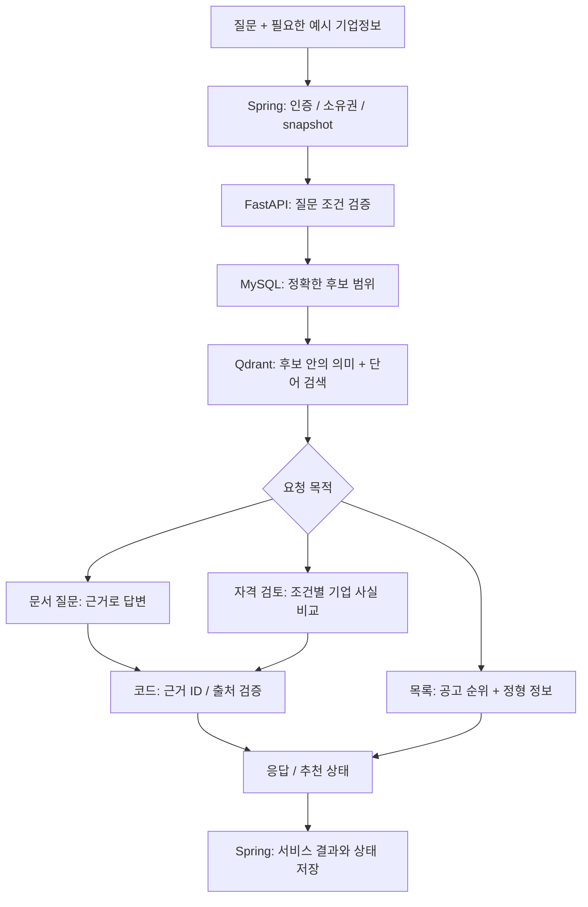
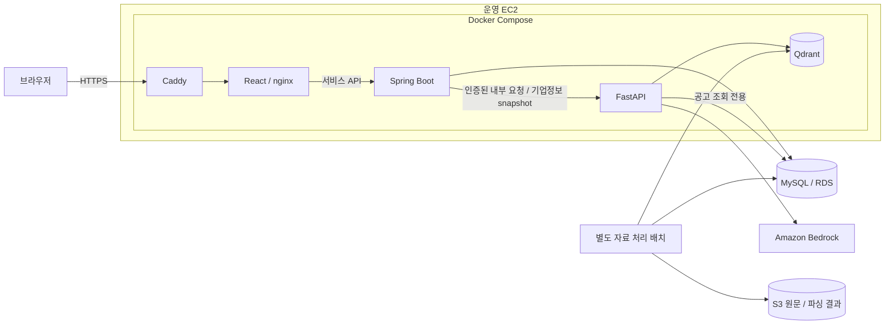
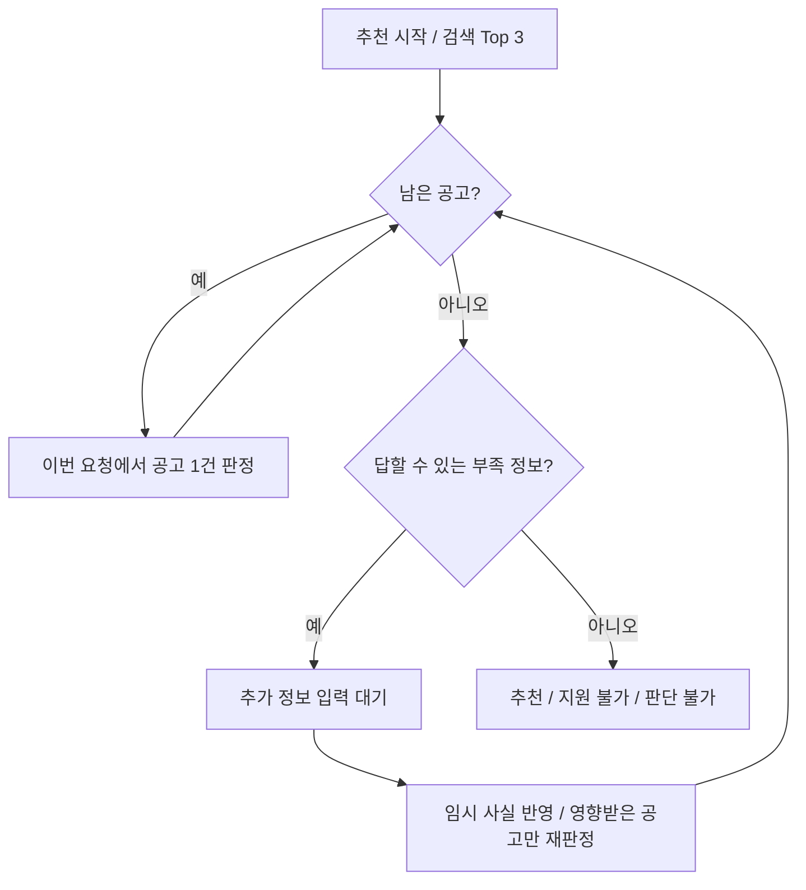

# BizAid AI — 프로젝트 마스터 가이드

> 기준일: **2026-10-07**. 프로젝트를 공부하고 면접에서 설명하기 위한 종합 학습 자료다. 다른 AI의 작업 인수인계에도 사용한다.
> 저장소의 코드·공통 계약·최신 문서와 개발 보고서를 대조했다. 운영 서버·AWS·실제 환경 파일은 이번 문서 작업에서 조회하지 않았다.
> **구현됨**, **과거 실행으로 확인됨**, **사용자가 운영 완료를 확인함**, **이번에 확인하지 않음**을 구분한다. 문서를 읽는 것만으로 새 작업·배포·데이터 변경이 승인되는 것은 아니다.

**공부할 때는 0절의 순서로 읽고, 실험은 18절, 숫자는 17절, 면접 답변은 21절에서 확인한다.** 연결한 코드와 보고서는 추가 확인용이다. 핵심 원리·문제·결정·결과·한계는 이 문서 안에 함께 적었다.

## 목차

- [0. 공부를 시작하는 사람을 위한 안내](#0-공부를-시작하는-사람을-위한-안내)
- [1. 다음 AI가 먼저 알아야 할 것](#1-다음-ai가-먼저-알아야-할-것)
- [2. 서비스 목적과 현재 상태](#2-서비스-목적과-현재-상태)
- [3. 전체 구조와 책임 경계](#3-전체-구조와-책임-경계)
- [4. 저장소 지도와 코드 진입점](#4-저장소-지도와-코드-진입점)
- [5. 화면과 사용자 흐름](#5-화면과-사용자-흐름)
- [6. 공개 API와 내부 API](#6-공개-api와-내부-api)
- [7. Spring 서비스와 데이터 소유권](#7-spring-서비스와-데이터-소유권)
- [8. 데이터 수집과 원문 보존](#8-데이터-수집과-원문-보존)
- [9. 문서 파싱과 표·OCR 처리](#9-문서-파싱과-표ocr-처리)
- [10. 조각·임베딩·식별값](#10-조각임베딩식별값)
- [11. 검색·질문 해석·근거 답변](#11-검색질문-해석근거-답변)
- [12. 기업정보 기반 순위와 자격 판정](#12-기업정보-기반-순위와-자격-판정)
- [13. LangGraph 추천 상태와 동시성](#13-langgraph-추천-상태와-동시성)
- [14. 인증·사용량·개인정보](#14-인증사용량개인정보)
- [15. 개발·운영 설정과 로컬 실행](#15-개발운영-설정과-로컬-실행)
- [16. 운영·배포·복원·모니터링](#16-운영배포복원모니터링)
- [17. 테스트·평가·실제 수치](#17-테스트평가실제-수치)
- [18. 기술 판단·실패·남은 한계](#18-기술-판단실패남은-한계)
- [19. AI 작업 절차와 변경별 확인](#19-ai-작업-절차와-변경별-확인)
- [20. 근거 문서와 이 문서의 유지 방법](#20-근거-문서와-이-문서의-유지-방법)
- [21. 면접에서 설명할 이야기와 질문](#21-면접에서-설명할-이야기와-질문)
- [22. 이 프로젝트의 용어를 쉬운 말로](#22-이-프로젝트의-용어를-쉬운-말로)

## 0. 공부를 시작하는 사람을 위한 안내

### 먼저 이 문장으로 프로젝트를 설명한다

**“기업마당 지원사업을 검색하고, 공고문에 적힌 조건을 예시 기업정보와 비교해 신청 가능 여부와 근거를 보여 주는 웹 서비스입니다.”**

정형 공고에는 사업명·지원 분야·대상·신청기간이 있다. 자세한 업력·매출·신용·제외 조건은 첨부 문서에 흩어져 있다. 이 둘을 함께 다뤄야 사용자가 원하는 사업을 찾고 왜 가능한지 이해할 수 있다.

단순히 문서를 챗봇에 넣는 데서 끝내지 않았다. 정형 사실은 DB, 문서 검색은 RAG, 자연어 해석은 LLM에 맡기고, 로그인·상태 저장·사용량·배포·감시를 붙여 실제 웹 서비스로 연결했다. 운영 주소는 **https://biz-aid.cloud**다. 실제 회사정보를 받는 사업 서비스가 아니라 예시 정보로 이용하는 포트폴리오 데모다.

### 공부 순서와 이해했는지 확인하는 질문

| 순서 | 이 문서에서 읽을 곳 | 이해할 내용 | 스스로 설명해 볼 질문 |
| --- | --- | --- | --- |
| 서비스부터 | 2·5절 | 무엇을 찾고 어떤 결과를 주는가 | 일반 검색·문서 질문·맞춤 추천은 어떻게 다른가? |
| 전체 구조 | 3·4·6절 | React → Spring → FastAPI와 저장소 역할 | Spring과 FastAPI를 나눈 이유는 무엇인가? |
| 일반 서버 | 7·14절 | 인증·권한·DB·사용량 | AI 호출 실패 때 사용 횟수를 어떻게 처리하는가? |
| 자료 준비 | 8·9절 | 수집·원문 보존·PDF/HWP/HWPX·표·OCR | 파싱 프로그램이 성공하면 문서 내용도 정확한가? |
| 검색 기반 | 10·11절 | chunk·벡터·dense/sparse·RRF·근거 | 정답 문서를 찾은 것과 정답 문장을 찾은 것은 왜 다른가? |
| 개인화·판정 | 12·13절 | 후보 필터·순위·조건 판정·추천 상태 | 정보가 없을 때 탈락시키는가, 추가로 묻는가? |
| 개선 과정 | 17·18절 | 비교 실험·선택 이유·실측·미해결 | 좋아진 지표와 여전히 안 되는 사례를 함께 말할 수 있는가? |
| 운영·품질 | 15·16·19절 | 환경 분리·배포/복구·감시·Harness | 이미지 되돌리기로 DB까지 되돌아가는가? |
| 면접 연습 | 21절 | 짧은 소개·대표 문제·꼬리 질문 | 수치의 날짜·표본·환경까지 말할 수 있는가? |

**코드를 전부 읽기 전에, 다음 핵심 연결을 설명할 수 있게 한다:** 회사정보는 Spring이 소유한다 → 필요한 사실만 FastAPI에 전달한다 → DB로 후보를 좁힌다 → 후보 안의 문서를 찾는다 → LLM이 조건을 비교한다 → 코드가 근거와 최종 상태를 검증한다.

### 기술이 각각 어디에 쓰이는가

| 기술 | 이 프로젝트에서 하는 일 | 공부할 핵심 |
| --- | --- | --- |
| React·TypeScript·Vite | 검색·기업정보·추천 화면 | 컴포넌트·입력 상태·타입·서버 응답 표시 |
| React Router·TanStack Query | URL 이동·서버 데이터 조회/캐시 | 새로고침 복원과 서버 상태, AI 중복 요청 방지 |
| Spring Boot·Java | 인증·서비스 API·기업정보·추천 상태 | 유스케이스·소유권·트랜잭션·오류 경계 |
| Spring Security·JWT | 로그인 사용자 식별·접근 통제 | Access/Refresh 수명·쿠키·탈퇴 뒤 토큰 무효화 |
| JPA·QueryDSL | 회원/기업 CRUD·조건별 공고 조회 | Entity와 동적 조회를 구분하는 이유 |
| MySQL·RDS·Flyway | 서비스 사실·공고 metadata·스키마 변경 이력 | FK·트랜잭션·version·migration checksum |
| FastAPI·Pydantic | Spring이 부르는 Python 내부 API | 입력 검증·공유 키·JSON 계약·안전한 오류 |
| SQLAlchemy Core | Python의 정형 공고 후보/metadata 접근 | Spring 소유 회원·기업 테이블을 조회하지 않는 경계 |
| Docling·PP-TableMagic·PP-OCRv5 | 문서 공통 표현·표 구조·글자 인식 | 원문·좌표·품질 상태를 보존하는 이유 |
| BGE-M3·PyTorch·Transformers | 문서/질문의 dense·sparse 벡터 | 의미·단어 검색, 동일 모델/설정으로 색인과 조회 |
| Qdrant·RRF | 후보 범위 벡터 검색·검색 순위 결합 | chunk와 공고의 검색 단위, 점수 대신 순위 결합 |
| Ollama·Amazon Bedrock | 자연어 조건 추출·답변·조건별 비교 | 로컬 모델과 관리형 모델 비교, 출력 계약/기한 |
| LangChain | Ollama 호출의 prompt·schema·stream 경계 | framework가 맡은 부분과 직접 구현한 판단 구분 |
| LangGraph | 검색·판정·추가 질문·재판정의 단계 분기 | 장기 상태는 Spring에 저장, 한 요청 한 단계 |
| LangSmith | 개발에서 선택적으로 단계·시간·token 관측 | 질문/회사/문서 본문을 외부에 보내지 않는 설계 |
| S3·SHA-256 | 원본·파싱 자료 저장·무결성·중복 식별 | 원본 파일과 공고별 관계를 따로 보존 |
| Docker Compose·buildx·Docker Hub | 서비스 실행·플랫폼 지정 빌드·이미지 전달 | 서버 빌드 없이 고정 버전 배포·서비스별 태그 |
| Caddy·nginx | HTTPS 입구·React 제공·API 전달 | Caddy와 앱 API의 역할, 비공개 내부 서비스 |
| EC2·IAM·CloudWatch·SNS·UptimeRobot | 서버·역할 기반 AWS 접근·상태/자원/장애 감시 | 키 파일 없이 접근, 감시가 보장하는 범위 |
| unittest·H2·Vitest·GitHub Actions·Harness | 규칙·DB·화면 검사와 CI·작업 관리 | 코드 테스트와 실제 AI 품질 평가의 차이 |

버전은 “최신 기술을 썼다”는 표현 대신 저장소 고정값으로 설명한다. Java 21·Spring Boot 3.5.16·Python 3.11·React 19 계열이다. 근거는 [backend/build.gradle](backend/build.gradle), [frontend/package.json](frontend/package.json), [CI](.github/workflows/ci.yml), [Python 질문 서버 의존성](data-pipeline/requirements-api.txt)이다. 모든 package 버전을 외우기보다 역할과 선택 이유를 먼저 이해한다.

### 대표 요청을 끝까지 따라가기

| 요청 | 실제 흐름 | 이해해야 할 차이 |
| --- | --- | --- |
| `/programs`에서 필터 검색 | React → Spring Controller → QueryDSL → MySQL → 목록 | 정형 검색. Qdrant/LLM이 필요하지 않음 |
| “소상공인 금융 지원사업 찾아줘” | React → Spring → FastAPI → 질문 조건 추출 → MySQL 후보 → Qdrant 공고 단위 검색 → 목록 | LLM은 필요한 질문 해석에 사용. 목록을 쓰는 추가 LLM 없음 |
| 선택한 공고의 대출한도 질문 | Spring → FastAPI → 그 공고의 chunk 검색 → LLM 답변 → 코드의 citation 연결 | 근거가 검색 범위를 벗어나면 거부. 없는 정보를 보완해서 답하지 않음 |
| 예시 기업으로 맞춤 추천 | Spring의 기업 snapshot → 개인화 후보·순위 Top 3 → 공고별 다음 단계 판정 → 부족 정보 입력 → 재판정/최종 결과 | 순위와 신청 자격은 별개. 다음 단계와 저장/권한도 다른 책임 |
| 지난 추천 다시 열기 | React → Spring의 저장된 workflow 조회 → 화면 복원 | 조회만으로 AI를 다시 호출하지 않음 |



이 그림은 필요한 단계의 역할을 보여 준다. 특정 공고를 이미 선택했거나 수동 필터를 쓴 요청은 자연어 조건 추출을 생략할 수 있다. 모든 요청에서 같은 수의 LLM 호출이 생기는 것은 아니다.

### 공부할 코드의 최소 경로

| 주제 | 먼저 볼 파일·함수 | 함께 보면 이해되는 테스트 |
| --- | --- | --- |
| 화면에서 API까지 | [App](frontend/src/App.tsx) → [client](frontend/src/shared/api/client.ts) → [HttpAiGateway](backend/src/main/java/com/bizaid/ai/infrastructure/HttpAiGateway.java) → [app.py](data-pipeline/src/biz_aid_pipeline/api/app.py) | [화면 흐름](frontend/src/app.test.tsx), [Spring↔AI](backend/src/test/java/com/bizaid/AiGatewayIntegrationTest.java) |
| 일반 검색과 질문 분기 | [runtime](data-pipeline/src/biz_aid_pipeline/runtime.py)의 `answer_query` → [natural](data-pipeline/src/biz_aid_pipeline/candidates/natural.py)의 `extract` → [router](data-pipeline/src/biz_aid_pipeline/rag/router.py) | [질문 조건](tests/contract/test_natural_filter.py) |
| RRF·공고 단위 검색 | [retriever](data-pipeline/src/biz_aid_pipeline/retrieval/retriever.py)의 `search`·`search_programs`·`rrf` | [검색 계약](tests/contract/test_document_retrieval.py) |
| 기업 순위 | [personalized](data-pipeline/src/biz_aid_pipeline/candidates/personalized.py)의 `company_query`·`blend_rankings` | [개인화 검색](tests/contract/test_personalized_search.py) |
| 출처와 최종 판정 | [rag/service](data-pipeline/src/biz_aid_pipeline/rag/service.py)·[eligibility/service](data-pipeline/src/biz_aid_pipeline/eligibility/service.py)의 `validate`·`overall_status` | [근거 답변](tests/contract/test_rag_answer.py), [자격 판정](tests/contract/test_eligibility.py) |
| 추천 상태·동시 진행 | [Python graph](data-pipeline/src/biz_aid_pipeline/workflow/recommendation.py)의 `build_graph` → [Spring workflow](backend/src/main/java/com/bizaid/ai/application/RecommendationWorkflowService.java)의 `claim`·`step` → [RecommendPage](frontend/src/features/recommend/RecommendPage.tsx) | [추천 흐름](tests/contract/test_recommendation_workflow.py), [Spring↔AI](backend/src/test/java/com/bizaid/AiGatewayIntegrationTest.java) |
| 문서/표 손실 | [pdf_tables](data-pipeline/src/biz_aid_pipeline/parsing/pdf_tables.py)의 `assess_table`·[pdf](data-pipeline/src/biz_aid_pipeline/parsing/pdf.py) | [표 평가](tests/contract/test_table_engine_eval.py), [PDF 파싱](tests/contract/test_document_parsing_pdf.py) |
| 조각·벡터·식별값 | [chunker](data-pipeline/src/biz_aid_pipeline/chunking/chunker.py)의 `chunk_document` → [embedder](data-pipeline/src/biz_aid_pipeline/indexing/embedder.py)의 `embedding_identity`·`encode` | [조각](tests/contract/test_document_chunking.py), [색인](tests/contract/test_document_indexing.py) |
| 가입 지연·트랜잭션 | [ActivityLogService](backend/src/main/java/com/bizaid/activity/application/ActivityLogService.java)의 `success`와 `afterCommit` | [ActivityLogTest](backend/src/test/java/com/bizaid/ActivityLogTest.java) |
| 사용량·배포 안전장치 | [AiUsageService](backend/src/main/java/com/bizaid/usage/application/AiUsageService.java)·[release](scripts/release.sh)·[deploy](scripts/deploy.sh) | [공개 서비스](backend/src/test/java/com/bizaid/PublicServiceTest.java), [릴리스](tests/contract/test_release.py), [배포](tests/contract/test_deploy.py) |

읽을 때는 **입력 → 판단 → 저장/응답 → 오류 → 테스트가 막는 실패** 순서로 메모한다. 클래스 이름을 외우는 것보다, “이 책임을 다른 계층에 두면 어떤 문제가 생기는가”를 설명하는 것이 중요하다.

### 숫자를 읽는 규칙

| 표시 | 의미 | 면접에서 붙일 설명 |
| --- | --- | --- |
| 설정값 | 코드/계약의 제한·차원·가중치 | 왜 그 경계를 두었는지. 성능 측정값은 아님 |
| 실측 | 날짜·입력·환경이 기록된 실행 | 표본과 환경을 함께 말한다. 운영 전체 성능으로 확대하지 않음 |
| 추정 | 도입 후보의 예상 비용·메모리·시간 | 실제 도입하거나 실측한 성과로 말하지 않음 |
| 미실행/오류 | 실행하지 않았거나 채점할 수 없던 결과 | 성공/실패에 임의로 섞지 않는다 |

핵심 수치는 17절에 모았다. 특히 **20/20 PASS는 고정 평가의 통과율**, **Hit@3는 정답 근거 순위**, **critical-token recall은 중요한 원문 수치 보존**이다. 세 가지를 모두 “AI 정확도”라고 부르면 설명이 틀어진다.

## 1. 다음 AI가 먼저 알아야 할 것

### 시작할 때

1. 사용자의 **현재 요청**과 `git status --short --branch`를 확인한다. 기존 staged·unstaged 작업을 보존한다.
2. [AGENTS.md](AGENTS.md), [현재 Task](harness/workspace/current-task.md), [작업 절차](harness/docs/workflow.md), [Git 정책](harness/rules/git-policy.md)를 읽는다.
3. 이 문서에서 해당 기능을 찾고, 연결된 **실제 코드·계약·테스트**를 열어 변경 범위를 확인한다.
4. 새 Task라면 기존 current-task와 검토 상태를 Report에 보존한 뒤 Task와 Registry.report를 맞춘다. 기존 Task를 이어가는 인수인계라면 제어 파일의 개발자 이름만 바꾸지 않는다.

### 판단 기준

| 질문 | 기준 |
| --- | --- |
| 무엇을 해도 되는가? | 현재 사용자 요청과 승인 범위. 문서의 다음 작업 목록은 자동 실행 지시가 아니다. |
| 무엇이 구현돼 있는가? | 현재 production code와 공통 계약. 최신 실행 보고서의 시점·범위를 함께 확인한다. |
| 지금 해야 할 일은 무엇인가? | 현재 Task와 사용자의 추가 지시. 이 문서에 특정 Task를 영구 고정하지 않는다. |
| 과거에 검증됐는가? | 실제 종료 코드·표본·환경이 있는 Report. 코드 존재나 문서 문장만으로 PASS를 만들지 않는다. |
| 최초 설계와 현재 구현이 다른가? | [PROJECT_DESIGN](PROJECT_DESIGN.md)은 최초 목표·배경이다. 현재 구현을 그 목표에 맞춘다고 임의로 확장하지 않는다. |
| 로컬 보고서가 없는 새 환경인가? | 새 Generated Report는 Git에서 제외될 수 있다. 없으면 해당 실험의 재현 여부는 미확인으로 남긴다. |

### 반드시 유지할 경계

- 개발은 `dev`에서 한다. 별도 요청 없이 commit·push·merge·force push·브랜치 삭제를 하지 않는다.
- 실제 `.env`, `.env.dev`, `.env.prod`, AWS 인증 파일과 비밀값을 임의로 열거나 출력하지 않는다. 이름·필요 변수·참조 경로만 다룬다.
- 실제 build/push·운영 서버 접속·AWS 변경·실모델 호출·대량 데이터 처리·DB migration 적용은 현재 요청의 승인 범위를 먼저 확인한다.
- React는 Spring만 호출한다. Spring의 인증·기업정보를 우회해 FastAPI나 DB를 직접 연결하지 않는다.
- FastAPI는 회원·기업·대화·추천 상태 테이블을 직접 읽거나 쓰지 않는다.
- 적용된 Flyway migration·동결 V1 평가·원본 자료·기존 식별값·벡터를 임의 변경하지 않는다.
- 새 코드·계약·규칙을 ignore로 숨기지 않는다. 검사를 약화해 성공시키거나 개발자가 AGY 승인 기록을 만들지 않는다.

이 프로젝트는 공개 포트폴리오다. 새 문서·코드·이미지·로그에 실제 AWS 계정 번호·서버 IP·버킷 이름·ARN·이메일·토큰·비밀번호를 넣지 않는다. 예시는 가상 값으로 작성한다.

## 2. 서비스 목적과 현재 상태

**BizAid AI는 기업마당 공고와 첨부 공고문을 함께 사용해 중소기업 지원사업을 검색하고, 예시 기업정보로 지원 자격을 미리 검토하는 서비스다.**

운영 주소: **https://biz-aid.cloud**. 사용자가 2026-10-05 운영 배포 완료를 확인했다. 실제 사용자가 제공한 회사 정보를 받기 위한 서비스가 아니라 포트폴리오 데모다.

공공 API에는 공고명·기관·분야·대상·신청기간이 있다. 업력·매출·신용점수·제외 사유·자부담 등 세부 조건은 PDF·HWP·HWPX 문서 안에 있다. 그래서 정형 조회와 문서 근거 검색을 함께 사용한다.

| 범위 | 현재 저장소 상태 |
| --- | --- |
| 데이터 파이프라인 | 정형 수집, 첨부 수집, S3 보관, 파싱, 조각 생성, 임베딩, 별도 V2 색인 구현 |
| 검색·RAG | MySQL 후보 필터, 공고 단위 hybrid 검색, 특정 공고 선택, 근거 답변·출처 검증 구현 |
| 맞춤 추천 | 기업정보 후보 필터·순위 반영, 상위 3개 자격 판정, 부족 정보·재판정·최종 결과 구현 |
| 웹 서비스 | React ↔ Spring ↔ FastAPI 연결, 가입·체험·기업정보·공고·대화·계정 관리 구현 |
| 운영 도구 | Caddy/Compose/RDS/Bedrock 설정, 복원, 서비스별 버전, 한 줄 배포·되돌리기, 점검·SNS 알림 구현 |
| AI 관측 | 개발에서 선택적 LangSmith. 운영에서는 설정과 관계없이 외부 추적 비활성 |
| 확인 한계 | 현재 운영 이미지 태그·AWS 리소스 상태·개별 최신 수정의 운영 반영 여부는 이번에 확인하지 않음 |

**운영 중이라는 사실과 저장소 최신 변경이 운영에 반영됐다는 사실은 다르다.** 이전의 `20261005-03`은 최초 운영 기록의 태그이며 현재 서버 태그로 단정하지 않는다.

### 데이터 상태의 시간 구분

| 기록 시점 | 기록된 상태 | 해석 |
| --- | --- | --- |
| V1 기준선 | 100-source 검증 자료, 3,849 point | 평가 재현용 동결. 서비스 갱신 대상 아님 |
| 2026-10-03 V2 적재 기록 | 2,776원본·64,041 point, 기준일 서비스 범위 1,372공고 | 해당 시점의 적재/완전성 수치 |
| 2026-10-05 배포 자료 | 공고 1,554건, 문서 source 3,288건, V2 60,362 point | 후속 정리 뒤 만든 배포 스냅샷 수치. 앞 시점과 합산하지 않음 |
| 이번 문서 작업 | 실제 DB·Qdrant 개수 미조회 | 위 숫자를 현재 서버 실측이라고 쓰지 않음 |

운영 공고 자료는 배포 때 준비한 고정 자료다. 자동 수집·갱신 작업은 없다. 과거 종료 공고 정리와 재생성 도구가 구현된 것과 주기 갱신이 켜진 것은 다르다.

## 3. 전체 구조와 책임 경계



| 구성 | 소유하는 일 | 맡기지 않는 일 |
| --- | --- | --- |
| React | 화면, 입력, 서버 상태 캐시, 사용자가 요청한 추천 진행 | 자격 최종 계산, 공고 후보/순위 생성, AI 직접 호출 |
| Spring | 인증·기업정보·대화·사용 횟수·추천 상태·동시성, 공고 정형 조회 | Python 검색/판정 로직의 재구현 |
| FastAPI | 받은 사실과 상태로 질문 해석·검색·판정·추천 단계 실행 | Spring 소유 데이터의 직접 조회·수정, 상태의 자체 영구 저장 |
| MySQL | 정확한 정형 공고와 서비스 사실, 문서 상태·식별 metadata | 문서 의미 검색 |
| Qdrant | 문서 조각의 의미·단어 벡터 검색 | 모집 상태·날짜·회원 권한 결정 |
| S3 | 원본과 파싱 결과 보관 | 실시간 질문의 직접 검색 |
| LLM | 질문 조건 추출, 근거 설명, 조건별 비교 | SQL 생성, 근거 URL 창작, 최종 자격 상태 결정 |
| 자료 처리 배치 | 원문·정형 데이터·문서·색인 생성과 이력 | 회원/대화 도메인 변경 |

기본 원칙: **DB가 아는 사실은 코드와 DB로, 문서는 RAG로, 해석이 필요한 부분은 LLM으로 처리한다.**

Caddy는 HTTPS 인증서 발급·갱신, 대표 도메인 전달, www 영구 이동, 보안 헤더를 담당한다. frontend nginx는 React 파일을 제공하고 `/api`를 Spring에 전달한다. FastAPI·Qdrant·RDS를 브라우저에 공개하지 않는다.

개발에서는 Caddy 없이 frontend nginx 또는 Vite proxy를 사용하고 MySQL도 로컬 Compose에서 실행한다. 운영 Compose에는 MySQL 컨테이너가 없으며 외부 RDS를 사용한다.

## 4. 저장소 지도와 코드 진입점

| 위치 | 역할 / 먼저 볼 파일 |
| --- | --- |
| `frontend/` | React UI. [App.tsx](frontend/src/App.tsx), `features/`, `shared/` |
| `backend/` | Spring 서비스. [backend 안내](backend/README.md), `src/main/java/com/bizaid/` |
| `data-pipeline/src/biz_aid_pipeline/` | 제품 Python 코드. [runtime.py](data-pipeline/src/biz_aid_pipeline/runtime.py), [API app.py](data-pipeline/src/biz_aid_pipeline/api/app.py) |
| `migrations/` | Spring·Python이 공유하는 유일한 Flyway 계보 |
| `contracts/` | 외부 API·Frontend/Backend·Backend/AI 경계와 기계 계약 |
| `scripts/` | 실행·배포·복원·검사 CLI. 제품 판단 로직은 해당 package에 둔다. |
| `infra/` | 개발 DB 준비와 HWP 변환 컨테이너 |
| `evals/` | 동결 입력으로 검색·AI·표 품질을 재는 평가 도구 |
| `tests/contract/`, `tests/integration/` | Python 규칙·오프라인 테스트 / 격리 MySQL 통합 테스트 |
| `docs/` | 운영·설정·AI 개선 비교. `docs/images/`에 README 설명 PNG가 있고 실제 화면 캡처·영상은 별도 준비 대상 |
| `harness/` | 작업 범위·규칙·Registry·검증·보고서·Backlog |
| `data/`, `models/`, `certs/` | 원문·생성물·모델·인증서. Git 제외. 공개 소스에 실제 자료·키를 추가하지 않는다. |

### Python package별 역할

| package | 주요 경계 |
| --- | --- |
| `config` | 프로필·변수·운영 안전 검증. 실제 설정값을 문서로 복사하지 않음 |
| `bizinfo`, `ingestion`, `persistence`, `quality` | API 원문·정규화·FULL 검증·공고 DB 적재 |
| `documents`, `storage` | 첨부 relation·형식 확인·ZIP 멤버·S3 검증 보관 |
| `parsing` | PDF/HWP/HWPX/이미지/오피스 → 공통 DoclingDocument |
| `chunking`, `indexing` | 파싱 결과 → FinalChunk → BGE-M3 벡터·Qdrant |
| `retrieval` | 읽기 전용 검색. 저장·upsert·파싱 코드를 호출하지 않음 |
| `candidates` | 정형 후보, 질문 조건, 공고 단위 검색·개인화 순위·지역 조건 |
| `rag` | LLM provider, 근거 답변, 목록/질문 분기 |
| `eligibility` | Profile 기반 공고 자격 판정·상위 공고 판정 |
| `workflow` | LangGraph 단계·추가 정보·재판정·최종 묶음 |
| `api`, `observability` | 내부 HTTP 직렬화·인증 / 민감정보 제외 추적 |

[ServiceRuntime](data-pipeline/src/biz_aid_pipeline/runtime.py)은 CLI와 FastAPI가 함께 쓴다. DB pool·Qdrant·provider를 재사용하고 BGE-M3 Retriever는 처음 필요할 때 잠금 안에서 만들어 재사용한다. 요청마다 무거운 모델을 생성하지 않는다.

## 5. 화면과 사용자 흐름

| URL | 화면 | 로그인·기업정보 조건 |
| --- | --- | --- |
| `/` | 서비스 소개·가입 없이 체험 | 비로그인 소개. 로그인 사용자는 `/ai`로 이동 |
| `/login` | 로그인·회원가입·체험 진입 | 가입 동의 입력. 회사정보 등록 폼은 별도 |
| `/ai` | AI 검색·공고 질문·대화 기록 | 로그인 필요. 기업정보가 없으면 전체 지역에서 검색 가능 |
| `/programs` | 일반 공고 목록·필터 | 공개 조회 |
| `/programs/:pblancId` | 공고 상세·지원 가능 여부 | 공고는 공개. 자격 판정은 로그인·기업정보 필요 |
| `/company` | 내 기업정보 등록·수정 | 로그인 필요. 일반 사용자당 기업정보 하나 |
| `/recommend/:workflowId?` | 추천 시작·진행·부족 정보·최종 결과 | 로그인·기업정보 필요. 주소의 ID로 상태 복원 |
| `/account` | 비밀번호 변경·회원 탈퇴 | 로그인 필요. 체험은 계정 변경 제한 |
| `/terms`, `/privacy` | 이용약관·개인정보 안내 | 공개 조회 |

회사정보 입력 안내는 [DemoCompanyNotice](frontend/src/shared/components/DemoCompanyNotice.tsx)를 재사용한다. 문구는 **실제 정보 대신 예시 정보를 넣어 주세요.** 이다. 적용 위치는 회사정보 등록/수정, 추천 추가 정보 폼, 공고 상세 신용점수/체납 폼이다.

체험은 미리 정한 예시 기업정보를 가진 계정을 만들어 `/ai`로 보낸다. 체험 기업정보를 수정하지 못한다. 부족 정보 입력과 단일 자격 확인은 예시 값으로 이용한다. 체험 계정은 24시간 뒤 정리한다.

React는 TanStack Query로 서버 상태를 관리한다. `frontend/src/shared/api/client.ts`가 요청·오류·재발급을 처리하며 Access Token을 메모리에 둔다. 화면의 빈 결과·로딩·추가 정보·실패는 실제 서버 응답대로 표시한다.

**오래된 주석 주의:** 일부 App/RequireCompany 설명에는 AI 검색도 기업정보 등록이 필요하다고 남아 있지만, 현재 [AiSearchPage](frontend/src/features/ai/AiSearchPage.tsx)는 기업정보 없는 사용자의 전체 지역 검색을 허용한다. 추천의 RequireCompany와 혼동하지 않는다. 이번 문서 작업에서 앱 주석/동작은 수정하지 않았다.

## 6. 공개 API와 내부 API

정확한 입력·응답 필드는 [Frontend/Backend 계약](contracts/frontend-backend/README.md), Controller/DTO, `frontend/src/features/*/*Api.ts`를 함께 확인한다. 아래는 탐색 지도다.

### Spring API

| 경로 | 메서드와 용도 | 주요 파일 |
| --- | --- | --- |
| `/api/health` | GET·HEAD, 공개 생존 확인 | `common/web/HealthController`, `auth/infrastructure/SecurityConfig` |
| `/api/auth/signup`, `/login`, `/refresh`, `/logout` | POST, 계정·토큰 수명 관리 | `auth/presentation/AuthController` |
| `/api/auth/trial` | GET 사용 가능 여부 / POST 체험 생성 | `AuthController`, `TrialService` |
| `/api/auth/me` | GET 로그인 사용자 | `AuthController` |
| `/api/account/password`, `/withdraw` | PUT 변경 / POST 탈퇴 | `AccountController`, `AccountService` |
| `/api/company`, `/regions` | GET·POST·PUT 기업정보 / GET 지역 목록 | `company/presentation/CompanyController` |
| `/api/programs`, `/filter-options`, `/{pblancId}` | GET 목록·선택지·상세 | `program/presentation/ProgramController` |
| `/api/conversations` | GET 목록 / POST 생성 | `conversation/presentation/ConversationController` |
| `/api/conversations/{id}`, `/{id}/messages` | DELETE 대화 / GET·POST 메시지 | `ConversationController` |
| `/api/ai/query` | POST 목록 검색 또는 문서 질문 | `ai/presentation/AiController`, `AiQueryService` |
| `/api/programs/{pblancId}/eligibility` | POST 단일 자격 판정 | `AiController`, `EligibilityService` |
| `/api/ai/personalized-search`, `/personalized-eligibility` | POST 개별 V2 검색/판정 API | `AiController`, 해당 Application Service |
| `/api/ai/workflows` | GET 과거 추천 / POST 추천 시작 | `ai/presentation/WorkflowController` |
| `/api/ai/workflows/{id}`, `/{id}/continue`, `/{id}/answers` | GET 복원 / POST 다음 단계·추가 사실 | `WorkflowController`, `RecommendationWorkflowService` |
| `/api/ai/usage` | GET 오늘 사용량 | `usage/presentation/UsageController` |

표에서 묶어 쓴 경로는 앞의 기본 경로 아래에 붙는다. 예: `/api/company/regions`, `/api/auth/login`. 실제 메서드별 공개 여부는 SecurityConfig를 확인한다.

### FastAPI 내부 API

| 경로 | 기능 |
| --- | --- |
| `GET /health` | AI process 생존 확인. 전체 DB·모델 품질 확인 아님 |
| `POST /internal/v1/query` | 목록/문서 질문 |
| `POST /internal/v1/eligibility` | 단일 공고 자격 판정 |
| `POST /internal/v2/personalized-search` | 기업 조건 후보·순위 |
| `POST /internal/v2/personalized-eligibility` | 상위 공고 자격 판정 API |
| `POST /internal/v2/workflows/start` | 저장된 기업 snapshot으로 추천 시작 |
| `POST /internal/v2/workflows/advance` | 받은 State로 진행/추가 답변 단계 실행 |

내부 API는 `X-Internal-Api-Key` 헤더로 인증한다. 값은 환경으로 주입하며 공개하지 않는다. Browser → FastAPI 직접 호출용 CORS를 열지 않는다. `data-pipeline/src/biz_aid_pipeline/api/app.py`는 검증·직렬화·호출만 맡는다.

FastAPI JSON은 snake_case, Java·React DTO는 camelCase다. [HttpAiGateway](backend/src/main/java/com/bizaid/ai/infrastructure/HttpAiGateway.java)의 전용 ObjectMapper가 변환하며 알 수 없는 응답 필드는 무시한다. 새 필드가 앱 동작에 꼭 필요하면 DTO·UI·계약·테스트를 함께 확인한다.

`NO_CANDIDATES`, `NO_INDEXED_PROGRAMS`, `SELECTION_REQUIRED`, `INSUFFICIENT_EVIDENCE`, `INELIGIBLE`, `NEEDS_MORE_INFO` 같은 결과는 사업 판단 결과이며 통신 장애와 구분한다. 사업 결과를 로그인 실패/서버 장애로 바꾸지 않는다.

Spring은 upstream 내부 인증 실패를 사용자 401로 내보내지 않는다. 503은 AI 사용 불가, 시간 초과는 504, 그 밖의 upstream 실패는 지정된 안전한 오류 코드로 변환한다. 상세 예외·본문·비밀값을 사용자에게 반사하지 않는다.

## 7. Spring 서비스와 데이터 소유권

### 코드 구성

`backend/src/main/java/com/bizaid/`는 도메인별 `auth`, `company`, `program`, `conversation`, `ai`, `activity`, `usage`, 공통 `common`으로 나뉜다.

| 내부 계층 | 내용 |
| --- | --- |
| presentation | Controller, 요청/응답 DTO, 입력 검증 |
| application | 유스케이스·트랜잭션·권한·서비스 연결 |
| domain | Entity·값·상태 규칙 |
| infrastructure | JPA·QueryDSL·JWT·외부 HTTP·설정 구현 |

의존 방향은 presentation → application → domain이다. 공통 폴더에는 여러 도메인이 실제 공유하는 것만 둔다. 별도 Aggregate/Port/Event 체계를 필요 없이 추가하지 않는다.

CRUD는 JPA, 선택 조건이 많은 공고 조회는 QueryDSL을 쓴다. 공고 데이터는 파이프라인 소유이므로 Spring이 임의 수집·갱신하지 않는다. AI 호출은 `AiGateway` 경계와 `HttpAiGateway` 한 곳에 모은다.

### 테이블과 소유권

| 테이블 | 역할 / 소유 계층 |
| --- | --- |
| `support_programs`, `support_program_sync_history` | 정형 공고와 수집 이력 / 파이프라인 |
| `document_acquisition_runs`, `document_sources` | 첨부 relation·원본 형식·SHA·보관 위치 / 파이프라인 |
| `document_parse_results`, `document_archive_members` | 버전별 파싱 상태·압축 멤버 / 파이프라인 |
| `users`, `refresh_tokens`, `login_throttles`, `user_consents` | 계정·인증·동의 / Spring |
| `companies` | 사용자당 하나의 회사 snapshot 기준 / Spring |
| `conversations`, `messages` | 대화와 AI 결과 JSON / Spring |
| `ai_workflows` | 추천 State JSON·진행 상태·version / Spring |
| `ai_usage_counters` | 계정·IP·체험·전체·가입 요청 횟수 / Spring |
| `activity_logs` | 성공/실패와 안전한 요약 / Spring |

FastAPI의 SQLAlchemy Core repository는 공고 후보·정형 metadata를 조회한다. `users`·`companies`·`ai_workflows`를 직접 읽지 않는다. 새로운 서비스 사실은 Spring에서 snapshot으로 전달한다.

### Flyway 계보

| migration | 핵심 변경 |
| --- | --- |
| V1·V2 | 정형 공고·실행 이력 / 한국어 COMMENT |
| V3·V4·V5 | 문서 source / S3 검증 위치 / parse 결과 |
| V6·V7·V8·V9 | 회원·기업·대화 / AI JSON / 활동 기록 / 추천 상태 |
| V10·V11 | 일반 ZIP 멤버 / 기업 지역 표준명 |
| V12·V13 | 로그인 제한·계정 관리 / 체험·동의·사용량 |
| V14·V15 | 한도·IP 예약/환불 설명 COMMENT |

DDL의 유일한 소유자는 [migrations](migrations/README.md)다. Python에 Alembic/자동 DDL을 만들지 않는다. Spring도 같은 계보를 사용한다. 이미 적용된 파일은 checksum이 보존돼야 하므로 수정 대신 새 migration을 작성한다. 작성과 실제 적용의 승인은 구분한다.

## 8. 데이터 수집과 원문 보존

### 정형 공고

```text
기업마당 API → 응답 원문/metadata/SHA 보존 → 타입 검증 → 정규화
→ source fingerprint → MySQL transaction → 실행/완전성 기록
```

- 공고 기준 키는 `pblanc_id`다. unknown field, 누락·null·빈 문자열 차이는 원본 JSON에 보존한다.
- HTML·URL·파일명·자유형 신청기간을 임의로 깨끗하게 만들어 원문을 덮지 않는다. 화면용 정제·파생 날짜는 분리한다.
- 실제 날짜 범위만 파생한다. “예산 소진시까지”처럼 종료일을 모르는 값은 UNKNOWN으로 남긴다.
- fingerprint는 정규화된 source JSON의 SHA-256이다. `created_at`, 관측 실행 ID 같은 운영 상태를 내용 hash에 섞지 않는다.
- INSERT·변경 UPDATE·CONTENT_NOOP을 구분한다. 동일 내용은 source 내용과 수정 시각을 다시 쓰지 않고 관측 상태만 갱신한다.

`source_active`는 API universe에서 관측됐다는 의미이며 “지금 신청 가능”과 다르다. SAMPLE/PARTIAL에서 보이지 않았다고 삭제하지 않는다. FULL은 모든 page·totalCount·ID·중복·정규화·transaction 검증을 통과해야 한다.

dev FULL의 미관측 처리에는 DRY-RUN 안전 경계가 있다. 과거 결과만으로 실제 soft-delete를 적용하지 않는다. 물리 삭제 경로를 추가하지 않는다. 중단된 실행의 page를 다른 시점 실행과 혼합하지 않는다.

### 첨부와 S3

`documents/`는 후보 URL/redirect/크기/실제 형식을 검증하고 원본 SHA를 기준으로 저장한다. 공고 relation과 파일 본문은 다른 개념이다. 같은 원본이 여러 공고에 연결될 수 있다.

S3에는 검증된 원본 binary와 DoclingDocument JSON을 보관한다. MySQL은 검증된 pointer·SHA·크기·상태를 보관한다. 기존 로컬 corpus는 원문 이사/복원 증거이므로 임의 삭제하지 않는다.

일반 ZIP은 압축을 제한된 깊이로 풀어 `document_archive_members`로 관리한다. 안전한 멤버만 실제 형식별 parser로 넘긴다. HWPX도 ZIP container 형식이지만 전용 parser가 읽으며 일반 ZIP 처리와 섞지 않는다.

새 Run은 고유 run-id를 사용한다. DB commit과 파일 Report 저장은 별도라 Report 쓰기 실패가 DB rollback을 뜻하지 않는다. 실제 DB 결과와 보고서 실패를 구분해서 복구한다.

주요 CLI는 [data-pipeline 안내](data-pipeline/README.md)에 있다. `collect`·S3 이사·대량 파싱·색인 명령은 자료/비용/DB를 바꾸므로 문서 읽기만으로 실행하지 않는다.

## 9. 문서 파싱과 표·OCR 처리

공통 결과는 **DoclingDocument**다. 서로 다른 형식을 제각각 chunk하지 않고 구조·원문·출처를 공통 표현으로 유지한다.

| 형식 | 현재 처리 |
| --- | --- |
| PDF | Docling layout·읽기 순서 + PP-TableMagic 표 구조. native text가 부족한 page만 PP-OCRv5 |
| HWP | 변환 컨테이너/LibreOffice로 PDF → 공통 PDF 경계 재사용 |
| HWPX | container XML을 전용 adapter로 읽어 제목·본문·표를 조립 |
| PNG·JPEG | 이미지 OCR. 신뢰도·본문 역할/실패 상태 기록 |
| DOCX | 오피스 parser. 실제 쪽수가 없으면 문서 순서·제목 경로로 출처 표현 |
| PPTX | 오피스 parser. 슬라이드와 위치 정보를 보존 |
| 일반 ZIP | 직접 Docling ZIP route는 비활성. 별도 안전 추출 뒤 멤버의 형식별 parser 사용 |
| XLSX·ODT·DOC·XLS·PPT·HWPML·UNKNOWN | 해당 route는 비활성/미지원. 임의 자동 변환·추측 처리하지 않음 |

정확한 route 상태는 [파싱 계약](contracts/schemas/document-parsing.contract.json)이다. 구현해 둔 변환 도구의 존재와 route 활성화는 다르다.

### 표를 틀리게 만드는 것보다 원문을 보존한다

PDF의 표는 PP가 검출한 경계와 cell grid를 검증한 뒤 구조화한다. native 단어 또는 선정 page의 OCR text를 cell에 연결한다. Docling TableFormer로 무조건 fallback하지 않는다.

- `TABLE_VALID`: 구조가 입증된 TableItem으로 사용한다.
- `TABLE_QUALITY_FAILED`: 행·열·병합 관계를 만들지 않고 해당 bbox의 원문과 실패 사유를 보존한다.
- 겹친 표·container·caption·footnote·cell 밖 text를 버리거나 한 표에 조용히 합치지 않는다.
- 금액·기간·퍼센트 같은 critical token의 설명되지 않는 손실을 검사한다.
- `source_sha256`, page/slide, bbox, parser identity, 품질 verdict를 metadata로 남긴다.

### 상태를 성공으로 덮지 않는다

`PARSED`, `EMPTY_TEXT`, `OCR_REQUIRED`, `ENCRYPTED`, `REJECTED_UNSAFE`, `CONVERSION_FAILED`, `PARSE_FAILED`, `UNSUPPORTED_FORMAT`, `ROUTE_NOT_ENABLED`를 구분한다.

PARSED만 검증된 S3 파싱 결과를 가진다. 실패/보류를 빈 성공 문서로 만들지 않는다. HWP 변환기 오류·모델 누락·암호화·압축 안전 실패의 원인을 별도로 기록한다.

도식·차트의 의미를 이해하는 범용 시각 모델은 production에 도입하지 않았다. OCR 문자가 존재한다고 그림의 의미까지 정확하다는 뜻은 아니다.

모델 artifact는 고정 manifest·hash로 제공하고 실행 중 다운로드하지 않는다. 전체 parser 환경과 BGE-M3만 필요한 질문 서버의 artifact 범위를 분리한다.

## 10. 조각·임베딩·식별값

### FinalChunk

[HybridChunker](data-pipeline/src/biz_aid_pipeline/chunking/chunker.py)는 저장된 DoclingDocument를 읽는다. `max_tokens=512`, 같은 BGE-M3 tokenizer, heading·표 header·문서 순서를 사용한다.

`text`는 원문 기반 본문이다. `embedding_text`에는 공고명·제목 경로를 검색 문맥으로 추가한다. provenance·내부 parser metadata·저장 경로를 본문으로 섞지 않는다.

512는 chunk 목표 길이다. 제목이나 나눌 수 없는 표 행 때문에 넘을 수 있으며 조용히 자르지 않는다. embedding 입력의 상한은 계약에서 별도로 검증한다.

### BGE-M3와 Qdrant

- 모델·revision·tokenizer를 공통 계약에 고정한다. CPU dense 1024차원과 sparse token weight를 만든다.
- Dense는 문장의 의미, sparse는 사업명·금액·고유명사 같은 단어 일치를 잡는다. ColBERT 출력은 사용하지 않는다.
- 서로 다른 embedding identity의 벡터를 한 collection에 섞지 않는다.
- 같은 내용의 임베딩은 재사용하되 공고 relation을 가진 point는 별도로 만든다.
- `document_role`은 BODY·FORM·LIST·UNKNOWN이다. FORM을 service 문서 근거로 자동 넣지 않는다.
- 대형 참고자료 admission과 기존 영향 정리는 별도 계약/도구로 다룬다. 원문 보관과 검색 대상은 다를 수 있다.

### 다음 AI가 바꾸면 안 되는 식별 관계

| 이름 | 무엇으로 정해지는가 | 변경 영향 |
| --- | --- | --- |
| `source_sha256` | 원본 byte | 원본 파일 identity |
| `parse_key` | 원본·parser/변환기·설정·artifact identity | 새 파싱 결과로 분리 |
| `chunk_set_key` | parse 결과·chunker/tokenizer·설정 | 조각 집합·stale 정리 변경 |
| `chunk_id` | 조각 집합·공고 relation·순번의 UUIDv5 | Qdrant point ID |
| `content_key` | 공통 본문·제목 문맥 | 벡터 재사용 경계 |
| `embedding_key` | 모델·revision·artifact·설정·runtime 버전 | 새 collection 필요 |

설명 문구 변경과 동작 설정 변경을 구분한다. 설명성 JSON 필드를 hash에 불필요하게 섞지 않는다. 반대로 tokenizer·분할·embedding_text 변경을 같은 key로 숨기지 않는다.

V1 collection은 기준선 재현용 동결이다. dev 서비스 V2는 `QDRANT_COLLECTION_NAMESPACE=v2`로 분리하고, prod 질문 서버는 `QDRANT_COLLECTION`에 명시한 준비된 collection을 읽는다. prod에서 dev의 namespace 계산을 그대로 적용한다고 가정하지 않는다.

Retriever는 schema/identity와 후보 scope를 검사하며 collection 생성·upsert·삭제를 하지 않는다. 재색인은 서버 배포 스크립트가 대신 수행하지 않는다.

## 11. 검색·질문 해석·근거 답변

### 일반 질문 흐름

```text
사용자 질문
→ 선택한 공고/질문 유형 확인
→ 필요한 경우 LLM의 구조화 조건 추출
→ 허용 값·질문 원문 근거 검사
→ MySQL 활성 공고 후보
→ 후보 안에서 Qdrant 검색
→ 목록 또는 근거 답변
→ 코드의 출처/결과 검증
```

LLM이 말한 조건이라도 질문에 실제로 없는 조건은 hard filter로 쓰지 않는다. “신청 가능”, “지원” 같은 일반 표현을 임의 업종·규모·기간으로 바꾸지 않는다. SQL은 코드가 만든다.

`source_active/deleted`, 모집 상태, 분야·대상 같은 정확한 범위는 MySQL 후보 계층이 결정한다. 후보 밖 Qdrant point는 검색/결과 검증에서 거부한다. 날짜 UNKNOWN은 OPEN으로 추측하지 않는다.

### 목록과 문서 질문

| 유형 | 처리 |
| --- | --- |
| `SEARCH_LIST` | 공고 단위 grouped dense/sparse 순위 → RRF 결합 → 중복 공고/사업 정리 → MySQL metadata 목록. 목록 문장을 쓰는 LLM은 추가하지 않음 |
| `DOCUMENT_QA` | 대상 공고 범위의 hybrid 근거 → context/evidence ID → LLM 답변 → 코드가 citation 연결 |
| 선택 필요 | 비슷한 공고가 있으면 `SELECTION_REQUIRED`. 임의 하나를 골라 답하지 않음 |

RRF는 각 검색 순위의 `1/(k+rank)`를 합치며 계약의 `k=60`을 사용한다. 의미·단어 검색 점수의 절대 스케일을 억지로 맞추지 않는다.

특정 공고 선택은 코드의 공고명·선택 ID·모집/동점 규칙으로 처리한다. 새 대화 문맥을 자동으로 RAG에 넣는 다회전 질의 확장은 구현된 대화 저장과 별개다.

Citation은 실제 검색 chunk의 공고·source·page/slide·bbox·chunk_index로 조립한다. LLM은 `[E1]` 같은 이번 요청의 evidence ID만 선택한다. 없는 출처·다른 공고 ID·미지의 evidence ID는 오류로 거부한다.

context의 표 triplet은 읽기 쉬운 cell 표현으로 바꾸되 원문·근거 ID를 유지한다. 파싱 구조가 없는 표를 답변 단계에서 복원했다고 주장하지 않는다.

### LLM provider와 제한시간

[rag/llm.py](data-pipeline/src/biz_aid_pipeline/rag/llm.py)의 공통 `LlmProvider`를 통해 Ollama 또는 Bedrock을 선택한다. dev 기본 provider가 Ollama라는 것과 현재 개발 환경/운영에서 Bedrock을 쓰는 것은 다르다.

Bedrock은 Claude Haiku 4.5의 ConverseStream과 지정 tool JSON을 사용하고 출력 schema를 다시 검증한다. SDK credential chain을 사용하며 EC2는 IAM 역할, 운영 이미지에는 AWS 키 파일을 넣지 않는다.

| 경계 | 현재 설정/계약 |
| --- | --- |
| LLM 한 번의 전체 기한 | 75초. token이 계속 나와도 전체 기한을 넘길 수 없음 |
| Spring → FastAPI | 연결 3초·응답 90초 기본 |
| frontend nginx의 API 대기 | 120초 |
| 자격 판정 출력 | 조건 15개 도달 또는 출력 2560 token 상한이면 실패 처리 |

잘린 JSON·출력 상한·기한 초과를 부분 성공으로 판정하지 않는다. 자동 재시도로 실제 사용량·비용·조건 개수를 임의 늘리지 않는다. 일부 workflow 공고별 실패는 다음 공고를 막지 않지만 실패 자체를 숨기지 않는다.

## 12. 기업정보 기반 순위와 자격 판정

### 어떤 요청이 어느 기업정보를 쓰나

| 경로 | 실제 전달 범위 / 주의 |
| --- | --- |
| 일반 `/api/ai/query` | Spring의 query 경로에서 기업 지역을 전달. 일반 검색을 기업의 모든 사실에 대한 완전 개인화라고 부르지 않음 |
| 별도 `/api/ai/personalized-search` | 현재 Java `CompanySearchSnapshot`은 규모·영업상태·지역·개업일만 전달 |
| 추천 workflow·personalized-eligibility | `EligibilityService.snapshot`의 판정용 전체 profile을 전달. 업종·직원·매출·인증 등의 순위 반영은 이 경로에서 사용할 수 있음 |
| 단일 `/api/programs/{id}/eligibility` | 저장된 profile + 이번 요청의 신용점수·체납 입력 |

Python의 개인화 기능이 넓어졌다고 기존 Java의 좁은 snapshot이 자동으로 넓어지는 것은 아니다. 필드 확장은 API/DTO/테스트 범위를 먼저 확인한다.

### 후보와 순위

- 기업 규모는 지원 대상의 포함 관계로 매핑한다. 폐업은 후보 없음이며, 정보 부족은 없는 사실을 추측하는 근거가 아니다.
- 기업 지역은 공통 16개 광역 표준명을 쓴다. 다른 광역 소관·제목 지역을 제외하는 규칙, 중앙부처·매핑 없는 기관을 유지하는 fail-open 규칙을 계약에서 읽는다.
- 소관기관/제목 지역은 실제 신청 가능 지역의 대리 정보다. 전국 대상인데 특정 지역 기관이 공고를 낸 경우 오제외 위험이 남아 있다.
- 업종·사업자 형태·업력 구간·직원/매출 구간·참(true)인 수출/벤처/연구소 정보로 코드가 짧은 검색 문장을 만든다.
- 같은 후보 안에서 질문과 기업정보 문장으로 각각 검색한다. 추가 LLM 호출은 없다.
- 질문 가중치 1, 기업정보 가중치 0.3, 일반 질문이면 0.6으로 RRF를 합친다. 회사 사실이 없으면 기존 질문 경로를 유지한다.
- 이후 기존 지역 가산점/유사도 경계와 상위 3개 선택을 유지한다. 가중치·깊이·제외 규칙은 [RAG 계약](contracts/schemas/rag-answer.contract.json)의 `personalized_ranking`이다.
- 순위용 회사 문장 원문은 응답·로그·LangSmith에 보내지 않고 사용 항목 이름과 가중치만 남긴다.

### 자격 판정

```text
공고 1개 + 기업 Profile
→ 그 공고의 근거 검색
→ LLM의 조건별 MET / NOT_MET / UNKNOWN
→ evidence와 기업 field 검증
→ 코드가 최종 상태 계산
```

| 최종 상태 | 의미 |
| --- | --- |
| `INSUFFICIENT_EVIDENCE` | 근거/조건이 없어 검토할 수 없음 |
| `INELIGIBLE` | 한 조건이라도 NOT_MET |
| `NEEDS_MORE_INFO` | 미충족은 없지만 UNKNOWN이 존재 |
| `ELIGIBLE` | 모든 조건이 MET |

조건마다 근거 ID와 비교한 profile field가 필요하다. 모델은 field ID enum으로 제한된 기업 항목을 보고 코드가 다시 검증한다. 실제 기업값이 하나도 없는데 MET/NOT_MET를 낸 조건은 UNKNOWN으로 보정하고 이유를 기록한다.

제외 조건은 “제외 상태가 아님”이 MET다. OR 대안과 독립 필수 조건을 혼동하지 않는다. 제출 서류/절차를 자격 조건으로 무조건 늘리지 않는다. prompt 예시는 생성 품질을 보강하지만 코드가 유효한 필수 조건을 임의 삭제하지 않는다.

추가 사실은 이번 추천 State에서만 쓴다. 회사 기본정보에 자동 저장하지 않으며 사용자가 `/company`에서 수정해야 한다.

## 13. LangGraph 추천 상태와 동시성

[workflow/recommendation.py](data-pipeline/src/biz_aid_pipeline/workflow/recommendation.py)는 다음 단계를 결정한다. HTTP 요청 간 저장과 권한·잠금은 Spring이 맡는다.



그림의 반복은 **여러 HTTP 요청에 걸친 진행**이다. 추천 시작 요청이 모든 공고를 판정하는 구조가 아니다.

| 상태 | nextAction | 화면 동작 |
| --- | --- | --- |
| `IN_PROGRESS` | `CONTINUE` | 사용자가 시작/이어서 진행한 흐름에서 다음 단계 요청 |
| `WAITING_FOR_USER` | `ANSWER` | 부족한 field별 입력 폼 |
| `COMPLETED` | `NONE` | 최종 묶음 표시 |
| `FAILED` | `NONE` | 실패 이유·새 시작/조회 안내 |

한 요청에서는 판정 LLM 호출을 최대 한 공고로 나눈다. 예전 Top3 전체 요청의 긴 응답 문제를 Spring 제한시간을 늘리는 대신 단계 구조로 해결했다.

Spring `RecommendationWorkflowService`는 단계 점유·version으로 동시 진행을 막는다. FastAPI 호출은 장시간 DB transaction 밖에서 수행하고, 결과는 점유한 version에 맞을 때만 저장한다. 동시에 진행하면 409 `workflow_busy`로 구분한다.

React는 한 번에 하나만 요청한다. 새로고침·지난 추천 열기는 GET으로 저장 상태를 복원하고 AI를 자동 재실행하지 않는다. 오류·충돌 뒤 자동 중복 재시도하지 않고 상태를 읽어 사용자가 이어간다.

최종 묶음은 기존 판정 결과를 코드가 조립한다. 추천은 ELIGIBLE, 제외는 INELIGIBLE, 실패·근거 부족·남은 UNKNOWN은 판단 불가다. 공고 순위는 검색 순위를 보존한다. 추천을 설명하려고 LLM을 한 번 더 부르지 않는다.

State JSON의 버전·새 필드·동시 진행·구형 저장 상태 호환성은 [내부 API 계약](contracts/schemas/internal-api.contract.json), 실제 State 코드와 Spring 통합 테스트를 함께 확인한다. 별도 LangGraph checkpointer·SQLite·PostgreSQL을 추가하지 않는다.

## 14. 인증·사용량·개인정보

### 인증과 계정

JWT Access Token은 frontend 메모리에, Refresh Token은 HttpOnly·SameSite=Strict cookie에 둔다. 운영 쿠키는 HTTPS Secure다. Spring은 stateless이며 CORS를 넓게 열지 않는다.

공고 공개 조회와 health GET/HEAD는 로그인 없이 가능하다. 회사정보·대화·AI 요청에는 인증이 필요하다. 모든 다른 HEAD 주소를 공개한 것은 아니다.

회원 탈퇴는 비밀번호/동의를 확인하고 서비스 데이터를 삭제한다. 활동 기록은 익명화하며 기존 토큰을 무효화한다. 로그인 후 비밀번호 변경은 가능하지만 분실 비밀번호 재설정은 없다. 데모 이용자는 잊었다면 다른 이메일로 새로 가입한다.

로그인 실패 제한은 계정과 IP별로 관리하고 신뢰 proxy 경계의 접속 IP만 사용한다. 외부에서 주장한 X-Forwarded-For를 그대로 신뢰하지 않는다.

### 사용 횟수

| 대상 | 문서·기본 설정의 하루 한도 |
| --- | ---: |
| 계정별 AI, 일반·체험 동일 | 10회 |
| 같은 실제 IP의 모든 계정 AI 합산 | 30회 |
| 체험 전체 AI | 200회 |
| 서비스 전체 AI | 300회 |
| 같은 IP의 가입 요청 | 5회 |

한국 자정 기준이다. 사용 1회는 검색 질문·추천 시작·단일 자격 판정 단위다. 같은 추천의 continue/추가 답변은 다시 차감하지 않는다.

계정 → IP → 체험(해당할 때) → 전체 counter를 원자적으로 예약한다. 뒤 한도에서 거절되거나 AI 예외가 발생하면 이번 요청이 예약한 항목만 역순으로 되돌린다. 다른 요청의 counter를 환불하지 않는다.

IP 원문은 counter에 저장하지 않고 hash로 식별한다. 계정 한도·IP 합산·체험 생성 제한·체험 pool은 다른 개념이다. 체험 계정을 여러 개 만들어 계정 한도를 우회해도 IP/전체 한도는 남는다.

호출 수 제한은 결제액의 절대 상한이 아니다. 하나의 추천에는 여러 내부 LLM 호출이 생길 수 있다. 실제 운영 한도는 승인된 운영 설정과 대조해야 하며 이번 문서에서 그 파일을 읽지 않았다.

### 기록과 추적

대화 본문은 `messages`가 기준 저장소다. `activity_logs`에는 안전한 코드·ID·개수만 기록하고 질문·답변·비밀값을 넣지 않는다. 활동 기록의 실패가 주 서비스 transaction을 망치지 않게 경계를 분리한다.

LangSmith에는 단계명·지연·오류 코드·token 개수 등을 명시적으로 보낸다. 질문·기업정보·문서·prompt·생성 본문·벡터를 보내지 않는다. 운영 추적은 강제 off다. 자동 LangChain/LangGraph 전체 입력 추적을 켜지 않는다.

## 15. 개발·운영 설정과 로컬 실행

| 구분 | 개발 | 운영 |
| --- | --- | --- |
| Compose | `docker-compose.yml`, app profile | `docker-compose.prod.yml`, 지정 이미지 pull |
| 실제 설정 | `.env.dev` | `.env.prod` |
| 작성 견본 | `.env.dev.example` | `.env.prod.example` |
| DB | 로컬 MySQL dev/test | RDS MySQL·TLS 검증 |
| FastAPI | Compose 컨테이너, 기본 dev | prod 환경, process 변수만 사용 |
| LLM | provider 선택 가능, 기본 Ollama; 최근 측정은 Bedrock | Bedrock 고정 |
| AI 추적 | 설정으로 선택 | 강제 off |
| parser/수집 | host .venv의 별도 배치 | 질문 서버에 수집/파싱 작업을 붙이지 않음 |
| API 문서·상세 오류·reload | dev 범위 | 운영 비활성 |

Git 브랜치와 실행 profile은 다르다. 개발 견본 이름은 `.env.dev.example`이고, example은 서비스가 자동으로 읽는 실제 설정 파일이 아니다.

개발 Python 도구는 Process Environment → 선택 profile 파일 → 비밀이 아닌 안전한 기본값 순이다. prod 서비스는 실제 파일을 애플리케이션이 직접 읽지 않고 Compose가 주입한 process 변수로 실행한다. Spring/Compose/IntelliJ의 읽는 방식은 각각 다르므로 단일 dotenv 규칙으로 설명하지 않는다.

셸의 export가 Compose의 `--env-file`보다 우선할 수 있다. 전달용 셸 변수는 `DEPLOY_*`를 쓰고 앱 변수와 이름을 겹치지 않는다. `prod` 셸 함수는 편의 도구이며 새 deploy.sh가 의존하지 않는다.

### 로컬 시작

[환경 설명서](docs/environment-guide.md), [파이프라인 안내](data-pipeline/README.md), [infra 안내](infra/README.md)의 의존성·모델·개발 설정·기존 데이터 준비를 먼저 따른다. 새 clone에는 실제 설정·모델·DB·Qdrant 자료가 없다. `up`만으로 운영 공고 자료가 자동 생성되지 않는다.

```bash
scripts/dev.sh up
scripts/dev.sh status
scripts/dev.sh logs fastapi
scripts/dev.sh restart backend
scripts/dev.sh build fastapi
scripts/dev.sh down
```

`down`은 개발 서비스를 끈다. 작업 요청에서 중지/재시작을 금지했다면 위 명령을 실행하지 않는다. 데이터 volume 삭제 옵션은 임의로 추가하지 않는다.

| 개발 주소 | 용도 |
| --- | --- |
| `http://localhost:3000` | Compose frontend |
| `http://localhost:8080` | Spring |
| `http://localhost:8000` | FastAPI 내부 API, 브라우저가 직접 사용하지 않음 |
| `http://localhost:6333` | 개발 Qdrant |
| `localhost:3306` | 개발 MySQL |
| `http://localhost:5173` | frontend를 npm dev로 따로 실행할 때 Vite |

Java는 21, Python은 3.11을 사용한다. 세부 package 버전은 `backend/build.gradle`, `frontend/package-lock.json`, `data-pipeline/requirements*.txt`와 각 계약이 기준이다. 임의 업그레이드로 모델·벡터 identity를 바꾸지 않는다.

## 16. 운영·배포·복원·모니터링

### 운영 구성

운영 EC2의 작업 폴더는 `~/bizaid`다. Caddy·frontend·backend·fastapi·Qdrant가 Compose로 실행되고 MySQL은 RDS다. EC2/RDS/S3는 시드니, Bedrock 설정은 서울 region을 사용한다. 실제 처리 지역은 선택한 추론 profile/정책 문서에 따라 검토하며 무조건 서울에만 처리된다고 단정하지 않는다.

운영 이미지의 기본 플랫폼은 `linux/amd64`다. backend와 FastAPI는 `bizaid` 일반 사용자 UID 10001로 실행한다. FastAPI worker는 현재 이미지에서 하나다. worker 수를 늘리면 BGE-M3 메모리도 복제되므로 성능 실측 없이 늘리지 않는다.

외부는 HTTPS 입구만 사용하고, RDS는 서버에서만 접근하도록 구성한다. Caddy의 인증서 자료, Qdrant volume, models·certs, 실제 환경 파일을 소스 코드 전달과 함께 덮어쓰지 않는다.

### 서비스별 이미지와 한 줄 배포

| 설정 이름 | 용도 |
| --- | --- |
| `BIZAID_IMAGE_REPO` | 세 서비스 이미지의 공통 저장소. 공개 문서에 실제 인증정보를 적지 않음 |
| `BIZAID_FRONTEND_TAG` | frontend 버전 |
| `BIZAID_BACKEND_TAG` | backend 버전 |
| `BIZAID_FASTAPI_TAG` | fastapi 버전 |

세 태그 중 필요한 값이 없으면 Compose는 원인과 변수 이름을 알리며 중단한다. `BIZAID_IMAGE_TAG` 하나를 쓰는 방식으로 되돌리지 않는다.

| 어디서 | 목적 | 운영자가 실행할 예시 |
| --- | --- | --- |
| 맥북 | backend 버전 생성·빌드·게시 | `scripts/release.sh backend` |
| 서버 | 최신 게시 버전 확인·배포·점검 | `bash scripts/deploy.sh backend` |
| 서버 | 직전 버전 적용·점검 | `bash scripts/deploy.sh --rollback backend` |
| 서버 | 태그·실행 중 이미지 표시 | `bash scripts/deploy.sh status` |

- release는 한국 시간 `YYYYMMDD-HHMM` 태그를 자동 생성하고 기존 수동 태그도 받는다. `--dry-run`은 계획만 표시한다.
- 선택 서비스만 buildx `linux/amd64 --load`로 빌드한다. frontend는 `frontend/` context와 `Dockerfile.prod`, backend는 루트 context와 `backend/Dockerfile`, fastapi는 루트 context와 `data-pipeline/Dockerfile.prod`를 사용한다.
- 미커밋 변경·기존 고정 태그·Docker 인증/조회 실패·buildx 누락이면 멈춘다. 이미지에는 revision·release-tag 라벨을 붙인다.
- 고정 `<서비스>-<버전>`을 게시한 뒤 같은 이미지를 `<서비스>-latest`로 게시한다. latest를 불변 버전으로 쓰지 않는다. 원격 검사와 push 사이의 완전한 원자성은 보장되지 않으므로 동시 같은 태그 게시를 피한다.
- deploy는 latest를 pull하고 release 라벨에서 실제 버전을 확인한다. 같은 버전이면 이미 최신으로 건너뛴다.
- 선택한 서비스 태그만 교체하고 권한 600의 설정 백업·배포 이력을 남긴다. 비밀값을 출력하거나 환경 파일을 source하지 않는다.
- config quiet → 선택 이미지 pull → `up -d --no-deps` → 실행 이미지/준비 확인 → smoke 순이다. 실제 실행은 고정 태그다.
- 명시 버전 `bash scripts/deploy.sh backend=20261005-03`은 기존 라벨 없는 이미지에도 가능하다.
- 점검 실패 시 자동 rollback하지 않는다. 실패 코드와 이전 버전 명령을 보여 준다. 이력 기반 rollback도 설정·상태·smoke를 다시 확인한다.

화면과 Spring의 API를 함께 바꾸면 호환되는 두 서비스를 함께 배포한다. DB 변경 전에는 RDS snapshot을 준비한다. 이미지 rollback은 DB migration/data의 rollback이 아니다. 검색 데이터·모델 identity 변경은 이 배포 절차만으로 해결되지 않는다.

### 실행 묶음과 데이터 복원

[make_deploy_bundle.sh](scripts/make_deploy_bundle.sh)는 현재 11개 allowlist 파일을 담는다. 앱 소스·실제 설정·모델·DB·테스트·Harness를 서버로 전달하지 않는다. S3 전달 방식은 운영 설명서를 따르고 GitHub 연결/서버 build를 추가하지 않는다.

자료는 공고 dump, V2 snapshot, models bundle, manifest로 분리한다. 사용자 데이터·체험·대화·workflow를 배포용 공고 dump에 섞지 않는다.

복원은 SHA·빈 대상·transaction/개수·정확 point 수를 검사한다. 기존 데이터에 덮어쓰거나 삭제해 새 결과를 맞추지 않는다.

`restore_deploy_data.sh models`는 디렉터리 755·파일 644와 실제 이미지 사용자 읽기 검사를 수행한다. `models-check`는 기존 모델 검사, `certs`는 backend 사용자 인증서 읽기 확인이다. macOS Docker 공유 파일의 읽기 성공만으로 Ubuntu 권한을 보장하지 않는다.

RDS는 VERIFY_IDENTITY와 CA truststore를 사용한다. host UID로 keytool을 실행해 root 소유 파일을 피한다. Caddyfile을 통째로 교체했으면 파일 단위 mount가 이전 내용을 잡을 수 있어 Caddy 재생성이 필요하다. 실행과 인증서 실제 발급 여부는 운영자가 확인한다.

### Smoke와 모니터링

`smoke_prod.sh`/`prod_smoke.py`는 health·landing·trial·ai_query·usage를 점검한다. **체험 계정과 실제 AI 호출·비용이 생길 수 있다.** 문서 검증용으로 임의 실행하지 않는다.

smoke 실패는 단계·주소·HTTP 상태·비밀값을 가린 응답 앞 300자를 제공한다. deploy는 민감정보를 내보내지 않도록 안전한 실패 정보와 복구 명령을 출력한다.

| 감시 | 역할 / 한계 |
| --- | --- |
| UptimeRobot | 공개 `/api/health` GET/HEAD 경로 생존 확인. DB 전체/AI 답변 품질 확인 아님 |
| CloudWatch 경보 | 자원·Bedrock 사용/지연·오류 지표. 경보 개수는 근거 없는 숫자로 고정하지 않음 |
| `monitor_prod.sh` | cron 10분 기준 컨테이너·디스크·메모리·FastAPI health·로그 오류 집계 |
| SNS 메일 | 문제 알림, 같은 문제 1시간 중복 억제, 해결 알림 |

기본 기준은 디스크 80%, 메모리 90%, 최근 10분 AI 실패 3건/ backend 오류 10건이다. 오류 본문·개인정보·질문을 메일로 보내지 않고 안전한 코드·개수·확인 명령을 보낸다.

전체 성공 AI 사용량은 RDS counter에 있으므로 서버 점검 스크립트가 DB 비밀번호 없이 직접 세지 않는다. 일부 workflow 판정 시간 초과도 로그 집계만으로 전부 탐지되지 않는다. CloudWatch와 수동 기능 확인을 함께 사용한다.

`--dry-run`과 `--test`가 있어도 서버/알림 실행 권한과 영향은 따로 확인한다. 실제 구성·cron 적용 여부는 이번 문서 작업에서 조회하지 않았다.

자세한 순서·정상 결과·문제 해결은 [운영 설명서](docs/deployment.md) §8~10을 따른다. 최초 도구 반영과 평소 이미지 배포는 다른 절차다.

## 17. 테스트·평가·실제 수치

### 검사 체계

| 검사 | 보장하는 범위 |
| --- | --- |
| `check-format.sh` | 정적 입력의 UTF-8/LF/공백·JSON 표준 형식 |
| `check-lint.sh` | Python AST·Bash 문법/실행권한·JSON 구조 |
| `check-contract.sh` | 계약·상태·파싱·검색·AI provider·배포의 규칙 테스트. 실제 외부 모델은 mock |
| `check-integration.sh` | 격리 MySQL의 적재/조회/복원·transaction·COMMENT |
| `check-comments.sh` | 설명성 주석의 한글 여부. 설명의 의미까지 자동 보장하지 않음 |
| `check-harness.sh` | Registry·링크·범위·Task/Report·Compose/CI·검토 상태 |
| `check-git-tracked.sh` | dev 정책·입력 추적·ignore·미분류 코드 경계 |
| Spring 테스트 | H2 기반 서비스/보안·workflow·사용량·실HTTP HEAD |
| React 검사 | TypeScript·Vitest 화면 흐름·Vite build |
| 동결 평가·브라우저/운영 확인 | 실제 LLM 품질·사용자 경험·배포 상태. 코드 검사와 별도 |

`check-all.sh`는 setup부터 위 Python/Harness/DB 검사를 묶는다. Java/Node build·Browser E2E·실제 AWS/Bedrock·운영 smoke는 포함하지 않는다. CI는 dev push에 Harness, backend, frontend job을 별도로 실행한다.

문서 작업처럼 실제 환경 파일 열람이 금지되면 setup/check-all/check-harness 전체/Integration이 실제 `.env.dev`를 읽는 경로와 충돌한다. 이를 조용히 실행하지 않고 안전한 정적 부분만 검사해 전체 gate는 NOT_RUN으로 기록한다.

### 수치 모음 — 날짜·표본·환경과 함께 읽는다

이번 문서 작업에서는 아래 AI/문서/DB 실험을 다시 실행하지 않았다. 기존 실행의 결과를 공부용으로 대조해 모았다. 숫자가 다른 행은 시점과 입력 범위가 다를 수 있으므로 합산하거나 하나의 개선율로 만들지 않는다.

| 항목 / 시점 | 기록된 수치 | 무엇을 뜻하는가 / 한계 | 출처 |
| --- | --- | --- | --- |
| 최초 표 엔진 비교, 2026-09-29 | PDF 32개·916쪽; GT 13쪽·19표·중요 token 226개 | 전체 corpus와 정답 표본의 크기는 다름. GT는 AI 작성·당시 사람 검증 대기 | [표 비교](harness/workspace/reports/development/2026-09-29-phase3-3b1-table-engine.md) |
| 같은 GT의 중요 token recall | TableFormer 0.522 → PP cells 0.925; 누락 108 → 17개 | 금액·기간·비율 등의 보존율. 최종 production 전체 정확도 아님 | [표 비교](harness/workspace/reports/development/2026-09-29-phase3-3b1-table-engine.md) |
| 같은 GT의 표 검출 / precision | 검출 recall: 0.789 / 0.895; precision: 1.000 / 0.773(TableFormer / PP) | PP는 더 찾지만 테두리를 표로 잘못 찾는 문제도 있음 | [표 비교](harness/workspace/reports/development/2026-09-29-phase3-3b1-table-engine.md) |
| PP 후보 품질 gate, 2026-09-29 | VALID 589표에서 9,325/9,328 = 99.97% 보존 | 구조 검증을 통과한 표의 native 중요 token. 실패 표를 포함한 전체 성공률 아님 | [PP 적합성](harness/workspace/reports/development/2026-09-29-phase3-3b2-pp-suitability.md) |
| PP 주입 방식 A/B | rectangle / native_words: 중요 token micro 0.7655 / 0.6681; 총 1,689.943 / 1,860.090초 | 같은 32문서·916쪽, macOS CPU. native_words 후보는 더 느리고 GT 지표 하락 | [Hybrid 비교](harness/workspace/reports/development/2026-09-29-phase3-3b3-hybrid-validation.md) |
| PP production 도입 확인 | 5문서, VALID 표 29개, provenance 61/61, 실패 표 영역 누락 0글자, JSON/Markdown/order round-trip 5/5 | 선정 문서 회귀 확인. 모든 문서의 의미/글자 오류 0이라는 뜻 아님 | [PP 도입](harness/workspace/reports/development/2026-09-29-phase3-3b5-pp-production.md) |
| 초기 Gold-v1, 2026-09-30 | 12문항. Dense / Hybrid 정답 문서 Hit@1 12/12, 근거 Hit@5 11/12; Sparse 11/12·10/12 | Hybrid가 이 표본에서 Dense를 이긴 것은 아님 | [Retrieval 평가](harness/workspace/reports/development/2026-09-30-retrieval-evaluation.md) |
| 근거 순위 재측정, 2026-10-06 | V1 10/12/12, V2 전체 7/11/11, V2 공고 범위 8/12/12(Hit@1/@3/@5) | 같은 Gold 12문항. 서비스와 가까운 공고 scope에서 상위 3개에 12개 모두 존재 | [개선 전 §2](docs/ai-improvement-before.md) |
| V1 동결 평가, 2026-10-01 | 10문항 중 7 PASS·3 FAIL | 옛 V1 품질 기준선. 현재 V2 20문항과 분모/기능이 다름 | [V1 기준선](harness/workspace/reports/development/2026-10-01-v1-ai-baseline.md) |
| 가입 지연, 2026-10-02 | 수정 전 50.2초; 수정 후 두 번 0.30초·0.06초 | 로컬 nginx 경유 가입 실측. 평균/p95/부하 시험값 아님 | [가입 지연](harness/workspace/reports/development/2026-10-02-signup-latency-fix.md) |
| 로컬 판정 폭주, 2026-10-03 | 67조건 중 고유 13·정확 중복 54, 출력 5,000+ token·267초+; 고아 생성 20,905 token·18분 이상 | Ollama의 같은 조건 반복과 읽기 timeout의 한계. 무상한 상태의 장애 기록 | [시간 초과 진단](harness/workspace/reports/development/2026-10-03-recommend-timeout-diagnosis.md) |
| 전체 기한 중단 확인 | 시험용 기한 5초 → 5.2초에 llm_timeout, 0.5초 뒤 생성 slot 비어 있음 | 짧게 낮춘 기한의 단일 검증. 모든 상황에서 정확히 기한에 종료된다는 보장 아님 | [시간 초과 진단](harness/workspace/reports/development/2026-10-03-recommend-timeout-diagnosis.md) |
| provider 비교, 2026-10-04 | Ollama 15 PASS·품질 FAIL 3·평가 ERROR 2 / Bedrock 19 PASS·FAIL 1 | 같은 동결 20문항, 각 1회. Ollama 오류 2건의 추천 품질은 비교 불가 | [묶음4 비교](harness/workspace/reports/development/2026-10-04-bundle4-quality.md) |
| 같은 비교의 응답 평균 / 최대 | Ollama 16.58 / 88.83초, Bedrock 4.42 / 23.55초 | 로컬 단발. 추천은 여러 순차 호출 합. 운영 SLA·p95 아님 | [묶음4 비교](harness/workspace/reports/development/2026-10-04-bundle4-quality.md) |
| 개선 전/후 고정 평가, 2026-10-06 | 20/20 → 20/20 PASS; 평균 4.47 → 4.34초, 최대 25.65 → 24.93초 | 맥북 dev·Bedrock·각 1회·재시도 없음. 작은 시간 차이를 유의한 속도 개선이라고 주장하지 않음 | [개선 전](docs/ai-improvement-before.md), [개선 후](docs/ai-improvement-after-1.md) |
| 회사별 순위 비교, 같은 날 | 예시 회사 4개 × 질문 2개. 개선 후 두 질문 모두 회사별 Top3가 달라짐 | 다양화 확인. 음식점 일반 질문 1위 TIPS는 그대로라 적합도 완전 해결 아님 | [개선 후 회사 비교](docs/ai-improvement-after-1.md) |
| 개인화 검색 시간 | 모델 적재 뒤 평균 1.49 → 1.58초(+0.09초) | 기업 문장 검색 추가의 로컬 비용. 실제 서버 시간은 미측정 | [개선 후](docs/ai-improvement-after-1.md) |
| 판정 prompt 비교 | 실제 판정 11건에서 서류형 조건 1 → 0; 조건 총 76 → 80, 평균 시간 6.91 → 7.11초 | 모든 조건이 줄거나 모든 품질이 좋아진 것은 아님. 앞 문서의 12건 표기는 후속 문서에서 11건으로 정정 | [개선 후](docs/ai-improvement-after-1.md) |
| 같은 개선 전/후 token·비용 참고 | 입력/출력 89,523/9,430 → 90,931/9,529; 공개 단가 환산 $0.1367 → $0.1386 | 당시 공개 단가로 산출한 전체 평가 참고 비용. 실제 AWS 청구액·현재 가격 아님 | [개선 전](docs/ai-improvement-before.md), [개선 후](docs/ai-improvement-after-1.md) |
| 배포용 데이터, 2026-10-05 | 공고 1,554·문서 source 3,288·V2 60,362 point | 당시 배포 snapshot. 현재 운영 DB 재조회 없음 | [배포 준비](harness/workspace/reports/development/2026-10-05-bundle6-0-deploy-kit.md) |
| 기존 전체 검사, 2026-10-06 | Contract 572·Integration 69, check-all exit 0, backend 51/51 | Health HEAD 작업 때의 기록. 현재 테스트 개수나 이번 문서 검증으로 쓰지 않음 | [HEAD Report](harness/workspace/reports/development/2026-10-06-health-head.md) |
| 이미지 등록 누락 CI, 2026-10-07 | Contract 575 중 실패 사례 40, Integration 69 PASS; 수정 뒤 관련 Harness 63개 PASS | 사용자 CI 로그와 로컬 수정 검증. 원격 전체 CI 재실행은 미확인 | [CI 수정 Report](harness/workspace/reports/development/2026-10-07-ci-image-registry-fix.md) |

### 현재 설정값 — 실험 결과와 구분한다

| 값 | 역할 / 이유 | 기준 파일 |
| --- | --- | --- |
| chunk 목표 512 token / dense 1024차원 | 문서 조각 크기와 BGE-M3 벡터 형식. 512가 모든 chunk의 강제 상한은 아님 | [Chunk 계약](contracts/schemas/document-chunking.contract.json), [Index 계약](contracts/schemas/document-indexing.contract.json) |
| RRF k=60, 답변 근거 top_k=5 | 검색 순위 결합과 답변에 전달하는 근거 수 | [Retrieval 계약](contracts/schemas/document-retrieval.contract.json), [RAG 계약](contracts/schemas/rag-answer.contract.json) |
| 질문 1 : 기업 0.3, 일반 질문 기업 0.6 | 질문 의도를 우선하면서 회사 사실을 순위에 추가 | [RAG 계약](contracts/schemas/rag-answer.contract.json) |
| LLM 전체 75초 / Spring 응답 90초 / nginx 120초 | 안쪽 처리를 먼저 끝내고 바깥 계층에 여유를 남김 | [내부 API 계약](contracts/schemas/internal-api.contract.json), [HttpAiGateway](backend/src/main/java/com/bizaid/ai/infrastructure/HttpAiGateway.java), [nginx](frontend/nginx.conf) |
| 판정 15조건 도달 / 출력 2560 token 상한 | 생성 폭주와 잘린 결과 판정 방지. 상한 도달은 실패 | [자격 계약](contracts/schemas/eligibility.contract.json) |
| 계정 10·IP 30·체험 전체 200·서비스 300·가입 IP 5 / 하루 | 비용·다계정 우회 방지의 기본값. 실제 서버 설정은 미조회 | [Spring 설정](backend/src/main/resources/application.yml) |

### 평가를 면접에서 설명하는 법

**정답 문서 Hit@1**은 가장 위 결과가 기대한 원문 파일인가를 본다. **근거 Hit@3/Hit@5**는 답에 필요한 특정 조각이 상위 범위에 있는가를 본다. 정답 문서 안에서도 다른 표·조건 조각을 찾으면 답변이 틀릴 수 있다. **cases-v2 PASS**는 검색·답변·판정별 사전에 고정한 기대 공고/핵심 사실/근거/상태를 만족했는가다.

**중요 token recall**은 금액·기간·비율·날짜 등 원문 중요한 요소 중 보존된 비율이다. micro는 전체 token을 모아 계산하고, macro는 표별 결과를 평균하므로 큰 표의 영향이 다르다. **표 검출 recall**은 정답 표를 얼마나 찾았는가, **precision**은 표라고 찾은 것 중 실제 표가 얼마나 되는가다. 검출이 늘어도 잘못 잡는 표가 늘 수 있다.

평가 Gold/expectation은 실행 전에 고정한다. 결과를 보고 정답을 바꾸거나 실패 문항만 재시도해 성과를 올리지 않는다. 형식 위반·출력 상한·채점기 오류·모델 품질 실패는 구분한다. 회사별 결과가 달라지는 것은 개인화 반영의 증거이며, 실제 신청 자격/사용자 만족도의 보장은 아니다.

이번 공부·면접 가이드의 문서 검증 결과는 [현재 보고서](harness/workspace/reports/development/2026-10-07-master-guide-study-and-interview.md)에 기록한다. 위 역사적인 검사 건수를 이번 실행 결과로 재사용하지 않는다.

## 18. 기술 판단·실패·남은 한계

### 18.1. 정형 검색·문서 검색·LLM을 나눈 이유

**문제:** 모집 상태나 날짜처럼 DB로 정확히 알 수 있는 사실까지 LLM에 물으면 잘못된 후보가 들어갈 수 있다. 반대로 매출·신용·제외 조항은 공고 첨부에 있으므로 정형 API만으로는 검토가 안 된다.

| 판단 | 선택 | 얻은 것 / 남은 것 |
| --- | --- | --- |
| 회원·기업·권한·날짜·활성 공고 | Spring/MySQL, 코드가 만든 조건 | 같은 사실에 일관된 처리. 원본 날짜를 모르면 UNKNOWN |
| 첨부의 의미·금액·세부 조건 | Qdrant에서 후보 공고 범위 RAG | 근거 위치를 유지하며 문서를 찾음. 파싱/검색 오류 가능 |
| 질문 표현·조건 해석·기업 사실 비교 | LLM의 구조화 출력 | 사람이 읽는 표현을 처리. 출력 schema·근거·field를 코드가 재검증 |
| 최종 자격 상태·citation | 검증된 조건을 코드로 합산하고 실제 근거 연결 | LLM이 “지원 가능”이나 출처 URL을 자유롭게 생성하지 못함 |

React는 사용자가 보는 화면, Spring은 서비스 사실과 권한, FastAPI는 Python AI/문서 처리 경계다. FastAPI에 회원 DB 접근을 추가하지 않고 Spring이 필요한 snapshot을 전달한다. MySQL·Qdrant·S3 역시 사실·검색·원본 보관의 역할이 다르다.

**질문 조건 오류의 방어:** LLM은 DB의 허용 category/target만 고르게 하고, 질문에 실제로 나온 표현인지 코드가 확인한다. “지원사업 추천해줘”에 질문하지 않은 업종·모집 상태를 추가하지 않는다. “지금 신청”의 날짜는 모델이 아니라 한국 기준일 코드가 정한다. 질문 지역을 정형 필터로 처리하지 못하면 적용하지 않았다고 표시한다.

공부: [natural.py](data-pipeline/src/biz_aid_pipeline/candidates/natural.py)의 `grounded`·`extract`, [service.py](data-pipeline/src/biz_aid_pipeline/candidates/service.py), [test_natural_filter](tests/contract/test_natural_filter.py). 이 선택의 효과를 수치로 비교한 새 architecture A/B 실험은 없으므로 구조 자체를 정확도 개선율로 말하지 않는다.

**면접 표현:** “모든 결정을 AI에 맡기지 않았습니다. 정형 사실로 검색 범위를 정하고, LLM은 그 안의 문서를 해석하게 했습니다. 모델 출력도 근거와 허용 필드를 검증한 뒤 사용합니다.”

### 18.2. 표 안의 금액·조건이 사라져 표 엔진을 비교했다

**문제:** PDF 표에는 신청 한도·지원 비율·기간이 있다. 표 parser가 행이나 병합 cell을 누락하면 검색과 답변이 틀릴 수 있다. 프로그램이 오류 없이 끝나는 것과 원문 보존은 다른 문제였다.

**비교:** 2026-09-29, PDF 32개·916쪽에서 TableFormer·PP-TableMagic·Camelot을 비교했다. 중요한 token과 구조·검출·자원 비용을 나눠 봤다.

| 후보 / 방법 | 관찰 | 결정 |
| --- | --- | --- |
| Docling TableFormer 유지 | GT 중요 token micro 0.522, 누락 108개. 표 precision은 1.000으로 더 좋음 | 원문 중요한 숫자 손실 문제 때문에 유지안보다 대안 검토 |
| PP-TableMagic cells | 같은 GT 0.925, 누락 17개. 검출은 늘지만 precision 0.773으로 frame 오검출 존재 | 바로 전면 채택하지 않고 native text adapter·구조 gate·손실 검증 추가 |
| Camelot lattice 등 | 모델 없이 가볍지만 선 없는 표·frame과 구조 검출 약점 | 비교한 corpus 기준 production 대체로 선택하지 않음 |
| PP 입력을 native_words로 바꾸기 | rectangle 대비 GT 중요 token 0.7655 → 0.6681, 총 시간 1,689.943 → 1,860.090초 | 개선되지 않아 rectangle 주입 유지 |
| 겹친 표를 크기만 보고 정리 | 실제 구조를 다른 행/열로 잘못 승격하는 사례 | 임의로 표 하나를 고르지 않고 FAILED 원문 보존 |

**최종 방식:** Docling은 문서 배치·읽기 순서, PP는 표 검출·구조, PDF native 글자는 cell의 실제 text를 담당한다. 표 경계와 grid를 입증한 결과만 `TABLE_VALID`로 구조화하고, 불확실한 표는 `TABLE_QUALITY_FAILED`로 text·bbox·출처를 보존한다. 다른 parser로 조용히 fallback하지 않는다.

**구현 중 추가로 찾은 손실:** 표를 교체할 때 caption/footnote 자식, cell에 속하지 않은 단어, 표 밖으로 걸친 text도 함께 지워졌다. 문서 합계에서는 누락과 중복이 상쇄될 수 있어 쪽/영역 단위로 확인했고, 자식·영역 밖 text를 보존하도록 고쳤다.

**확인 결과:** production 경로 선정 5문서에서 실패 표 영역 누락 0글자, VALID 표 29개, provenance 61/61, round-trip 5/5였다. 앞의 GT 수치와 이 회귀 확인은 서로 다른 검증이다. GT는 초기 AI 작성·사람 검증 대기 기록이며, 99.97% 역시 VALID 표만의 native token 보존율이다. **“표 인식 정확도 99.97%”라고 말하지 않는다.**

공부: [pdf_tables.py](data-pipeline/src/biz_aid_pipeline/parsing/pdf_tables.py)의 grid·`assess_table`, [pdf.py](data-pipeline/src/biz_aid_pipeline/parsing/pdf.py), [table 평가 테스트](tests/contract/test_table_engine_eval.py). 출처: [엔진 비교](harness/workspace/reports/development/2026-09-29-phase3-3b1-table-engine.md), [A/B](harness/workspace/reports/development/2026-09-29-phase3-3b3-hybrid-validation.md), [도입 확인](harness/workspace/reports/development/2026-09-29-phase3-3b5-pp-production.md).

**면접 표현:** “표가 만들어졌다는 사실보다 지원금·기간이 보존됐는지를 검사했습니다. 더 잘 검출하는 모델도 오검출이 있어서 구조 gate를 넣고, 불확실하면 구조를 꾸며 내지 않고 원문을 남겼습니다.”

### 18.3. 검색의 출력 단위를 문서 조각과 공고로 구분했다

**문제:** 의미 검색은 비슷한 내용, 단어 검색은 사업명·금액·고유명사에 강점이 있다. 서로 점수 체계가 다르고, 검색 상위 chunk만 잘라 공고를 중복 제거하면 한 공고의 조각이 목록 자리를 차지해 다른 공고가 사라진다.

**선택한 방식:** BGE-M3 하나로 dense/sparse를 만들고 RRF로 순위를 합친다. 초기 Gold 12문항에서 Dense와 Hybrid는 정답 문서 Hit@1 12/12, 근거 Hit@5 11/12로 동률이었다. Sparse는 각각 11/12·10/12였다. Hybrid는 작은 표본의 우월성을 주장해서가 아니라 의미와 정확한 단어 신호를 함께 유지하려고 선택했다.

```text
근거 답변: chunk 단위 dense 순위 + sparse 순위 → RRF → 상위 근거
공고 목록: 각 검색에서 pblanc_id로 group, 공고별 대표 chunk → 공고 순위 RRF
기업 맞춤: 위의 공고 검색을 질문/기업 문장으로 각각 실행 → 가중 RRF
```

RRF는 `1/(60 + rank)`를 합한다. 검색에 없는 항목의 해당 기여는 없다. 점수 절대값을 정규화할 필요가 없지만, 이미 좋은/나쁜 후보를 판단하는 장치는 아니므로 MySQL scope가 먼저 필요하다.

공고 목록은 Qdrant `group_by=pblanc_id`, `group_size=1`로 공고별 대표 조각을 받고 순위를 합친다. 같은 사업의 연도·모집 차수 중복은 별도 코드가 기존 첫 순위를 보존한다. 지역이 다른 사업까지 임의로 합치지 않는다.

또 다른 문제는 chunk 본문에 사업명이 없는 것이었다. `embedding_text`에 공고명·제목 문맥을 넣되 `text` 원문은 유지했다. 검색 입력이 바뀌므로 chunk 집합 식별값도 바꾸고 재색인 경계를 명시했다. 이 변경의 영향과 평가 근거 추적은 원본 SHA·chunk 순번으로 관리했다. **기대값을 결과에 맞춰 바꾸지는 않았다.**

공부: [retriever.py](data-pipeline/src/biz_aid_pipeline/retrieval/retriever.py)의 `rrf`·`search_programs`, [chunker.py](data-pipeline/src/biz_aid_pipeline/chunking/chunker.py), [검색 계약](contracts/schemas/document-retrieval.contract.json). 출처: [초기 검색 평가](harness/workspace/reports/development/2026-09-30-retrieval-evaluation.md), [제목 문맥](harness/workspace/reports/development/2026-09-30-imp001-title-context.md), [공고 다양성](harness/workspace/reports/development/2026-10-01-imp014-discovery-diversity.md).

**면접 표현:** “근거 답변의 결과 단위는 조각이고, 지원사업 목록의 결과 단위는 공고입니다. 조각을 뽑고 나중에 중복을 지우는 방식이 공고 다양성을 줄여, 검색 단계부터 공고 단위로 묶었습니다.”

### 18.4. 모델이 필드명·출처·최종 판단을 자유롭게 만들지 못하게 했다

**문제:** V1 평가에서 모델이 한국어 추가 사실 이름을 조금 다르게 써서 허용 field 검증에 실패했다. 또한 공고 근거가 없거나 회사 사실이 null인데도 비교 결과를 만들 위험이 있다.

**해결:** 기본 기업정보는 고정 영문 field ID, 추가 사실은 `extra_1`처럼 요청 안의 안정적인 ID로 보낸다. 원래 한국어 이름은 설명으로 전달하고 결과에서 다시 연결한다. JSON schema에는 허용 field/evidence ID enum을 넣고 생성 후에도 앱 코드가 검증한다.

| 상황 | 처리 | 이유 |
| --- | --- | --- |
| 없는 근거 ID·다른 공고 근거 | 실패 | 출처를 맞는 것처럼 고쳐 붙이지 않음 |
| 허용되지 않은 기업 field | 실패 | 다른 사실을 비교한 결과를 사용하지 않음 |
| 비교할 기업값이 전부 없음 | UNKNOWN으로 보정 | 모델의 추측을 실제 사실로 취급하지 않음 |
| 근거/조건 없음 | INSUFFICIENT_EVIDENCE | 불합격과 근거 부족을 구분 |
| NOT_MET 하나라도 있음 | INELIGIBLE | 다른 UNKNOWN이 있어도 명확한 미충족 우선 |
| 미충족은 없고 UNKNOWN 있음 | NEEDS_MORE_INFO | 필요한 정보만 추가로 질문 |
| 모든 조건 MET | ELIGIBLE | 검증된 조건 결과로만 최종 상태 계산 |

이 검증은 **모델이 중요한 자격 조건을 하나도 빠뜨리지 않았는지까지 증명하지 않는다.** 올바른 ID에 연결된 해석 자체도 틀릴 수 있어 실제 품질 평가가 필요하다. V1 동결 7/10은 과거 실패까지 보존한 기준선이며, field ID 수정 뒤 V1 전체가 10/10이 됐다고 주장하지 않는다.

공부: [eligibility/service.py](data-pipeline/src/biz_aid_pipeline/eligibility/service.py)의 `fact_ids`·`output_schema`·`validate`·`overall_status`, [test_eligibility](tests/contract/test_eligibility.py). 출처: [V1 기준선](harness/workspace/reports/development/2026-10-01-v1-ai-baseline.md), [V1 코드 마감](harness/workspace/reports/development/2026-10-01-v1-code-closing.md).

**면접 표현:** “LLM에게 최종 지원 가능 여부를 자유문장으로 받지 않았습니다. 조건별 결과와 근거를 구조화해 검증하고, 정보 부족을 별도 상태로 남긴 뒤 코드로 종합했습니다.”

### 18.5. 느린 추천과 끝나지 않는 생성은 다른 문제였다

**문제 A — 긴 작업 한 번에 실행:** Top 3 판정을 한 HTTP 요청에 묶으면 전체 처리 시간이 Spring 응답 기한을 넘을 수 있다. timeout 숫자만 늘리는 대신 검색·공고별 판정·추가 정보·최종 결과를 LangGraph 단계로 나눴다. Spring은 짧은 transaction으로 version/점유를 저장하고, **AI 호출은 transaction 밖**에서 실행하며 같은 version일 때만 결과를 저장한다. 새로고침 조회는 AI를 자동 재실행하지 않는다.

**문제 B — 출력 자체가 반복:** 단계로 나눠도 한 공고가 끝없이 조건을 생성하면 실패한다. 2026-10-03 진단에서 67조건 중 정확 중복이 54개였고, 5,000+ token·267초+로 계속 생성됐다. Spring이 90초에 포기한 뒤에도 Ollama는 18분 이상·20,905 token을 생성했다. stream 읽기 사이 timeout은 token이 계속 오면 전체 시간을 제한하지 못했다.

| 해결 | 현재 경계 | 확인 / 한계 |
| --- | --- | --- |
| 한 요청 한 공고 판정 | 한 단계에서 판정 최대 한 건 | 전체 추천이 한 번의 기한 안에 끝난다는 뜻 아님 |
| monotonic 전체 기한 | LLM 75초, Spring 90초, nginx 120초 | 안쪽 기한을 먼저 끝냄. 기한 넘으면 stream 닫음 |
| 출력·조건 상한 | 현재 2560 token, 조건 15개 도달 시 실패 | 잘린 목록에서 빠진 미충족을 무시하지 않음 |
| 공고별 실패 격리 | 실패 공고는 FAILED, 다음 공고는 계속 | 실패를 지원 가능/근거 부족으로 바꾸지 않음 |
| 안정적인 State 저장 | version·단계 점유, 충돌 409 | DB 연결을 AI 대기 내내 잡지 않음 |

출력 상한은 최초 1024 → 1280 → Bedrock 상한 실패 후 2560으로 바뀌었다. 과거 제한값을 현재 값으로 설명하지 않는다. 기한 시험을 5초로 낮춘 경우 5.2초에 실패하고 생성 slot이 비었음을 확인했다. 이것은 완료 품질을 올린 실험이 아니라 **폭주를 멈추는 안전성 확인**이다.

공부: [rag/llm.py](data-pipeline/src/biz_aid_pipeline/rag/llm.py)·[recommendation.py](data-pipeline/src/biz_aid_pipeline/workflow/recommendation.py)·[Spring workflow](backend/src/main/java/com/bizaid/ai/application/RecommendationWorkflowService.java). 출처: [단계화](harness/workspace/reports/development/2026-10-01-v2-3-langgraph-workflow.md), [폭주 진단](harness/workspace/reports/development/2026-10-03-recommend-timeout-diagnosis.md), [상한 후속](contracts/schemas/eligibility.contract.json).

**면접 표현:** “긴 업무는 요청을 단계로 나눴고, 한 호출의 무한 생성은 전체 기한과 출력 상한으로 막았습니다. 두 문제를 구분했고, 잘린 조건 목록을 성공 판정에 사용하지 않았습니다.”

### 18.6. 로컬 모델과 Bedrock을 같은 고정 문항으로 비교했다

**문제:** 로컬 Ollama의 답변 누락·조건 판정 오류와 긴 지연이 있었다. 운영 provider를 바꾸기 전에 기대 공고·핵심 사실·근거·판정 상태를 고정한 20문항을 각 provider에서 한 번씩 실행했다. 실패 문항만 반복해서 성과를 올리지 않았다.

| 2026-10-04 비교 | Ollama 로컬 모델 | Bedrock Claude Haiku 4.5 |
| --- | --- | --- |
| 전체 결과 | 15 PASS·품질 FAIL 3·채점 ERROR 2 | 19 PASS·FAIL 1 |
| 공고문 질문 | 5/7 PASS | 7/7 PASS |
| 단일 자격 판정 | 1/2 PASS | 2/2 PASS |
| 평균 / 최대 시간 | 16.58 / 88.83초 | 4.42 / 23.55초 |

**결정:** 운영 LLM을 Bedrock으로 선택하고 공통 provider 인터페이스 뒤에 둔다. Bedrock은 SDK credential chain과 EC2 IAM 역할, 강제 tool JSON·생성 뒤 schema 검증을 사용한다. 기존 후보 검색·판정 상태·75초 기한은 provider와 분리한다. Ollama 실행 경계도 보존한다.

**후속:** Bedrock의 유일한 실패는 당시 1280 token 상한 도달이었다. 이후 2560으로 늘린 뒤 2026-10-06 개선 전 측정은 20/20, 평균 4.47초였다. 기업 순위/prompt 개선 후도 20/20, 평균 4.34초였다. **19/20 → 20/20을 전부 기업 순위 개선 성과로 설명하지 않는다.**

**한계:** 맥북 dev 단발 비교이며 Ollama 추천 2건은 채점 오류 때문에 품질 비교 불가다. 답변/검색/추천/판정이 섞인 평가의 PASS를 모든 사용자 질문 정확도로 쓰지 않는다. 관리형 모델은 호출 비용·권한·네트워크 의존이 생기므로 사용량 한도·오류 경계·관측을 함께 두었다.

공부: [LlmProvider·BedrockLlmProvider](data-pipeline/src/biz_aid_pipeline/rag/llm.py), [cases-v2](evals/cases-v2/evaluate.py), [Bedrock 테스트](tests/contract/test_bedrock_llm.py). 출처: [묶음4 품질 비교](harness/workspace/reports/development/2026-10-04-bundle4-quality.md), [개선 전](docs/ai-improvement-before.md), [개선 후](docs/ai-improvement-after-1.md).

**면접 표현:** “같은 고정 20문항을 비교한 결과, Bedrock은 19건 통과했고 평균 응답은 4.42초였습니다. 로컬은 15건 통과와 채점 오류 2건이 있어 일부는 비교할 수 없었습니다. 표본과 환경을 전제로 운영 provider를 선택했습니다.”

### 18.7. 회사가 달라도 같은 추천이 나와 기업정보 검색을 추가했다

**문제:** 회사정보는 규모·지역으로 후보를 줄이는 데 쓰였지만 순위는 질문만으로 정했다. 예시 회사 4개 × 질문 2개에서 업종·업력·매출이 다른 A/A2는 같은 결과, 일반 질문은 모든 회사에 같은 Top 3였다. 음식점 소상공인에게 TIPS가 1위인 사례가 있었다.

| 후보 | 검토한 장단점 | 결정 |
| --- | --- | --- |
| 기업정보 문장 + 기존 BGE-M3 검색 + 가중 RRF | 이미 있는 모델 사용, 추가 LLM 없음, 같은 후보/순위 구조로 비교 가능 | 채택 |
| LLM에게 후보 Top 3를 다시 고르게 하기 | 의미 적합성 해석 가능성은 있지만 호출 비용·지연·순위 판단 경계 확대 | 이번에는 채택하지 않음. 예상 효과는 실측 아님 |
| 가중치 후보 0.3/0.3·0.5/0.5·0.3/0.6·0.5/0.8 | 회사별 순위 차이와 기존 cases-v2 기대 공고 유지 확인 | 질문 1, 기업 0.3 / 일반 질문 기업 0.6 선택 |

**구현:** 업종·사업자 형태·업력/직원/매출 구간·참인 인증/수출 항목으로 코드가 회사 문장을 만든다. 신용·체납 원값을 검색 문장에 넣지 않는다. 질문 검색과 같은 MySQL 후보 범위에서 기업 문장을 추가 검색한다. 각 검색은 dense/sparse의 공고 단위 RRF이고, 그 둘을 다시 가중 RRF로 합친다. 질문을 우선한다.

**결과:** 두 질문 모두 회사별 Top 3가 달라졌다. 모델 적재 후 평균 개인화 검색 시간은 1.49 → 1.58초로 늘었다. cases-v2 기존 기대 공고도 유지됐다. 하지만 음식점 일반 질문 1위는 TIPS로 남았고 기업 가중치 0.8 후보에서도 같았다. 0.3/0.6과 0.3/0.3의 이번 표본 결과도 같아 최적 가중치를 증명한 것은 아니다.

**함께 고친 판정 prompt:** “확인서 제출 가능”을 서류가 증명하는 실제 자격으로 쓰고 국세/지방세 같은 관련 조건을 묶는 예시를 추가했다. 실제 11건에서 서류형 조건 1 → 0, 조건 총 76 → 80, 평균 판정 시간 6.91 → 7.11초였다. 조건 개수 감소 실험이 아니며 지원 내용을 조건으로 뽑는 사례는 남았다. 코드 후처리로 조건을 삭제하면 중요한 NOT_MET도 지울 수 있어 선택하지 않았다.

**요청 경로 한계:** 추천 workflow는 전체 판정 snapshot을 넘기지만 별도 Java personalized-search는 앞의 좁은 snapshot을 쓴다. Python이 지원하는 모든 개인화 항목이 모든 화면/API에서 쓰인다고 말하지 않는다(12절).

공부: [company_query·blend_rankings](data-pipeline/src/biz_aid_pipeline/candidates/personalized.py), [가중치 비교 도구](evals/ai-improvement-1/compare_company_weights.py), [SYSTEM_PROMPT](data-pipeline/src/biz_aid_pipeline/eligibility/service.py). 출처: [개선 전](docs/ai-improvement-before.md), [개선 후](docs/ai-improvement-after-1.md).

**면접 표현:** “기업정보가 후보 필터에만 쓰이는 문제를 측정하고, 같은 모델로 회사 문장을 추가 검색했습니다. 회사별 결과는 갈렸지만 일반 질문 적합도는 완전히 해결되지 않아, 다양화와 정답률을 구분해 보고했습니다.”

### 18.8. 재정렬 모델은 필요성을 측정한 뒤 보류했다

**관찰:** 2026-10-06 Gold 12문항에서 V2 전체 검색 Hit@1/@3/@5는 7/11/11, 정답 공고 범위 검색은 8/12/12였다. 실제 문서 질문에 가까운 방식에서는 상위 3개에 정답 근거가 모두 있고 답변에는 5개를 넘긴다. 전체 검색 열세를 그대로 서비스 답변의 실패라고 보지 않았다.

**판단:** cross-encoder 재정렬은 질문과 각 후보를 함께 읽어 순서를 다시 매길 수 있지만, 현재 운영 자원에서 모델/CPU 비용을 추가할 근거가 부족했다. 보고서의 추가 메모리 1.1~2.3GB·시간 1~3초는 **8GB 서버를 전제로 한 후보 추정**이지 설치·실측 결과가 아니다.

모델 없이 같은 문서의 이웃 조각을 함께 넘기는 방법도 후보로 검토했다. 이것 역시 이 Task에서 구현한 기능이 아니다. 우선 사용자에게 보이는 기업정보 순위를 개선하고, 실제 답변의 근거 누락이 늘면 scope·context·재정렬을 다시 비교한다.

출처: [개선 전 §2·§3](docs/ai-improvement-before.md), [현재 Retriever](data-pipeline/src/biz_aid_pipeline/retrieval/retriever.py). **면접 표현:** “재정렬이 좋아 보인다는 이유만으로 추가하지 않았습니다. 서비스 범위의 근거 순위와 자원 제약을 보고 먼저 해결할 문제를 골랐습니다. 미도입 모델의 성능 효과는 실측하지 않았습니다.”

### 18.9. 회원가입 50초 지연은 인증 계산이 아니라 FK 대기였다

**증상:** 2026-10-02, nginx 경유와 Spring 직접 가입이 모두 50.2초였고 로그인/목록은 빨랐다. 따라서 frontend proxy보다 가입 transaction 경로를 조사했다.

```text
가입 transaction: users 새 행 INSERT, 아직 commit 전
→ 성공 활동 기록: REQUIRES_NEW의 다른 연결
→ activity_logs.user_id FK가 커밋 전 users 행을 기다림
→ 바깥 가입은 안쪽 기록이 끝나야 commit 가능
→ 잠금 대기 한도 후 기록 실패, 그제야 가입 응답
```

**수정:** 성공 기록은 `afterCommit` 뒤 별도 transaction으로 저장한다. 가입이 rollback되면 성공 기록도 남기지 않는다. 실패 기록은 rollback 뒤에도 남아야 하므로 즉시 별도 transaction을 유지한다. 본 서비스와 관측 기록의 생명주기를 구분했다.

**테스트가 놓친 이유:** H2 Entity 기반 테이블에는 실제 V8 FK가 없었다. 테스트에 같은 FK를 추가해 수정 전 실패를 재현하고 수정 뒤 검증했다. 로컬 가입 두 번은 0.30초·0.06초였고 당시 Spring 17/17이 통과했다. 부하 시험이나 p95 개선율로 말하지 않는다.

공부: [ActivityLogService](backend/src/main/java/com/bizaid/activity/application/ActivityLogService.java)·[ActivityLogTest](backend/src/test/java/com/bizaid/ActivityLogTest.java). 출처: [가입 지연 Report](harness/workspace/reports/development/2026-10-02-signup-latency-fix.md).

**면접 표현:** “분리한 기록 transaction이 아직 커밋되지 않은 사용자 행을 FK로 참조해서 서로 기다렸습니다. 성공 기록을 commit 이후로 옮겼고 테스트에도 실제 FK 조건을 추가해 재발을 막았습니다.”

### 18.10. 실제 배포에서 권한·버전·감시 문제를 운영 도구로 반영했다

| 문제 | 원인 / 해결 | 확인할 코드·근거 |
| --- | --- | --- |
| Ubuntu의 FastAPI가 모델 config를 못 읽음 | 복원 models가 700인데 이미지가 일반 사용자. 디렉터리 755·파일 644, 이미지 실제 사용자로 모든 파일 읽기 검사. macOS Docker 공유 폴더는 이 문제를 숨길 수 있음 | [restore](scripts/restore_deploy_data.sh), [배포 후 정리](harness/workspace/reports/development/2026-10-05-bundle7-1-post-deploy.md) |
| smoke가 HTTPError만 출력 | health·landing·trial·ai_query·usage 단계와 주소·상태·안전한 본문 앞 300자를 표시 | [prod_smoke](scripts/prod_smoke.py), [배포 후 정리](harness/workspace/reports/development/2026-10-05-bundle7-1-post-deploy.md) |
| 세 서비스를 같은 태그로 결합 | 서비스별 필수 태그, 선택 빌드/배포. latest는 발견용, 실제 실행/이력은 고정 버전 | [release](scripts/release.sh), [deploy](scripts/deploy.sh), [배포 문서](docs/deployment.md) |
| www HTTPS·파일 교체 | www 사이트도 Caddy가 인증서 발급·대표 도메인 영구 이동. 파일 단위 mount를 교체하면 Caddy 재생성 절차 | [Caddyfile](Caddyfile), [배포 문서](docs/deployment.md) |
| 외부 감시 HEAD가 401 | health GET만 공개돼 있었음. health HEAD만 공개하고 다른 HEAD 보호 유지. 실제 HTTP에서 200·본문 없음 확인 | [SecurityConfig](backend/src/main/java/com/bizaid/auth/infrastructure/SecurityConfig.java), [HEAD Report](harness/workspace/reports/development/2026-10-06-health-head.md) |
| 이미지 추가 뒤 CI 실패 40사례 | 새 PNG 5개가 Registry에 없어서 공통 검사에서 먼저 실패. 파일 11개를 모두 등록, 관련 Harness 63개 통과 | [Registry](harness/registry.json), [CI 수정 Report](harness/workspace/reports/development/2026-10-07-ci-image-registry-fix.md) |

배포 스크립트는 dirty tree·중복 고정 태그·Docker 인증/조회 오류를 거부한다. 서버는 선택 태그 변경 전 권한 600 백업·이력을 남기고 config·pull·상태·smoke를 확인한다. smoke 실패는 자동 rollback하지 않고 실패 이유와 명령을 출력한다. 이미지 되돌리기는 DB·자료 되돌리기가 아니기 때문이다.

CI의 사례는 서비스 코드 결함이 아니었다. 공통 사전 조건이 실패해 각 테스트가 보려던 다른 조건에 도달하지 못했다. 검사를 완화하거나 테스트를 삭제하지 않고 누락된 입력 등록을 맞췄다. 관련 테스트 통과와 원격 전체 CI 재실행은 구분한다.

**면접 표현:** “로컬 성공이 실제 Linux 권한을 보장하지 않아 이미지 실행 사용자로 읽기 검사를 넣었습니다. 배포는 서비스별 고정 버전과 이력으로 재현하고, health·자원 감시·실제 기능 점검의 범위를 나눴습니다.”

### 남은 한계

| 영역 | 지금 이해해야 할 제한 |
| --- | --- |
| 일반 질문의 개인화 | 음식점 소상공인의 일반 질문에서 TIPS가 여전히 1위인 표본이 있음 |
| 지역 조건 | 소관/제목 대리 필터와 실제 신청 지역이 어긋날 수 있음 |
| 데이터 신선도 | 고정 자료, 자동 공고 갱신 없음. 신청 전 최신 원문 확인 필요 |
| 문서 품질 | 구조 없는 표·OCR 오인식·차트 의미·미지원 형식. 모든 원문 의미 정확도 평가 아님 |
| 조건 생성 | prompt 개선으로 일부 서류형 오판을 줄였으나 모든 공고의 조건 완전성 보장 아님 |
| 대화 | 저장/복원 구현과 대화 문맥을 이용한 질의 확장은 별개 |
| 계정 | 비밀번호 분실 재설정 없음, 데모에는 예시 정보 사용 |
| 운영 | 한 서버·제한된 자원·순차 AI 단계. 교체 중 중단 가능, 무중단 배포/고가용성 아님 |
| 검증 | 고정 소표본 PASS가 전체 공고·모든 업종의 정답률 아님 |

[Improvement Backlog](harness/docs/improvement-backlog.md)는 누적 관찰 기록이다. 제목이나 오래된 Status 한 줄만 보고 현재 기능이 없다고 단정하지 않는다. 항목의 최신 Evidence/Remaining과 코드까지 확인한다.

예: IMP-003에는 초기 OPEN 설명과 후속 Bedrock 비교가 함께 있고, IMP-019는 순위 구현 후에도 실제 지역·일반 질문 적합도 문제가 남는다. ZIP 미지원 초기 기록도 현재 안전한 멤버 처리와 분리해서 읽는다. 부분 해결을 전체 해결로 바꾸지 않는다.

## 19. AI 작업 절차와 변경별 확인

### Harness 자산

| 자산 | 용도 |
| --- | --- |
| `AGENTS.md` | 먼저 읽는 규칙과 Routing Registry |
| `harness/workspace/current-task.md` | 승인된 현재 작업 하나, 진행/검증/Report |
| `harness/registry.json` | 실행·필수 파일과 Task Report·검토 상태 |
| `contracts/schemas/*.contract.json` | 제품 로컬 계약. 모든 파일이 표준 JSON Schema는 아님 |
| `harness/rules/`, `harness/skills/` | 안전·DB·AI·파일/데이터 경계와 해당 작업 절차 |
| `harness/workspace/reports/development/` | 공동 개발 결과와 실제 exit·미검증 기록 |
| `harness/workspace/reports/agy/` | 독립 검토. 개발자가 대신 승인하지 않음 |
| `harness/changelog/harness-changes.md` | 작업/규칙/구조 변경 이유 |

Codex와 Claude는 같은 Task를 이어가는 Developer/Generator다. AGY는 독립 Reviewer다. 다른 AI에게 넘긴다고 current-task·Registry의 역할을 교체하지 않는다.

Generated Report/Checkpoint/Artifact는 non-gating이고 새 산출물은 Git ignore다. current-task·정적 README·실행 코드·규칙·미분류 입력은 strict다. 임의 handoff 파일을 Generated라고 새로 분류하지 않는다.

### 변경 유형별 먼저 볼 곳

| 요청 | 코드와 계약 | 관련 확인 |
| --- | --- | --- |
| 화면 문구/입력 | frontend 해당 feature·공통 컴포넌트·App | typecheck/test/build. 문구만이면 backend/DB/배포로 범위를 넓히지 않음 |
| 계정·사용량 | Spring auth/usage/security·관련 migration | H2 서비스/보안·동시성·횟수 환불·UI |
| API 필드 | Controller/DTO·HttpAiGateway·FastAPI·각 계약 | JSON casing·구형 응답/State·양쪽 consumer |
| 검색/개인화 | candidates/retrieval·RAG/retrieval 계약 | scope·원문 grounding·동결 평가·개인화 경로별 snapshot |
| 자격 판정 | eligibility·Profile·eligibility 계약 | 근거/field 검증·UNKNOWN·출력 상한·최종 상태 |
| 추천 흐름 | workflow·Spring State/잠금·React nextAction | 한 요청 한 단계·충돌·복원 조회·구형 State·추가 답변 영향 |
| 문서 파싱 | parsing router·형식 parser·parsing 계약 | 원문 손실·품질 상태·provenance·모델 hash |
| 조각/모델 | chunking/indexing·공통 identity 계약 | 신규 key·재색인 계획·동결 V1 보존 |
| DB | migrations·DB 규칙·JPA/SQL 조회 | 사용자 적용 승인·checksum·COMMENT·rollback 한계 |
| 배포/운영 | release/deploy/bundle/restore/smoke/monitor·Compose | fake 명령·합성 env·권한·실행 범위·서버 실제 적용 별도 |
| 문서/Task | 현재 문서·코드 경로·Registry·workflow | 출처·링크·형식·공개 정보·기존 staged 보존 |

기본 종료 순서는 입력/검사 범위 확정 → 실제 검증 → 결과 확인 → Generated Report → 독립 검토·사용자 확인이다. 실행하지 않은 gate·배포·검토를 완료로 기록하지 않는다. 사용자의 금지와 충돌하는 검사는 이유와 NOT_RUN 범위를 남긴다.

의도적으로 미룬 실제 관찰 문제는 Backlog의 기존 ID에 Evidence/재검토 조건을 남긴다. 단순한 새 기능 아이디어나 불필요한 리팩터링을 작업에 섞지 않는다.

### 인수인계에 남길 내용

- 현재 Task/승인 범위·사용자의 추가 금지/선호.
- 완료/진행 중/남은 한 걸음, 변경 파일과 기존 사용자 변경의 구분.
- 실제 검사 명령·exit·실행 환경·실패·미실행 파일/기능.
- DB migration 작성/적용, 재색인, 운영 배포가 각각 어느 상태인지.
- 다음 AI가 처음 확인할 명령과 실제 코드 위치. 비밀값은 남기지 않음.

이 문서는 프로젝트 지식이다. **작업 상태와 권한은 매 세션 current-task·사용자 지시·Git Diff에서 다시 확인해야 한다.**

## 20. 근거 문서와 이 문서의 유지 방법

### 현재 기능의 기준 파일

| 주제 | 근거 |
| --- | --- |
| 서비스 소개 | [README](README.md) |
| 계층·작업 경계 | [Architecture](harness/docs/architecture.md), [파일 경계](harness/rules/file-boundaries.md), [AI 경계](harness/rules/ai-boundary-rules.md) |
| 개발/운영·배포 | [환경 설명서](docs/environment-guide.md), [운영 설명서](docs/deployment.md), 실제 Compose·Dockerfile·scripts |
| API | [Frontend/Backend](contracts/frontend-backend/README.md), [Backend/AI](contracts/backend-ai/README.md), Controller·DTO·API app |
| DB·데이터 | [migrations](migrations/README.md), [DB 규칙](harness/rules/database-rules.md), [파이프라인](harness/docs/data-pipeline.md), [Source 규칙](harness/rules/data-source-rules.md) |
| AI·관측 | [RAG](harness/docs/rag.md), [Observability](harness/docs/observability.md), 공통 계약·실제 Runtime/provider |
| 검증/한계 | [Testing](harness/docs/testing.md), [평가 안내](evals/README.md), [Backlog](harness/docs/improvement-backlog.md) |
| 작업 절차 | [Workflow](harness/docs/workflow.md), [Registry](harness/registry.json), [Changelog](harness/changelog/harness-changes.md) |
| 용어 | [한국어 용어집](harness/docs/glossary-ko.md) |

### 수치·시간·역사적 의사결정 출처

| 기록 | 기준 문서/Report |
| --- | --- |
| V1 동결 7/10 | [V1 기준선](harness/workspace/reports/development/2026-10-01-v1-ai-baseline.md) |
| 초기 12문항 검색 | [Retrieval 평가](harness/workspace/reports/development/2026-09-30-retrieval-evaluation.md) |
| 표 엔진 최초 비교·A/B | [엔진 비교](harness/workspace/reports/development/2026-09-29-phase3-3b1-table-engine.md), [PP 후보](harness/workspace/reports/development/2026-09-29-phase3-3b2-pp-suitability.md), [Hybrid A/B](harness/workspace/reports/development/2026-09-29-phase3-3b3-hybrid-validation.md) |
| 가입 지연·생성 폭주 | [가입 지연](harness/workspace/reports/development/2026-10-02-signup-latency-fix.md), [판정 기한 진단](harness/workspace/reports/development/2026-10-03-recommend-timeout-diagnosis.md) |
| PDF 표 production 도입 | [PP 표 도입](harness/workspace/reports/development/2026-09-29-phase3-3b5-pp-production.md) |
| V2 형식별 적재 | [V2 문서](harness/workspace/reports/development/2026-10-02-v2-data-completeness.md), [이미지](harness/workspace/reports/development/2026-10-02-image-ocr-stage2.md), [오피스](harness/workspace/reports/development/2026-10-02-office-stage3.md), [ZIP](harness/workspace/reports/development/2026-10-02-generic-zip-stage4.md) |
| Bedrock/Ollama 동결 20건 | [묶음4 품질 비교](harness/workspace/reports/development/2026-10-04-bundle4-quality.md) |
| 사용량·운영 경계 | [배포 전 점검](harness/workspace/reports/development/2026-10-04-bundle5-2-predeploy.md) |
| 배포 자료 1,554 / 3,288 / 60,362 | [배포 준비](harness/workspace/reports/development/2026-10-05-bundle6-0-deploy-kit.md) |
| 최신 순위·평가 | [개선 전](docs/ai-improvement-before.md), [개선 후](docs/ai-improvement-after-1.md), [AI 개선 Report](harness/workspace/reports/development/2026-10-06-ai-improvement-1.md) |
| 모니터링/HEAD/최근 검사 수 | [모니터링](harness/workspace/reports/development/2026-10-06-prod-monitoring.md), [Health HEAD](harness/workspace/reports/development/2026-10-06-health-head.md) |
| 이전 AI 인수인계 가이드 검증 | [전체 가이드 Report](harness/workspace/reports/development/2026-10-07-project-master-guide.md) |
| 이번 공부·면접 가이드 검증 | [공부·면접 가이드 Report](harness/workspace/reports/development/2026-10-07-master-guide-study-and-interview.md) |

새 개발 Report는 Git에서 제외돼 공개 clone에 없을 수 있다. 로컬 Report 링크의 부재를 실험 완료의 증거로 삼지 않는다. 공개 clone에서는 추적된 코드·계약·docs의 측정 문서로 확인하고, 필요한 실행 결과는 사용자에게 요청한다.

옛 [프로젝트 설계](PROJECT_DESIGN.md)와 인수인계 Report는 당시의 목표·제약·미완료를 기록한 역사 자료다. “FastAPI는 host”, “Bedrock 미구현”, “운영 예정”, “기업정보가 순위에 안 쓰임” 같은 과거 문장을 현재에 적용하지 않는다.

가이드를 갱신할 때는 해당 코드/계약·새 Report를 먼저 확인한다. 날짜·표본·숫자 출처를 남기고, 이전 상태/Report는 보존한다. 비밀값·실제 환경·서버를 조회해 문서를 채우지 않는다. 변경 뒤 링크/경로·Registry·문법·형식과 요청 범위에 맞는 검사를 수행한다.

## 21. 면접에서 설명할 이야기와 질문

### 21.1. 소개를 짧게 말하기

> “BizAid AI는 기업마당 지원사업을 검색하고 공고문 근거로 기업의 신청 자격을 검토하는 서비스입니다. React·Spring·FastAPI로 구성했습니다. 정확한 날짜와 후보는 DB로, 첨부 문서는 RAG로, 조건 해석은 LLM으로 나눴습니다. 실제 웹 서비스로 배포했고, 표 손실·모델 지연·기업별 순위·운영 권한 문제를 측정하고 개선한 과정이 있습니다.”

조금 더 설명할 시간이 있으면 한 가지 문제를 골라 이어 말한다.

> “예를 들어 기업정보가 추천 후보에만 반영돼 업종이 달라도 같은 결과가 나왔습니다. 회사정보를 구간화한 검색 문장을 만들고 기존 모델로 한 번 더 검색해 질문 순위와 합쳤습니다. 예시 회사 4개와 질문 2개에서는 회사별 Top 3가 달라졌고 추가 LLM은 없었습니다. 다만 음식점의 일반 질문 1위가 여전히 TIPS여서, 개인화 반영과 적합도 완전 해결은 구분해 보고했습니다.”

이 문장은 **저장소에서 확인한 구현/실험의 설명 예시**다. 면접에서 본인이 직접 한 일, AI 도움을 받은 구현, 본인이 검토·결정한 일을 실제 작업 이력대로 구분한다. 모든 코드를 혼자 작성했다거나 실행하지 않은 검토를 완료했다고 말하지 않는다.

### 21.2. 직무에 맞춰 꺼낼 이야기

| 강조할 분야 | 대표 이야기 | 반드시 같이 말할 한계 |
| --- | --- | --- |
| 서비스 전체 설계 | MySQL·문서 검색·LLM·서비스 상태의 책임 분리 | 나눴다는 것만으로 처리량/정확도가 검증된 것은 아님 |
| Backend | 가입 50.2초 FK 대기 → afterCommit → 0.30·0.06초 | 로컬 가입 두 번, 부하 시험 아님. H2에 실제 FK가 없던 테스트 빈틈 |
| AI/RAG | 표 엔진 비교·공고 scope·근거 ID 검증 | GT 검토 상태·표본 한계, citation 존재가 의미 정답을 보장하지 않음 |
| 검색/개인화 | dense/sparse RRF·공고 group·기업정보 가중 RRF | 초기 Hybrid는 Dense와 동률. 일반 질문 적합도 미해결 |
| 장애 대응 | 읽기 timeout과 전체 기한 구분·출력 폭주 중단 | 실패를 막는 것과 모델이 정답을 내는 것은 다름 |
| 운영 | 서비스별 고정 버전·권한 확인·배포 점검·감시 | 한 서버, 중단 가능. 이미지 rollback으로 DB는 복구되지 않음 |
| 품질 관리 | 동결 평가·contract/integration·Registry 누락 회귀 | mock 테스트 통과와 실모델 품질, 과거 CI와 이번 결과는 구분 |

답변 순서는 **사용자가 겪는 문제 → 어떻게 원인을 확인했는가 → 후보를 왜 선택/제외했는가 → 무엇을 바꿨는가 → 어떤 입력으로 확인했는가 → 남은 문제**로 한다. framework 이름을 먼저 길게 나열하지 않는다.

### 21.3. 예상 질문과 설명할 답

| 질문 | 이 프로젝트 기준 답변 | 더 물으면 설명할 것 |
| --- | --- | --- |
| 어떤 문제를 해결하나요? | 사업을 찾는 것과 지원 조건을 확인하는 데 필요한 정형 공고/첨부를 연결했습니다. 기업정보로 후보와 순위를 만들고 문서 근거를 붙여 조건을 검토합니다. | 일반 공고 검색은 DB만 사용. 신청 최종 결정은 실제 공고·기관 확인 필요 |
| 왜 Spring과 FastAPI를 나눴나요? | Spring이 인증·기업·대화·추천 상태를 소유하고, FastAPI는 Python 모델·문서 검색·판정 로직을 맡습니다. React는 Spring만 호출합니다. | snapshot 전달·내부 공유 키·camelCase/snake_case 변환, 추가 배포/호출 경계라는 비용 |
| MySQL과 Qdrant를 왜 같이 쓰나요? | MySQL은 날짜·활성 상태·대상 같은 정확한 조건과 서비스 사실, Qdrant는 첨부 조각의 의미/단어 검색입니다. 먼저 SQL 후보를 만들고 Qdrant에도 같은 범위를 필터로 전달합니다. | 결과를 나중에 자르기만 하는 것이 아님. S3는 원본 보관, 질문의 벡터 검색 저장소가 아님 |
| RAG면 환각이 없어지나요? | 아닙니다. 잘못 파싱하거나 다른 조각을 검색할 수 있고 LLM 해석도 틀릴 수 있습니다. scope·근거 ID·field 검증과 UNKNOWN/근거 부족 상태를 둡니다. | 올바른 citation은 출처 연결 검증이지 답의 의미 정확성 검증이 아님 |
| 왜 BGE-M3·Hybrid·RRF인가요? | 같은 모델로 dense/sparse를 만들고 서로 다른 점수 척도 대신 순위를 합칩니다. 초기 12문항에서 Hybrid와 Dense는 동률이었고 단어 신호를 함께 유지하려고 선택했습니다. | ColBERT는 미사용. k=60은 계약값, “Hybrid가 항상 더 정확”이라는 결론 없음 |
| 왜 검색 결과를 group하나요? | 목록은 공고가 결과 단위입니다. chunk 상위만 자르면 한 공고의 여러 조각이 자리를 차지하므로 검색에서 pblanc_id별 대표 조각을 받습니다. | 문서 질문은 chunk 검색을 유지. 같은 사업 중복 정리는 별도 규칙 |
| 회사정보를 어떻게 추천에 쓰나요? | 확실한 규모·상태·지역은 후보 조건에, 업종·업력/직원/매출 구간 등은 순위용 문장에 씁니다. 질문/기업 검색을 같은 후보에서 하고 가중 RRF로 합칩니다. | 추가 LLM 없음. 질문 1·기업 0.3/일반 0.6. 모든 API에 전체 snapshot이 전달되지는 않음 |
| 추천 순위가 높으면 지원 가능한가요? | 순위는 관련성을 찾는 단계이고 자격은 문서 조건과 기업 사실을 비교하는 별도 단계입니다. 상위 공고도 미충족 또는 정보 부족일 수 있습니다. | 최종 결과는 ELIGIBLE·INELIGIBLE·판단 불가로 묶되 원래 검색 순위 유지 |
| 왜 최종 판정을 코드로 하나요? | 조건 결과를 검증하고 NOT_MET가 있으면 불가, 없고 UNKNOWN이면 추가 정보, 전부 MET이면 가능으로 합칩니다. 모델에게 종합 상태와 출처를 자유 생성시키지 않습니다. | 모델의 필수 조건 누락은 이 코드만으로 검출 불가. 실제 평가 필요 |
| LangChain과 LangGraph는 각각 뭔가요? | LangChain은 Ollama의 prompt/schema/stream 호출 경계, LangGraph는 검색·공고 판정·추가 답변·최종 결과의 분기입니다. | 상태를 LangGraph 자체 DB에 저장하지 않고 Spring/MySQL에 저장. Bedrock은 직접 SDK provider 경계 |
| 왜 비동기 큐 대신 여러 HTTP 단계인가요? | 현재 구현은 저장한 State를 한 단계씩 진행합니다. 요청당 한 공고 판정으로 긴 합산 대기를 줄이고 UI 진행/추가 질문을 연결했습니다. | 큐 기반 작업 시스템을 비교 도입한 실험은 없음. 중단/고아 작업/다중 서버 대응은 후속 검토 영역 |
| 동시 클릭하면 AI가 두 번 실행되나요? | Spring이 짧은 transaction에서 version/단계 점유를 확인하고, AI 호출 후 같은 version에만 저장합니다. React도 동시 요청을 막고 충돌 시 조회로 상태를 복원합니다. | 409 처리·GET 복원·장시간 transaction을 피하는 이유. 모든 장애에서 exactly-once를 보장한다고 말하지 않음 |
| timeout을 왜 늘리지 않았나요? | 긴 추천 합산과 무한 생성은 다릅니다. 합산은 단계화하고, 생성은 token이 계속 와도 끝나는 75초 전체 기한·출력 상한을 뒀습니다. | token 사이 timeout과 monotonic deadline, stream 닫기, 잘린 조건을 판정하면 생기는 오판 |
| Bedrock을 선택한 근거는 뭔가요? | 동결 20문항 단발 비교에서 로컬은 15 PASS·실패 3·채점 오류 2, Bedrock은 19 PASS·실패 1. 평균 16.58 → 4.42초였습니다. | 오류 2문항은 비교 불가, 맥북 측정·운영 SLA 아님, 후속 20/20은 상한 수정 등 다른 시점 |
| 표 인식을 얼마나 개선했나요? | 초기 GT에서 중요 token recall 0.522 → 0.925로 더 잘 보존하는 후보를 확인했습니다. 오검출/구조 문제를 따로 gate로 막고 production 선정 5문서의 실패 표 영역 누락 0을 확인했습니다. | 초기 GT는 AI 작성·사람 검증 대기. 99.97%는 VALID 표 native token 보존, 전체 정확도 아님 |
| 왜 reranker를 안 넣었나요? | 서비스 공고 범위의 Gold 12문항 Hit@3가 12/12였고 답변에는 근거 5개를 줍니다. 추가 모델 비용 대비 이득이 불명확해 먼저 회사 순위 문제를 해결했습니다. | 예상 메모리/시간은 미도입 추정. 근거 누락이 늘면 같은 데이터로 비교할 계획 |
| 가입 지연에서 무엇을 배웠나요? | REQUIRES_NEW가 무조건 안전한 분리가 아니었습니다. 안쪽 활동 로그 FK가 커밋 전 사용자 행을 기다려 성공 로그를 afterCommit으로 옮겼습니다. | H2 Entity 모델에 실제 FK가 없어 테스트가 놓쳤고, 같은 FK로 재현하도록 보완 |
| JWT는 어디에 저장하나요? | Access는 React 메모리, Refresh는 HttpOnly·SameSite=Strict 쿠키이며 운영은 Secure입니다. 탈퇴 사용자는 Access 서명이 맞아도 사용자 존재를 확인해 인증하지 않습니다. | 세션 stateless와 DB 사용자/refresh 조회는 모순 아님. XSS/CSRF 전체 안전성을 이 배치만으로 보장하지 않음 |
| 비용 폭주와 다계정 우회는요? | 계정·실제 IP·체험 pool·서비스 전체로 사용량을 원자 예약하고 뒤 단계 거절/AI 예외에는 이번 요청 예약만 환불합니다. 가입 IP 제한도 따로 둡니다. | 기본 한도는 실제 운영 설정과 다름. 추천 한 번에 여러 LLM 호출이므로 횟수가 청구액 절대 상한은 아님 |
| 서버에 AWS 키가 있나요? | 운영은 EC2 IAM 역할과 SDK credential chain으로 임시 인증정보를 받아 씁니다. 이미지나 서버 묶음에 AWS 키 파일을 넣지 않습니다. | local 개발 profile과 운영 역할을 구분. 실제 계정/ARN/키 값은 공개하지 않음 |
| 최신 버전 배포와 rollback은요? | 맥북에서 선택 서비스를 빌드·게시, 서버가 latest 라벨로 버전을 찾아 고정 태그로 실행합니다. 변경 전 백업/이력과 config·상태·smoke 검사가 있습니다. | latest 자체를 고정 버전처럼 쓰지 않음. API 동시 변경은 함께 배포, DB/data 복구는 별도 |
| Caddy와 nginx가 왜 둘 다 있나요? | Caddy는 HTTPS 인증서·대표 도메인/www 이동·보안 헤더, frontend nginx는 React 정적 파일과 /api를 Spring으로 전달합니다. | browser는 내부 FastAPI/DB/Qdrant를 직접 호출하지 않음 |
| 모니터링만으로 AI 오류를 다 알 수 있나요? | health 감시는 생존, CloudWatch는 자원/사용·지연/오류, 서버 스크립트는 컨테이너·자원·로그, smoke는 기능 연결을 봅니다. | health 200과 AI 정답은 별개. smoke는 계정/실제 호출이 생기며 부하 시험 아님 |
| 테스트가 많으면 충분한가요? | Contract는 규칙/가짜 모델, Integration은 실제 격리 DB, 화면/서버 테스트는 서비스 흐름, 동결 실모델 평가는 품질을 봅니다. 서로 대체하지 않습니다. | CI 입력 등록 누락처럼 공통 조건 실패도 따로 분석. 개수는 실행 시점과 함께 제시 |
| AI로 코드를 만들었다면 본인 역할은요? | 요구·책임 경계·평가 기대값·실측·배포/검증 결정을 실제 작업 이력으로 설명하고, 이해한 코드의 흐름과 실패 원인을 직접 설명합니다. | 이 문서는 개인별 기여를 증명하지 않음. Codex/Claude 개발과 독립 Reviewer 역할을 혼동하지 않음 |

### 21.4. 면접에서 과장하기 쉬운 표현 고치기

| 이렇게 말하면 부정확함 | 대신 이렇게 말한다 |
| --- | --- |
| “전체 정확도 100%입니다.” | “2026-10-06의 고정 20문항이 모두 통과했습니다. 전체 공고/업종으로 일반화하지 않았습니다.” |
| “RRF가 Dense보다 잘 나옵니다.” | “초기 12문항은 동률이었습니다. 의미와 단어 신호를 함께 유지하려고 선택했습니다.” |
| “표 정확도 99.97%입니다.” | “품질 gate를 통과한 표에서 native 중요 token 9,325/9,328을 보존한 후보 평가입니다.” |
| “회사별 결과가 달라져 추천 문제가 해결됐습니다.” | “순위에 기업정보가 반영됐지만 음식점의 일반 질문 TIPS 1위 같은 부적합은 남았습니다.” |
| “Bedrock 이후 항상 4초입니다.” | “동결 20문항의 로컬 평균이 4.42초였고 최대는 23.55초였습니다.” |
| “재정렬을 넣으면 몇 초 느려지는 걸 확인했습니다.” | “추가 지연/메모리는 후보 추정입니다. 재정렬 모델을 실제 도입/측정하지 않았습니다.” |
| “배포는 무중단이고 자동 복구됩니다.” | “서비스별 고정 버전으로 교체합니다. 중단 가능성이 있고 smoke 실패 시 수동 되돌리기 명령을 제공합니다.” |
| “오늘 전체 CI를 통과했습니다.” | “실제 실행한 검사와 과거 기록을 구분합니다. 문서 작업에서는 안전한 정적·격리 검사만 수행합니다.” |

### 21.5. 후속 과제를 물어보면

현재 한계는 18절 끝의 표를 기준으로 답한다. 다음 내용은 **후속 비교 계획의 예시이며 이미 구현한 기능이 아니다.**

| 남은 문제 | 다음에 확인할 방법 | 먼저 바꾸지 않을 경계 |
| --- | --- | --- |
| 일반 질문에 부적합한 추천 | 고정 표본 외의 업종/기업/질문을 분리해 평가하고 적합성 기대값을 실행 전에 확정 | 기존 기대값을 개선 결과에 맞춰 수정하지 않음 |
| 조건 누락·지원 내용을 자격으로 생성 | 공고별 실제 필수 요건과 생성 조건을 비교, UNKNOWN/누락/오판을 별도 집계 | 필수 NOT_MET를 후처리로 지워 통과시키지 않음 |
| 지역 대리 필터의 오제외 | 실제 신청 지역과 기관/제목 지역을 분리해 정답 자료 만들기 | 질문 지역을 적용했다고 거짓 표시하지 않음 |
| 새 공고 자동 갱신 없음 | 수집 완전성·날짜 파생·실패 재개·기존 색인 영향 확인 뒤 갱신 정책 결정 | 일부 수집에서 미관측 공고를 삭제하지 않음 |
| 운영 자원/동시 요청 | 실제 승인된 환경에서 지연·메모리·동시성 측정 | worker 증설·모델 추가를 무조건 해결책으로 선택하지 않음 |
| 데이터/스키마와 이미지 rollback 차이 | snapshot·호환성·복구 절차를 검토하고 범위별 리허설 계획 | 이미지 교체만으로 DB migration을 되돌렸다고 말하지 않음 |

공부를 마쳤는지 확인하려면 가이드를 잠깐 덮고 **전체 구조, 대표 요청 하나, 대표 장애 하나, 대표 실험 하나, 남은 한계 하나**를 설명한다. 각 수치가 언제 어떤 입력에서 나온 값인지 말할 수 있어야 한다.

## 22. 이 프로젝트의 용어를 쉬운 말로

| 용어 | 뜻 | 프로젝트에 적용하면 |
| --- | --- | --- |
| 정형 / 비정형 | 정해진 칸의 값 / 자유로운 문서 내용 | 공고 분야·날짜 / PDF의 세부 자격 조항 |
| RAG | 검색한 자료를 근거로 답하는 방식 | 공고 chunk를 찾아 LLM에 근거로 제공 |
| parser / OCR | 문서 구조를 읽는 도구 / 이미지의 글자를 읽는 도구 | 글자 있는 PDF와 스캔 PDF는 처리 경로가 다름 |
| native text | 문서가 원래 가진 글자 정보 | PDF에 들어 있는 글자를 표 cell에 연결 |
| chunk / token | 검색용 문서 조각 / 모델이 세는 입력·출력 단위 | 한 공고는 여러 chunk, 글자 수와 token 수는 다름 |
| embedding / dense | 의미를 수치로 표현 / 고정 길이 의미 벡터 | BGE-M3 dense 1024차원, 가까운 의미를 검색 |
| sparse | 일부 단어에만 가중치를 둔 벡터 | 사업명·금액 같은 단어 신호 검색 |
| RRF / weighted RRF | 순위의 역수를 합침 / 검색별 비중도 둠 | dense+sparse, 그 후 질문+기업 순위 결합 |
| scope / hard filter | 검색 대상 범위 / 조건 밖 후보를 제외 | MySQL 후보 ID를 Qdrant에도 전달 |
| reranker | 검색 후보의 순서를 다시 판단하는 모델 | 현재 미도입. 모델/지연 대비 효과를 확인해야 함 |
| evidence / citation / provenance | 근거 / 표시한 출처 / 원문 위치·처리 이력 | E번호 → source/page/bbox/chunk 연결 |
| GT / Gold / baseline | 평가 정답 / 고정 정답 자료 / 비교 기준 결과 | 표 GT, Gold-v1, V1 동결 7/10은 다른 평가 |
| recall / precision / Hit@k | 정답 중 찾은 비율 / 찾은 것 중 정답 비율 / 상위 k 적중 | 표 검출과 정답 근거 순위를 각각 평가 |
| fail-closed / fail-open | 불확실하면 거부 / 불확실하면 후보 유지 | 잘린 판정은 실패 / 모르는 기관 지역은 임의 제외 안 함 |
| snapshot | 한 시점의 값을 복사한 자료 | Spring이 보내는 기업 facts 또는 배포용 데이터 자료 |
| workflow / State | 여러 단계 흐름 / 현재 단계와 결과 | 공고 판정 진행·부족 정보·최종 결과 JSON |
| transaction / FK | 함께 확정·취소하는 DB 작업 / 다른 행을 참조하는 제약 | 가입과 로그가 다른 연결이면 커밋 전 FK 대기 가능 |
| afterCommit / REQUIRES_NEW | 본 작업 확정 뒤 / 별도 transaction | 성공 로그는 확정 뒤, 실패 로그는 별도 기록 |
| optimistic lock / version | 같은 버전을 수정했는지 확인하는 동시성 제어 | 이미 다른 요청이 점유한 추천은 409 |
| fingerprint / SHA / identity | 내용 지문 / byte hash / 처리 조건을 구분하는 값 | 동일 원문 재사용, 모델/조각 변경은 새로운 식별값 |
| idempotent | 같은 작업을 반복해도 같은 결과 상태 | 같은 공고/원문/point를 중복 생성하지 않는 경계 |
| artifact / manifest | 실행에 필요한 모델 파일·산출물 / 파일과 hash 목록 | 임의 새 모델 다운로드 대신 고정 모델 검증 |
| image / tag / label | 실행 패키지 / 이름으로 가리킨 버전 / 이미지 metadata | latest에서 release-tag 확인 뒤 고정 태그로 실행 |
| reverse proxy / TLS | 대신 받아 내부로 전달 / 암호화된 연결 | Caddy HTTPS 입구, nginx의 API 전달 |
| IAM role | AWS가 작업 주체에 주는 접근 역할 | EC2가 임시 인증정보를 받으며 키 파일을 이미지에 넣지 않음 |
| Contract / Integration | 입력·출력·규칙 검사 / 실제 구성 간 연결 검사 | fake LLM 규칙과 실제 격리 MySQL을 분리 |
| Harness / Registry | 작업·검증 절차 / 검사할 자산 목록 | 새 입력을 등록하고 생성 보고서와 규칙을 구분 |
