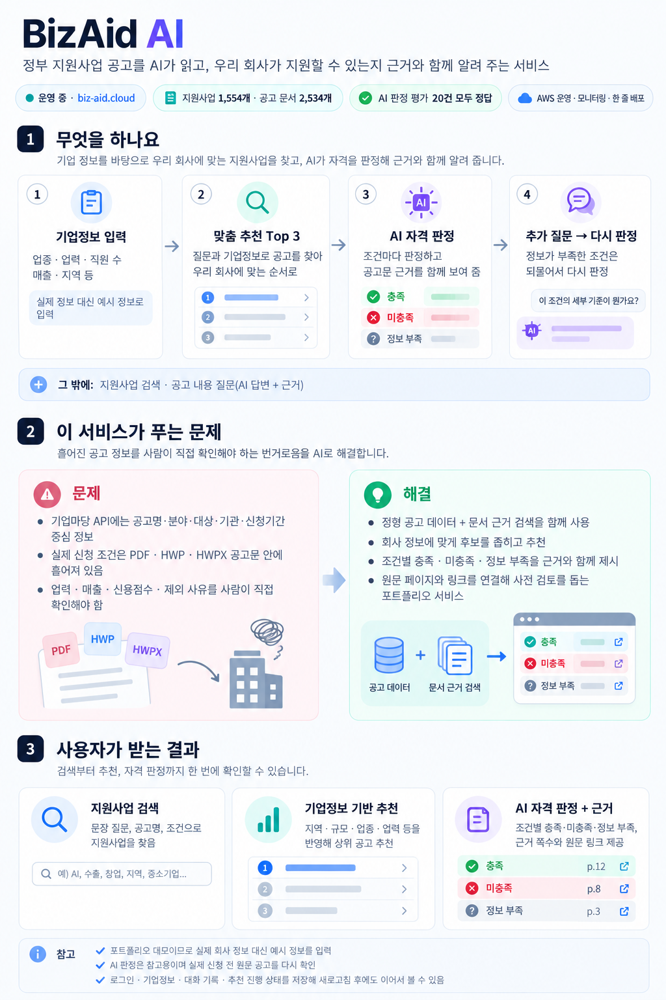
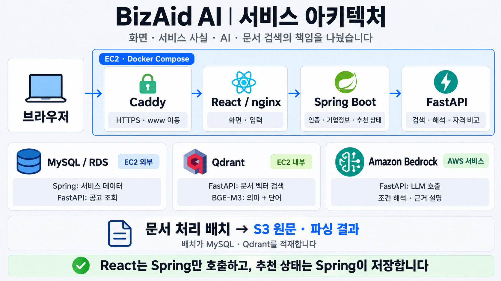
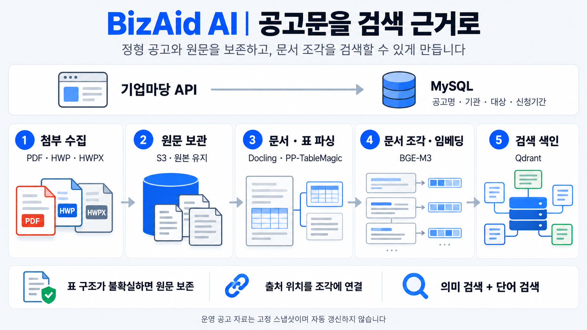
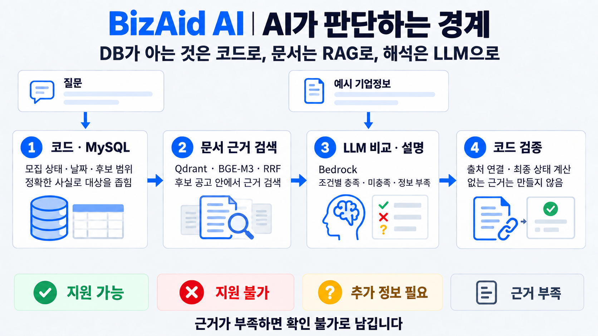
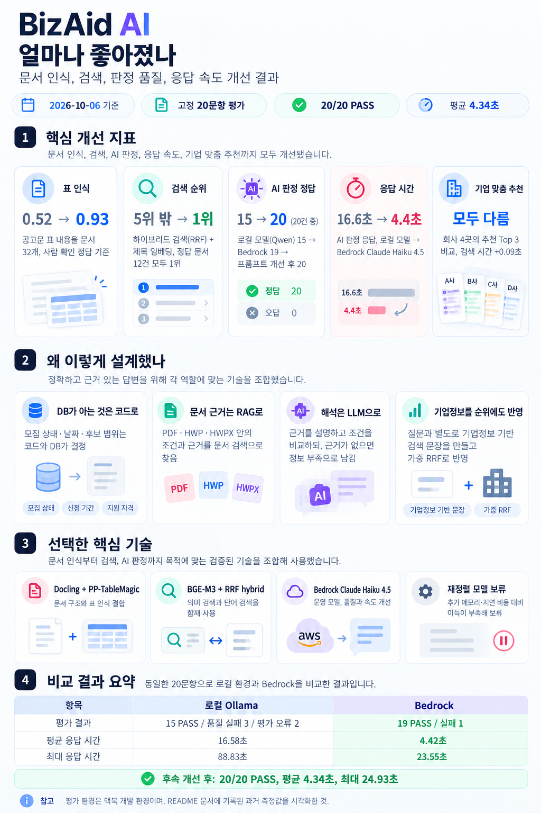
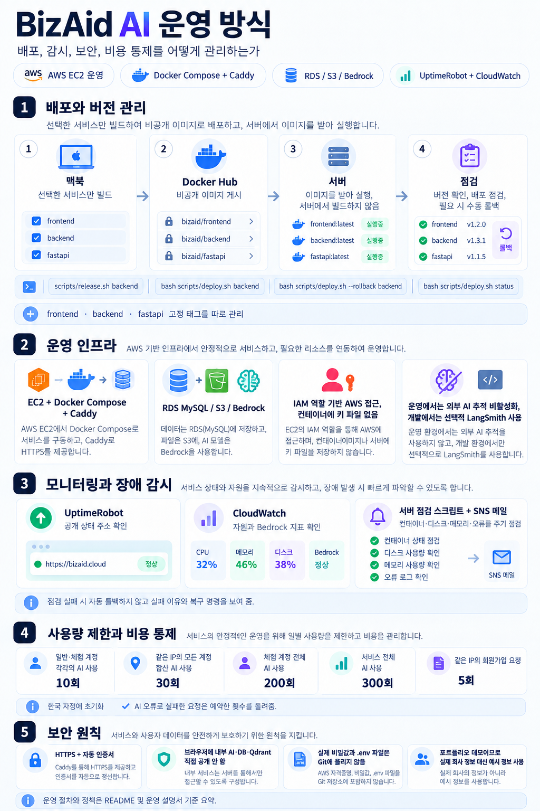

# BizAid AI

**회사 정보와 공고문 근거를 함께 사용해 중소기업 지원사업을 찾고, 지원 가능성을 검토하는 포트폴리오 서비스입니다.**

[운영 사이트 바로가기](https://biz-aid.cloud) · 가입 없이 예시 기업정보로 체험할 수 있습니다.

> 실제 정보 대신 예시 정보를 넣어 주세요. AI 판정은 참고용이며, 신청 전 원문 공고를 확인해야 합니다.




## 서비스 구조



| 구성 | 책임과 선택한 기술 |
| --- | --- |
| React · TypeScript · Vite · TanStack Query | 화면과 서버 상태 관리. Spring만 호출합니다. |
| Spring Boot · Spring Security · JPA · QueryDSL · Flyway | 인증, 기업정보, 대화·추천 상태의 기준 저장소와 공고 조회를 담당합니다. |
| FastAPI · LangChain · LangGraph | 질문 해석, 검색, 자격 비교를 수행합니다. LangChain은 모델 호출에, LangGraph는 추천의 반복·분기에 사용합니다. |
| MySQL · Qdrant · S3 | 정형 데이터 / BGE-M3 의미·단어 벡터 검색 / 원문·파싱 결과 보관을 나눕니다. |
| Docling · PP-TableMagic · Bedrock | 문서·표를 읽고, 운영에서는 Claude Haiku 4.5로 근거 설명과 조건 비교를 수행합니다. |

FastAPI는 회원·기업 테이블을 직접 읽지 않습니다. Spring이 필요한 기업정보만 전달하고, 요청 사이의 추천 상태도 Spring이 저장합니다. S3는 자료 처리에 사용하며 질문 서버가 직접 읽지는 않습니다.

## 기술 판단과 확인한 결과

### 공고문을 검색 근거로 만드는 과정



### AI 판단과 코드 검증의 경계



| 판단 | 이유와 결과 |
| --- | --- |
| **DB가 아는 것은 코드로, 문서는 RAG로, 해석은 LLM으로** | 모집 상태·날짜·후보 범위는 DB와 코드가 결정합니다. 문서에서 근거를 찾은 뒤 LLM이 설명·비교하고, 코드가 출처와 최종 판정 상태를 검증합니다. 근거가 없으면 확인 불가로 남깁니다. |
| **표 인식 개선** | Docling의 문서 배치 분석과 PP-TableMagic의 표 구조 검출을 결합했습니다. 금액·기간 등 원문 손실을 검사하고, 구조가 불확실하면 행·열을 만들어 내지 않고 원문을 보존합니다. 도입 시 5문서 확인에서 실패 표 영역의 원문 누락은 0글자였습니다. |
| **RRF hybrid 검색** | BGE-M3의 의미 검색과 단어 검색 순위를 RRF로 합칩니다. 초기 고정 12문항에서 정답 문서 1위는 12/12로 의미 검색 단독과 동률이었습니다. 사업명·금액·코드의 단어 신호를 함께 유지하려고 선택했습니다. |
| **기업정보를 순위에도 반영** | 기업정보로 만든 검색 문장을 질문과 별도로 검색하고 가중 RRF로 합칩니다. 예시 회사 4개 × 질문 2개에서 회사별 상위 3개 결과가 달라졌습니다. 추가 LLM 호출은 없습니다. 일반 질문의 적합도는 여전히 한계가 있습니다. |
| **로컬 모델에서 Bedrock으로 전환** | 같은 고정 문항에서 답변·판정 품질과 응답 시간을 비교한 뒤 운영 모델을 바꿨습니다. 아래 표에 평가 오류까지 함께 남겼습니다. |
| **재정렬 모델 보류** | 서비스 방식으로 범위를 좁힌 근거 검색은 12문항 모두 상위 3개 안에 정답이 있었습니다. 추가 모델의 메모리·지연 부담을 감수할 근거가 부족해, 먼저 기업정보 검색을 개선했습니다. |

## 개선항목



**모델 전환 비교 — 2026-10-04, 고정 20문항, 로컬 단발 측정**

| 항목 | 로컬 Ollama | Bedrock |
| --- | --- | --- |
| 평가 결과 | 15 PASS / 품질 실패 3 / 평가 오류 2 | 19 PASS / 실패 1 |
| 평균 응답 시간 | 16.58초 | 4.42초 |
| 최대 응답 시간 | 88.83초 | 23.55초 |

평가 오류가 난 로컬 추천 문항은 비교할 수 없습니다. 이 표는 전체 서비스의 정답률이나 운영 서버의 응답 시간을 보장하지 않습니다.

**후속 AI 개선 평가 — 2026-10-06**: 기존 고정 20문항에서 **20/20 PASS**, 평균 **4.34초**, 최대 **24.93초**였습니다. 모델 전환 비교와 다른 시점의 결과입니다. 평가 환경은 맥북 개발 환경이며, 저장소의 최신 개선이 운영에 반영됐는지는 별도 배포 확인이 필요합니다.

측정 조건과 남은 문제는 [개선 전 측정](docs/ai-improvement-before.md), [개선 후 비교](docs/ai-improvement-after-1.md)에 정리했습니다.

## 어떻게 운영하나요?



| 항목 | 운영 방식 |
| --- | --- |
| AWS 구성 | EC2에서 Docker Compose와 Caddy를 실행합니다. 데이터는 RDS MySQL, 원문·복원 자료는 S3, LLM은 Bedrock을 사용합니다. |
| 인증·접속 경계 | AWS 호출은 EC2 IAM 역할의 임시 인증정보를 사용하며 컨테이너에 AWS 키 파일을 넣지 않습니다. 내부 AI·DB·Qdrant를 브라우저에 공개하지 않습니다. |
| 배포 | 맥북에서 선택한 서비스만 빌드해 비공개 Docker Hub에 게시합니다. 서버는 빌드 없이 이미지를 받아 실행합니다. |
| 버전·되돌리기 | frontend·backend·fastapi의 고정 태그를 따로 관리합니다. 버전 자동 생성, 설정 백업, 변경 기록, 배포 점검을 스크립트로 처리합니다. |
| 상태·장애 감시 | UptimeRobot으로 공개 상태 주소를 확인하고, CloudWatch 경보로 자원·Bedrock 지표를 봅니다. 서버 점검 스크립트는 컨테이너·디스크·메모리·오류를 확인해 SNS 메일로 알립니다. |
| AI 추적 | 개발에서는 선택적 LangSmith 추적을 사용합니다. 운영에서는 외부 AI 추적을 끕니다. |

평소 배포 예시입니다. 서버 명령은 `~/bizaid`에서 실행하며, 되돌리기는 문제가 있을 때만 사용합니다.

| 어디서 | 목적 | 명령 |
| --- | --- | --- |
| 맥북 | backend 게시 · 버전 자동 생성 | `scripts/release.sh backend` |
| 서버 | backend 배포·점검 | `bash scripts/deploy.sh backend` |
| 서버 | 직전 backend 버전으로 되돌리기 | `bash scripts/deploy.sh --rollback backend` |
| 서버 | 서비스별 현재 버전 확인 | `bash scripts/deploy.sh status` |

점검 실패 시 자동으로 되돌리지 않고 실패 이유와 복구 명령을 보여 줍니다. DB 구조 변경이 있으면 배포 전에 RDS 스냅샷을 준비합니다. 자세한 설치·배포·알림 절차는 [운영 설명서](docs/deployment.md)를 참고하세요.

### 사용량과 가입 제한

| 대상 | 하루 한도 |
| --- | ---: |
| 일반·체험 계정 각각의 AI 사용 | 10회 |
| 같은 IP의 모든 계정 합산 AI 사용 | 30회 |
| 체험 계정 전체 AI 사용 | 200회 |
| 서비스 전체 AI 사용 | 300회 |
| 같은 IP의 회원가입 요청 | 5회 |

한국 자정에 초기화합니다. 검색 질문·추천 시작·단일 자격 판정을 세고, 같은 추천의 후속 단계는 추가 차감하지 않습니다. AI 오류로 실패한 요청은 예약한 횟수를 돌려줍니다. 호출 수 제한은 과금을 완전히 막는 비용 상한은 아닙니다.

## 한계와 이용 안내

| 한계 | 안내 |
| --- | --- |
| 실제 회사 정보를 받기 위한 서비스가 아님 | 포트폴리오 데모입니다. 회사명·매출·신용점수 등은 예시로 입력하세요. 입력 폼에도 안내합니다. |
| 비밀번호 재설정 없음 | 비밀번호를 잊었다면 다른 이메일로 새로 가입하세요. 로그인 후 비밀번호 변경은 지원합니다. |
| 일반 질문의 기업 맞춤이 약함 | 구체적인 목적을 적는 편이 좋습니다. 평가에서 음식점 소상공인에게도 TIPS 기술창업 공고가 1위로 나왔습니다. |
| 공고 자동 갱신 없음 | 2026-10-05 배포 기준의 공고 자료를 고정해 사용합니다. 수집은 한 번 준비한 자료이며 운영 중 자동으로 갱신하지 않습니다. 최신 공고는 기업마당 원문에서 확인하세요. |
| AI 판정은 사전 검토 | 표본 평가가 모든 업종·공고를 보장하지 않습니다. 실제 신청 여부는 원문 조건과 담당 기관에 확인해야 합니다. |

## 테스트와 품질 관리

| 검사 | 최근 문서에 기록된 결과 · 2026-10-06 |
| --- | --- |
| Python Contract 테스트 | 572개 통과. 파싱·검색·AI 응답 형식·배포 등 구성요소 사이의 규칙을 검사합니다. |
| MySQL Integration 테스트 | 69개 통과. 실제 테스트 DB에서 저장·조회·복원 경계를 검사합니다. |
| `scripts/check-all.sh` | 종료 코드 0. 형식·문법·Contract·Integration·Git 추적·주석·Harness 검사를 묶습니다. |

위 수치는 기존 검증 기록입니다. 이번 README 작업에서 서비스·모델 성능을 다시 측정한 결과가 아닙니다. Spring과 React의 테스트·빌드는 `check-all`과 별도로 실행합니다.

Harness는 AI 개발 도구가 지킬 범위·계약·작업 상태를 저장소에 관리하는 방식입니다. `AGENTS.md` → 현재 Task → 관련 규칙·검사 → 보고서 → 독립 검토·사용자 확인 순으로 작업하며, 실행하지 않은 검사를 통과로 기록하지 않습니다.

## 로컬 실행

Docker와 로컬 의존성·모델 준비, 개발 설정 작성은 [환경 설명서](docs/environment-guide.md)와 [데이터 파이프라인 실행 안내](data-pipeline/README.md)를 따릅니다. 실제 설정·비밀값은 Git에 올리지 않습니다.

```bash
scripts/dev.sh up
scripts/dev.sh status
./scripts/check-all.sh
```

화면은 `http://localhost:3000`입니다. 자세한 포트·개발/운영 차이는 환경 설명서에 있습니다.

| 더 알아볼 내용 | 문서 |
| --- | --- |
| 프로젝트 전체와 구현 배경 | [PROJECT_MASTER_GUIDE](PROJECT_MASTER_GUIDE.md) |
| AI 개선 측정·남은 문제 | [개선 전](docs/ai-improvement-before.md) · [개선 후](docs/ai-improvement-after-1.md) |
| 실행·배포·되돌리기·모니터링 | [환경 설명서](docs/environment-guide.md) · [운영 설명서](docs/deployment.md) |
| 테스트 범위·API 계약·작업 규칙 | [테스트 안내](harness/docs/testing.md) · [계약](contracts/README.md) · [AGENTS](AGENTS.md) |
