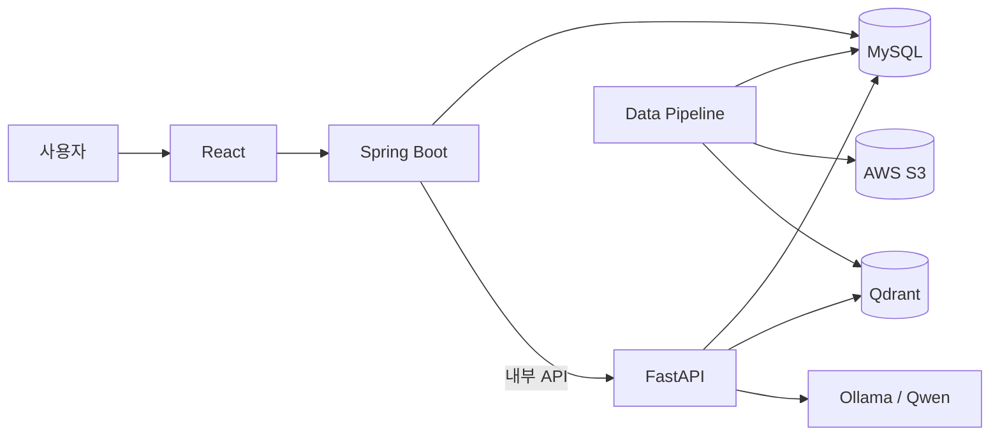

# BizAid AI

기업 정보와 실제 공고문 근거를 함께 사용해 중소기업 지원사업을 찾고, 질문하고, 지원 가능성을 검토하는 서비스입니다.

## 해결하려는 문제

지원사업 공공 API에는 공고명·분야·대상·기관·신청기간 같은 정형 정보가 있습니다. 하지만 업력, 매출,
신용점수, 제외 조건처럼 신청 판단에 필요한 내용은 PDF·HWP·HWPX 공고문 안에 흩어져 있습니다.

BizAid AI는 두 데이터의 역할을 나눕니다.

- MySQL은 모집 상태와 분야처럼 정확히 비교할 조건을 다룹니다.
- Qdrant는 공고문에서 질문과 관련된 근거를 찾습니다.
- 대규모 언어 모델(LLM)은 검색된 근거를 설명하고 조건별 비교를 수행합니다.
- 일반 코드는 근거를 검증하고 지원 자격의 최종 상태를 계산합니다.

> 사용자는 우리 회사가 받을 수 있는 지원사업을 찾고, 공고 근거를 확인한 뒤 지원 가능 여부를 검토할 수 있습니다.

## 주요 기능

- 자연어로 지원사업 검색
- 특정 공고문에 대한 근거 기반 질문
- 공고 ID·문서 page를 포함한 근거 표시(Citation)
- 기업 정보와 공고 조건을 비교하는 지원 자격 판정
- JWT 로그인, 기업정보 관리, 지원사업 목록·상세, 대화 저장

## 아키텍처



| 구성요소 | 역할 |
| --- | --- |
| React | 로그인, 기업정보, 지원사업, AI 검색·자격 판정 화면 |
| Spring Boot | 서비스 API, JWT 인증, JPA·QueryDSL 조회, 대화·활동 기록, FastAPI 호출 경계 |
| FastAPI | 질문 유형·조건 분석, 검색, 근거 답변, 자격 조건 비교 |
| MySQL | 공고 정형 데이터와 서비스 데이터의 기준 저장소 |
| AWS S3 | 원본 공고문과 파싱 결과 JSON 영구 보관 |
| Qdrant | BGE-M3 dense·sparse 문서 조각 검색 |

React는 Spring Boot만 호출합니다. Spring Boot는 공유 키로 FastAPI 내부 API를 호출하며, AI 결과를 임의로
재정렬하거나 고쳐 쓰지 않습니다.

## AI 처리 흐름

```text
사용자 질문
  → 자연어 조건과 SEARCH_LIST / DOCUMENT_QA 구분
  → 질문에 실제로 있는 조건만 검증
  → MySQL에서 활성 공고 후보 선택
  → 후보 공고 안에서 Qdrant Dense + Sparse 검색
  → RRF로 검색 순위 결합
  → 목록은 MySQL 정보로 반환 / 문서 질문은 LLM 답변 생성
  → 애플리케이션이 실제 검색 결과에서 Citation 연결
```

지원 자격 판정은 공고 하나와 기업 정보 snapshot을 입력으로 받습니다. LLM은 조건별로 `MET`, `NOT_MET`,
`UNKNOWN`을 비교하고, 최종 `ELIGIBLE`, `INELIGIBLE`, `NEEDS_MORE_INFO`, `INSUFFICIENT_EVIDENCE` 상태는
애플리케이션 코드가 계산합니다.

## 핵심 기술 선택

| 선택 | 이유 |
| --- | --- |
| 정형 데이터와 문서 지식 분리 | 날짜·상태는 DB로 정확히 판단하고 세부 조건은 원문에서 찾기 위해 |
| JPA + QueryDSL | 일반 CRUD는 단순하게, 선택 조건이 많은 지원사업 목록은 타입 안전하게 조회하기 위해 |
| BGE-M3 | 한 모델에서 의미 검색용 dense vector와 단어 검색용 sparse vector를 함께 만들기 위해 |
| Dense + Sparse + RRF | 의미가 비슷한 문장과 사업명·금액 같은 정확한 단어를 함께 찾기 위해 |
| Citation을 코드에서 연결 | LLM이 존재하지 않는 page나 출처를 만드는 일을 막기 위해 |
| 자격 최종 상태를 코드에서 계산 | 누락된 기업정보를 추측하지 않고 일관된 판정 규칙을 유지하기 위해 |
| React → Spring → FastAPI | 인증·서비스 데이터와 AI 실행 책임을 분리하고 브라우저가 내부 AI API에 직접 의존하지 않게 하기 위해 |

## 주요 문제 해결 사례

1. **일반 제목 조각이 검색에서 밀리는 문제**

   검색용 입력에 공고명을 추가하고 원문 근거 text는 그대로 보존했습니다. 기대 근거가 5위 밖에서 1위로 올랐습니다.

2. **한 공고의 여러 조각이 목록을 독점하는 문제**

   조각을 자른 뒤 중복 제거하는 대신 공고별 최고 조각으로 순위를 매겼습니다. 결과가 2개에서 5개로 회복됐고 중복은 0건이었습니다.

3. **LLM이 질문에 없는 조건을 만드는 문제**

   모델이 낸 조건을 DB의 허용 값과 질문 원문으로 다시 검증하는 Grounding Guard를 두었습니다.

4. **한국 공문서 형식과 표 처리 문제**

   PDF·HWP·HWPX를 DoclingDocument로 통일했습니다. 구조를 증명하지 못한 표는 틀린 행·열을 만들지 않고 원문 글자와 provenance를 보존합니다.

5. **Spring 계층의 역방향 의존 문제**

   도메인별 package 안을 presentation → application → domain / infrastructure로 정리해 HTTP DTO가 도메인으로 새지 않게 했습니다.

## V1 AI 평가

V1 종료 시점의 성능을 이후 변경과 같은 조건으로 비교하기 위해 10개 사례를 고정했습니다.

| 기능 | 결과 |
| --- | ---: |
| 지원사업 검색(SEARCH_LIST) | 4 / 4 PASS |
| 공고문 질문(DOCUMENT_QA) | 2 / 3 PASS |
| 지원 자격 판정 | 1 / 3 PASS |
| **전체** | **7 / 10 PASS** |

검색 결과의 중복과 MySQL 후보 범위 밖 공고는 0건이었고, QA·자격 근거에 다른 공고가 섞인 사례도 0건이었습니다.
실패 3건은 최대 지원기간 누락 1건과 허용되지 않은 기업정보 필드 이름을 모델이 사용한 자격 판정 2건입니다.
이 결과는 숨기거나 보정하지 않은 V1의 한계이며, V2의 provider·prompt·검색 변경을 비교하는 출발점입니다.

## 기술 스택

- Frontend: React 19, TypeScript, Vite, TanStack Query
- Backend: Java 21, Spring Boot, Spring Security, JPA, QueryDSL, Flyway
- AI API / Pipeline: Python 3.11, FastAPI, Docling, PaddleX, BGE-M3
- Storage: MySQL 8.4, AWS S3, Qdrant
- LLM: Ollama, Qwen3.5 9B
- Infrastructure: Docker Compose, GitHub Actions

## 로컬 실행

실제 비밀값은 추적되지 않는 `.env.dev`에 둡니다. 필요한 변수 이름은 [.env.example](.env.example)에서 확인합니다.

```bash
# Python 의존성과 고정 모델 artifact 준비
python3.11 -m venv .venv
.venv/bin/python -m pip install -r data-pipeline/requirements.txt
export BIZAID_DOCLING_ARTIFACTS_PATH="$HOME/.cache/biz-aid/docling-artifacts"

# 저장소와 로컬 전제 검사
./scripts/setup.sh

# Qdrant
docker compose --env-file .env.dev --profile dev-vector up -d qdrant

# 호스트 FastAPI (고정 모델 artifact와 Ollama가 준비된 dev 환경)
.venv/bin/python -B scripts/run_api.py

# MySQL + Spring Boot + React
docker compose --env-file .env.dev --profile app up --build
```

- Frontend: `http://127.0.0.1:3000`
- Spring Boot: `http://127.0.0.1:8080`
- FastAPI는 현재 호스트 `127.0.0.1:8000`에서 별도로 실행합니다.

개발 검증은 `./scripts/check-all.sh`로 실행합니다. Backend와 Frontend의 개별 build/test 및 실제 AI E2E 범위는
[Testing](harness/docs/testing.md)을 따릅니다.

## 현재 상태와 V2

V1은 데이터 수집부터 React → Spring Boot → FastAPI AI 흐름과 고정 AI 기준선까지 완성했습니다.
현재 제약은 전체 문서 corpus 미처리, 일부 표·OCR 품질, FastAPI Compose 미통합, 운영 배포 미완료입니다.

V2에서는 frozen V1 기준선으로 모델 provider·prompt·검색 변경 전후를 먼저 비교합니다. Reranker, LangChain,
LangGraph는 이름만으로 도입하지 않고 평가에서 필요한 경우에 검토합니다.

상세한 설계 결정과 실험 결과는 [PROJECT_MASTER_GUIDE](PROJECT_MASTER_GUIDE.md), 미룬 문제는
[Improvement Backlog](harness/docs/improvement-backlog.md), 개발 규칙은 [AGENTS.md](AGENTS.md)에서 확인할 수 있습니다.
