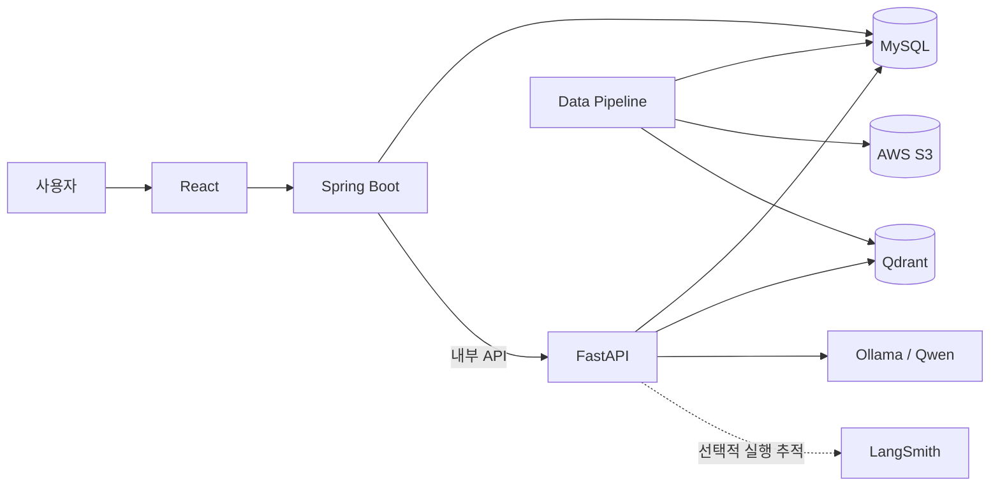

# BizAid AI

기업 정보와 실제 공고문 근거를 함께 사용해 중소기업 지원사업을 찾고, 질문하고, 지원 가능성을 검토하는 서비스입니다.

## 해결하려는 문제

기업마당 API에는 공고명·분야·대상·기관·신청기간 같은 정형 정보가 있지만, 업력·매출·신용점수·제외 조건처럼 실제 신청 판단에 필요한 내용은 PDF·HWP·HWPX 공고문에 흩어져 있습니다.

BizAid AI는 역할을 나눠 이 문제를 해결합니다.

- MySQL은 모집 상태와 지원 대상처럼 정확히 비교할 조건과 서비스 상태를 관리합니다.
- S3는 원본 공고문과 파싱 결과를 보관합니다.
- Qdrant는 후보 공고 안에서 관련 근거를 찾습니다.
- 대규모 언어 모델(LLM)은 근거를 설명하고 조건별 비교를 수행합니다.
- 일반 코드는 근거를 검증하고 지원 자격의 최종 상태를 계산합니다.

## 주요 기능

- 자연어 지원사업 검색과 특정 공고문 질문
- 공고 ID·문서 page를 포함한 근거 표시(Citation)
- 기업 정보 기반 Top 3 검색과 공고별 지원 자격 판정
- 부족한 기업 정보를 추가로 묻고 다시 판정하는 단계형 추천 흐름
- JWT 로그인, 기업정보·지원사업·대화·활동 기록 관리
- 추천 진행 상태 저장, 새로고침 복원, 최종 추천·지원 불가·판단 불가 분류

## 아키텍처



| 구성요소 | 역할 |
| --- | --- |
| React | 로그인·기업정보·공고·AI 검색·단계형 맞춤 추천 화면 |
| Spring Boot | JWT, 서비스 API, JPA·QueryDSL 조회, 대화·활동·추천 State의 Source of Truth |
| FastAPI | 질문 구조화, 후보 범위 검색, 근거 답변, 자격 비교, LangGraph 추천 단계 실행 |
| MySQL | 공고 정형 데이터, 문서·파싱 metadata, 회원·기업·대화·workflow 상태 |
| AWS S3 | 원본 공고문과 파싱된 DoclingDocument JSON |
| Qdrant | BGE-M3 dense·sparse 문서 조각 검색 |
| LangSmith | 설정으로 켜는 V2 workflow 단계 추적. 질문·기업정보·문서 원문은 전송하지 않음 |

React는 Spring Boot만 호출합니다. Spring은 서비스 데이터와 workflow State를 소유하고, FastAPI는 받은 State로 한 단계를 실행합니다. FastAPI는 회원·기업 테이블을 직접 읽지 않습니다.

## AI 처리 흐름

### 검색과 공고문 질문

```text
질문 → LangChain 기반 구조화 출력 → 질문에 실제로 있는 조건만 검증
     → MySQL 활성 공고 후보 → 후보 안에서 Qdrant Dense + Sparse 검색
     → RRF 순위 결합 → 목록 또는 근거 기반 답변 → 코드가 Citation 연결
```

### 맞춤 추천

```text
저장된 기업정보 snapshot + 질문 → Top 3 검색
→ LangGraph가 공고를 한 건씩 판정
→ 부족 정보 질문 → 임시 답변으로 필요한 공고만 재판정
→ 코드가 추천 / 지원 불가 / 판단 불가 조립
→ Spring이 MySQL에 State JSON 저장, React는 nextAction만 따라감
```

LangChain은 LLM 호출 계층에만, LangGraph는 반복·분기가 필요한 추천 흐름에만 사용합니다. 검색 범위·RRF·근거 연결·자격 최종 상태는 일반 코드가 결정합니다.

## 핵심 기술 선택

| 선택 | 이유 |
| --- | --- |
| 정형 데이터와 문서 지식 분리 | 날짜·상태는 DB로 정확히 판단하고 세부 조건은 원문에서 찾기 위해 |
| JPA + QueryDSL | 일반 CRUD와 선택 조건이 많은 공고 조회를 각각 단순하고 타입 안전하게 구현하기 위해 |
| BGE-M3 + Dense/Sparse + RRF | 의미가 비슷한 문장과 사업명·금액 같은 정확한 단어를 함께 찾기 위해 |
| Citation을 코드에서 연결 | LLM이 존재하지 않는 page나 출처를 만드는 일을 막기 위해 |
| 자격 최종 상태를 코드에서 계산 | 누락된 기업정보를 추측하지 않고 일관된 판정 규칙을 유지하기 위해 |
| LangGraph State와 MySQL 저장 분리 | 그래프는 다음 단계를 정하고 Spring은 요청 사이의 상태·동시성을 관리하기 위해 |
| 선택적 LangSmith 추적 | 단계별 지연과 오류를 보되 질문·기업정보·문서·prompt를 외부로 보내지 않기 위해 |

## 문제 해결 사례

1. 공고 제목 정보가 부족해 검색에서 밀린 문제를 검색 입력에 제목을 추가해 기대 근거 1위로 개선했습니다.
2. 한 공고의 여러 조각이 목록을 독점하던 문제를 공고 단위 그룹 검색으로 바꿔 결과 2개를 5개로 회복했습니다.
3. LLM이 질문에 없는 조건을 만들던 문제를 허용 값과 질문 원문을 다시 확인하는 Grounding Guard로 막았습니다.
4. PDF·HWP·HWPX를 DoclingDocument로 통일하고, 구조를 증명하지 못한 표는 틀린 행·열 대신 원문과 provenance를 보존했습니다.
5. Top 3 판정을 한 요청에 묶어 161초가 걸린 문제를 LangGraph 단계 실행으로 나눠 실제 시작 14.7초, 판정 1건 39.4초로 Spring의 90초 제한 안에 넣었습니다.

## V1 고정 평가

V1 종료 시점의 10개 사례를 고정해 이후 변경의 비교 기준으로 사용합니다.

| 기능 | 결과 |
| --- | ---: |
| 지원사업 검색(SEARCH_LIST) | 4 / 4 PASS |
| 공고문 질문(DOCUMENT_QA) | 2 / 3 PASS |
| 지원 자격 판정 | 1 / 3 PASS |
| **전체** | **7 / 10 PASS** |

실패 3건은 숨기거나 보정하지 않았습니다. V1 collection과 평가 기대값은 동결되어 있으며, V2 전체 데이터 평가는 아직 수행하지 않았습니다.

## 기술 스택

- Frontend: React 19, TypeScript, Vite, TanStack Query
- Backend: Java 21, Spring Boot, Spring Security, JPA, QueryDSL, Flyway
- AI / Pipeline: Python 3.11, FastAPI, LangChain, LangGraph, Docling, PaddleX, BGE-M3
- Storage: MySQL 8.4, AWS S3, Qdrant
- LLM / Observability: Ollama, Qwen3.5 9B, LangSmith
- Infrastructure: Docker Compose, GitHub Actions

## 현재 상태

### 완료

- V1 서비스와 실제 React → Spring → FastAPI E2E
- V1 고정 평가 10건(7 PASS / 3 FAIL)
- V2-0 LangChain LLM 호출 경계부터 V2-6 LangSmith 선택적 추적까지의 기능 구현
- V2 맞춤 추천 화면과 MySQL workflow State 저장
- dev LangSmith 추적 설정 완료. `.env.dev`에서 전용 API key와 `BIZAID_TRACING_ENABLED=true`를 사용하며, 진단 중 잘못 생성된 `biz_aid` 프로젝트는 사용자가 삭제했습니다.

### V2 데이터 상태

- V2 서비스 범위 데이터는 2026-10-03 기준 2,776문서·64,041 point가 V2 collection에 적재돼 있습니다(PDF·HWP·HWPX 2,534 + 이미지 105 + DOCX·PPTX 7 + 일반 ZIP 내부 파일 130). 서비스 범위 1,372공고 모두 point가 있고 단계마다 완전성 검증을 통과했습니다.
- 서비스 검색(FastAPI)은 V2 collection(`QDRANT_COLLECTION_NAMESPACE=v2`)을 읽습니다. V1 collection(3,849 point)은 기준선 재현용으로 그대로 둡니다.
- 일반 ZIP 내부 파일은 양식(FORM)을 빼고 적재했습니다(양식 323개는 보관만). 공고 근거를 차지하던 참고자료 40원본은 검색에서 빼고 파싱 결과만 보관합니다(IMP-028). XLSX·옛 오피스는 지원하지 않습니다.

### 아직 검증하지 않음

- V2 collection 서비스 전환
- V2 전체 데이터에서의 검색·추천 품질과 V1 기준선 비교
- V2 전체 workflow가 LangSmith에서 단계별로 기록되는지에 대한 실제 사용자 흐름 검증

### 다음 작업

1. `QDRANT_COLLECTION_NAMESPACE=v2`로 V2 collection 전환
2. React 화면에서 추천 흐름을 끝까지 진행하고 LangSmith 기록 확인
3. cases-v2로 V2 평가

V1 collection `bizaid_chunks_v1_228acdd12220`은 기준선 재현용이므로 수정하거나 추가 적재하지 않습니다. V2 기능 Smoke는 아직 V1 collection 또는 3문서 V2 smoke collection을 사용한 기능 확인이며, V2 전체 품질 결론이 아닙니다.

## 로컬 실행과 검증

실제 비밀값은 Git에 추적되지 않는 `.env.dev`에 둡니다. 변수 이름만 [.env.example](.env.example)에서 확인합니다.

```bash
python3.11 -m venv .venv
.venv/bin/python -m pip install -r data-pipeline/requirements.txt
export BIZAID_DOCLING_ARTIFACTS_PATH="$HOME/.cache/biz-aid/docling-artifacts"

./scripts/setup.sh
docker compose --env-file .env.dev --profile dev-vector up -d qdrant
.venv/bin/python -B scripts/run_api.py
docker compose --env-file .env.dev --profile app up --build

./scripts/check-all.sh
```

- Frontend: `http://127.0.0.1:3000`
- Spring Boot: `http://127.0.0.1:8080`
- FastAPI: 호스트 `127.0.0.1:8000`에서 별도 실행

## 문서 안내

| 목적 | 문서 |
| --- | --- |
| 프로젝트 전체와 기술 의사결정 학습 | [PROJECT_MASTER_GUIDE.md](PROJECT_MASTER_GUIDE.md) |
| 다음 개발 작업과 금지 범위 | [current-task.md](harness/workspace/current-task.md) |
| 실제 시스템 경계 | [architecture.md](harness/docs/architecture.md) |
| 미해결 문제와 재검토 조건 | [improvement-backlog.md](harness/docs/improvement-backlog.md) |
| 테스트가 보장하는 범위 | [testing.md](harness/docs/testing.md) |
| API 계약 | [contracts/](contracts/README.md) |
| 단계별 실제 실행 결과 | `harness/workspace/reports/development/`의 Task별 Report |

개발 Agent는 [AGENTS.md](AGENTS.md)부터 읽고, 사용자는 이 README 다음에 PROJECT_MASTER_GUIDE를 읽는 것이 가장 빠릅니다.
